# 后端系统设计文档 - 数据获取基础设施

## 0. 现有系统分析

### 0.1 现有架构分析

根据项目规则文档，当前系统采用微服务架构，包含以下核心服务：
- **bff-service**: 业务聚合+API网关
- **data-collector**: 数据采集+存储（本次迭代的核心服务）
- **quant-engine**: 量化计算引擎
- **ai-service**: AI分析服务

**技术栈特点：**
- 微服务架构，服务间通过HTTP协议同步通信
- 共享基础设施：MySQL、Redis、MongoDB
- Golang作为后端开发语言

### 0.2 现有组件清单

**可复用的基础设施：**
- MySQL数据库：用于结构化数据存储
- Redis缓存：用于高频访问数据缓存
- MongoDB：用于非结构化数据存储（新闻、政策等文本数据）
- HTTP通信框架：服务间通信机制

**需要新建的组件：**
- data-collector服务（目前为空目录）
- 数据采集模块
- 数据存储模块
- 数据服务API模块

### 0.3 架构约束识别

**技术约束：**
- 必须使用Golang开发
- 必须遵循微服务架构模式
- 必须使用HTTP协议进行服务间通信
- 必须使用共享的数据库基础设施
- 数据库设计禁止使用外键约束和视图

**业务约束：**
- 数据采集必须遵守robots.txt协议
- 必须控制访问频率避免反爬虫
- 数据仅用于学术研究，不得商业转售

### 0.4 演进策略

**渐进式演进方案：**
1. 基于现有微服务架构，完善data-collector服务
2. 复用现有数据库基础设施，按业务需求设计表结构
3. 遵循现有HTTP通信模式，设计标准化API接口
4. 采用模块化设计，便于后续功能扩展

## 1. 系统架构概览

### 1.1 整体架构图

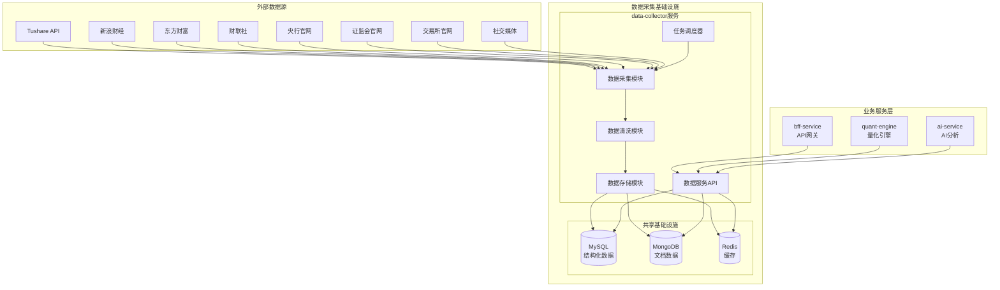

### 1.2 核心模块概述

1. **数据采集模块**：负责从多个外部数据源采集股票、财务、新闻、政策数据
2. **数据清洗模块**：对采集的原始数据进行标准化处理和质量检查
3. **数据存储模块**：将清洗后的数据存储到相应的数据库中
4. **数据服务API**：为其他服务提供数据查询接口
5. **任务调度器**：管理数据采集任务的定时执行

### 1.3 技术栈选型

**开发语言：** Golang（与现有架构保持一致）
**Web框架：** Gin（轻量级HTTP框架）
**数据库：** 
- MySQL 8.0（结构化数据）
- MongoDB 4.4（文档数据）
- Redis 6.0（缓存）
**HTTP客户端：** Go标准库net/http + 第三方库colly（爬虫）
**任务调度：** cron（定时任务）
**配置管理：** Viper
**日志：** logrus

### 1.4 数据流概览

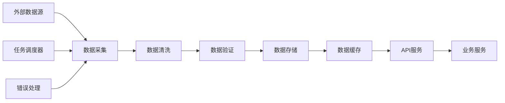

## 2. 功能模块设计

### 2.1 股票数据采集模块

#### 2.1.1 模块职责
- 采集股票基础信息（代码、名称、行业、市场等）
- 采集股票行情数据（价格、成交量、技术指标等）
- 采集股票复权因子数据
- 支持全量初始化和增量更新
- 处理Tushare API限流和权限控制

#### 2.1.2 模块架构

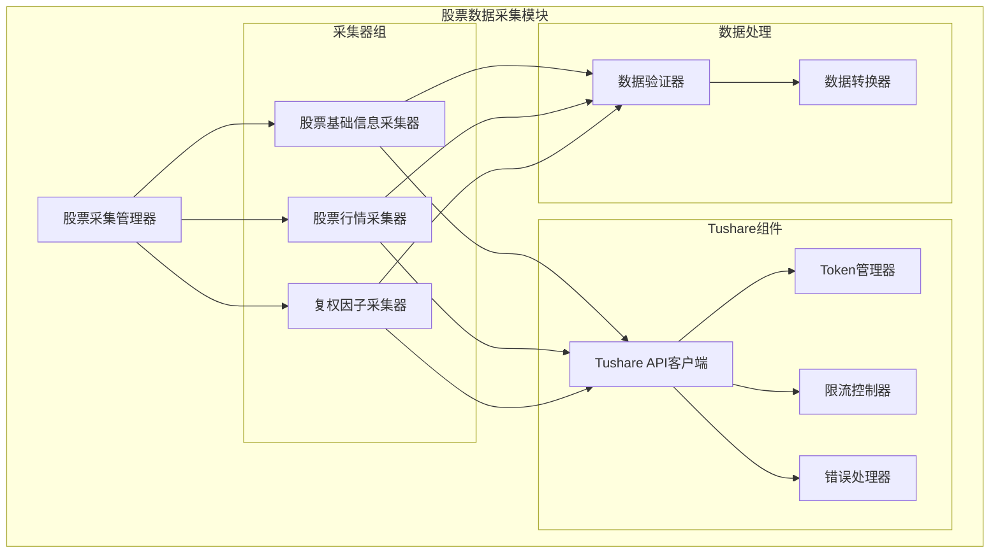

#### 2.1.3 核心接口设计

**股票基础信息采集接口**
```go
type StockBasicCollector interface {
    // 全量采集股票基础信息
    CollectAll() (*CollectResult, error)
    
    // 增量采集新上市股票
    CollectIncremental(since time.Time) (*CollectResult, error)
    
    // 采集指定股票信息
    CollectBySymbols(symbols []string) (*CollectResult, error)
}
```

**股票行情数据采集接口**
```go
type StockQuoteCollector interface {
    // 采集指定日期的行情数据
    CollectByDate(date time.Time, symbols []string) (*CollectResult, error)
    
    // 采集指定时间范围的行情数据
    CollectByDateRange(start, end time.Time, symbols []string) (*CollectResult, error)
    
    // 采集最新行情数据
    CollectLatest(symbols []string) (*CollectResult, error)
}
```

**复权因子采集接口**
```go
type AdjFactorCollector interface {
    // 采集指定股票的复权因子
    CollectBySymbol(tsCode string, start, end time.Time) (*CollectResult, error)
    
    // 批量采集复权因子
    CollectBatch(tsCodes []string, start, end time.Time) (*CollectResult, error)
}
```

#### 2.1.4 数据模型

**股票基础信息模型**
```go
type StockBasic struct {
    Symbol      string    `json:"symbol" db:"symbol"`           // 股票代码
    TSCode      string    `json:"ts_code" db:"ts_code"`         // Tushare代码
    Name        string    `json:"name" db:"name"`               // 股票名称
    Area        string    `json:"area" db:"area"`               // 地域
    Industry    string    `json:"industry" db:"industry"`       // 行业
    Market      string    `json:"market" db:"market"`           // 市场类型
    ListDate    time.Time `json:"list_date" db:"list_date"`     // 上市日期
    IsHS        string    `json:"is_hs" db:"is_hs"`             // 是否沪深港通
    CreatedAt   time.Time `json:"created_at" db:"created_at"`   // 创建时间
    UpdatedAt   time.Time `json:"updated_at" db:"updated_at"`   // 更新时间
}
```

**股票行情数据模型**
```go
type StockQuote struct {
    Symbol      string    `json:"symbol" db:"symbol"`           // 股票代码
    TradeDate   time.Time `json:"trade_date" db:"trade_date"`   // 交易日期
    Open        string    `json:"open" db:"open"`               // 开盘价
    High        string    `json:"high" db:"high"`               // 最高价
    Low         string    `json:"low" db:"low"`                 // 最低价
    Close       string    `json:"close" db:"close"`             // 收盘价
    PreClose    string    `json:"pre_close" db:"pre_close"`     // 昨收价
    Change      string    `json:"change" db:"change"`           // 涨跌额
    PctChg      string    `json:"pct_chg" db:"pct_chg"`         // 涨跌幅
    Vol         string    `json:"vol" db:"vol"`                 // 成交量
    Amount      string    `json:"amount" db:"amount"`           // 成交额
    CreatedAt   time.Time `json:"created_at" db:"created_at"`   // 创建时间
    UpdatedAt   time.Time `json:"updated_at" db:"updated_at"`   // 更新时间
}
```

**复权因子数据模型**
```go
type AdjFactor struct {
    TSCode      string    `json:"ts_code" db:"ts_code"`         // 股票代码
    TradeDate   time.Time `json:"trade_date" db:"trade_date"`   // 交易日期
    AdjFactor   string    `json:"adj_factor" db:"adj_factor"`   // 复权因子
    CreatedAt   time.Time `json:"created_at" db:"created_at"`   // 创建时间
    UpdatedAt   time.Time `json:"updated_at" db:"updated_at"`   // 更新时间
}
```

#### 2.1.5 业务流程时序图

**股票基础信息全量采集时序图**
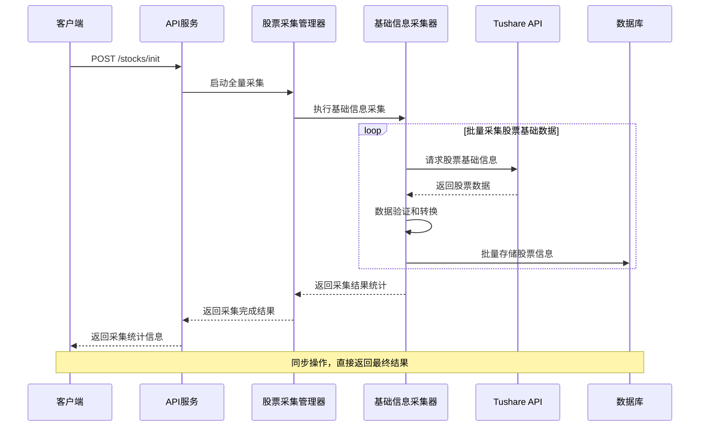

**股票行情数据采集时序图**
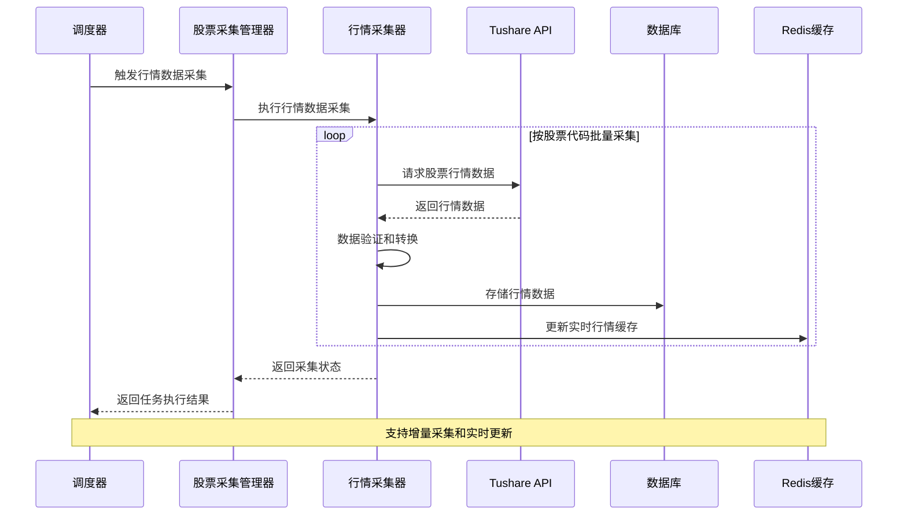

**复权因子采集时序图**
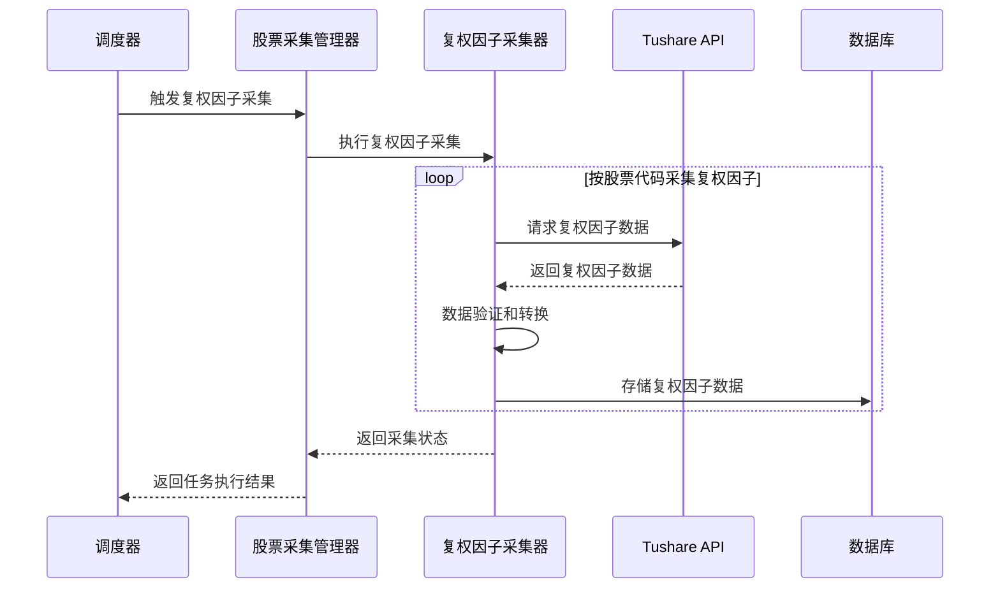

#### 2.1.6 技术限制和约束

**Tushare API限制：**
- 调用频率限制：每分钟200次（根据积分等级调整）
- 积分权限限制：不同接口需要不同积分等级
- 数据延迟：实时数据有15分钟延迟
- Token有效期：需要定期更新Token

**Token管理策略：**
- 多Token配置：支持配置多个有效的Tushare Pro API token
- 轮换策略：使用round robin算法轮换使用，避免单个token频率限制
- 异常处理：当token失效时自动切换到下一个可用token

**错误处理策略：**
- 频率限制(40203)：切换到下一个token并重试，最大重试3次
- 积分不足(40001)：接口降级或跳过
- Token无效(40101)：切换到下一个可用token
- 网络超时：立即重试，最大重试3次

**性能约束：**
- 单次批量采集不超过1000只股票
- 历史数据回填按月分批处理
- 内存使用控制在500MB以内

#### 2.1.7 实现细节

**Token管理器实现：**
```go
type TokenManager struct {
    tokens     []string
    currentIdx int
    mutex      sync.RWMutex
}

func NewTokenManager(tokens []string) *TokenManager {
    return &TokenManager{
        tokens:     tokens,
        currentIdx: 0,
    }
}

func (tm *TokenManager) GetToken() string {
    tm.mutex.Lock()
    defer tm.mutex.Unlock()
    
    if len(tm.tokens) == 0 {
        return ""
    }
    
    // Round robin: 获取当前token并移动到下一个
    token := tm.tokens[tm.currentIdx]
    tm.currentIdx = (tm.currentIdx + 1) % len(tm.tokens)
    
    return token
}

func (tm *TokenManager) NextToken() {
    tm.mutex.Lock()
    defer tm.mutex.Unlock()
    
    // 强制切换到下一个token（用于异常处理）
    tm.currentIdx = (tm.currentIdx + 1) % len(tm.tokens)
}
```

**限流控制实现：**
```go
type RateLimiter struct {
    tokens   chan struct{}
    interval time.Duration
    quit     chan struct{}
}

func (r *RateLimiter) Allow() bool {
    select {
    case <-r.tokens:
        return true
    default:
        return false
    }
}
```

**错误重试实现：**
```go
func (c *TushareClient) CallWithRetry(req *Request) (*Response, error) {
    var lastErr error
    for i := 0; i < maxRetries; i++ {
        // Round robin获取token
        req.Token = c.tokenManager.GetToken()
        
        resp, err := c.call(req)
        if err == nil {
            return resp, nil
        }
        
        // 处理token相关错误
        if isTokenError(err) {
            c.tokenManager.NextToken()
            continue
        }
        
        if rateLimitErr, ok := err.(*RateLimitError); ok {
            c.tokenManager.NextToken()
            time.Sleep(rateLimitErr.RetryAfter)
            continue
        }
        
        lastErr = err
        if !isRetryableError(err) {
            break
        }
        
        time.Sleep(time.Duration(i+1) * time.Second)
    }
    return nil, lastErr
}

func isTokenError(err error) bool {
    // 检查是否为token相关错误（如40101: token无效）
    if apiErr, ok := err.(*APIError); ok {
        return apiErr.Code == 40101
    }
    return false
}
```

### 2.2 财务数据采集模块

#### 2.2.1 模块职责
- 采集上市公司财务报表数据（资产负债表、利润表、现金流量表）
- 采集财务指标数据（ROE、ROA、PE、PB等）
- 支持按季度和年度采集
- 处理财务数据的历史回填

#### 2.2.2 模块架构

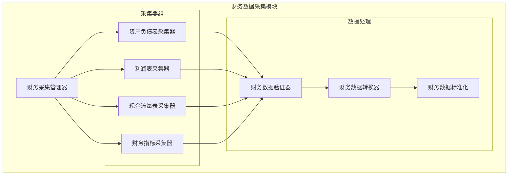

#### 2.2.3 核心接口设计

**财务报表采集接口**
```go
type FinancialReportCollector interface {
    // 采集资产负债表
    CollectBalanceSheet(symbol string, year int, quarter int) (*CollectResult, error)
    
    // 采集利润表
    CollectIncomeStatement(symbol string, year int, quarter int) (*CollectResult, error)
    
    // 采集现金流量表
    CollectCashFlow(symbol string, year int, quarter int) (*CollectResult, error)
    
    // 批量采集财务报表
    CollectBatch(symbols []string, year int, quarter int) (*CollectResult, error)
}
```

#### 2.2.4 业务流程时序图

**财务数据采集时序图**
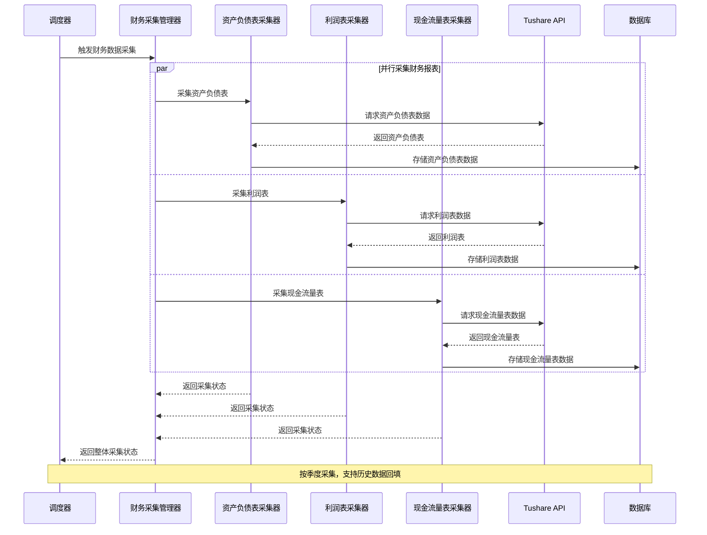

#### 2.2.5 技术限制和约束

**数据更新频率：**
- 季报数据：每季度末后1个月内更新
- 年报数据：每年4月30日前更新
- 历史数据回填：按年度分批处理

**数据质量控制：**
- 财务数据一致性校验
- 异常值检测和标记
- 数据完整性验证

### 2.3 新闻数据采集模块

#### 2.3.1 模块职责
- 采集财经新闻数据
- 采集公司公告信息
- 新闻内容文本清洗和结构化
- 支持关键词过滤和分类

#### 2.3.2 业务流程时序图

**新闻数据采集时序图**
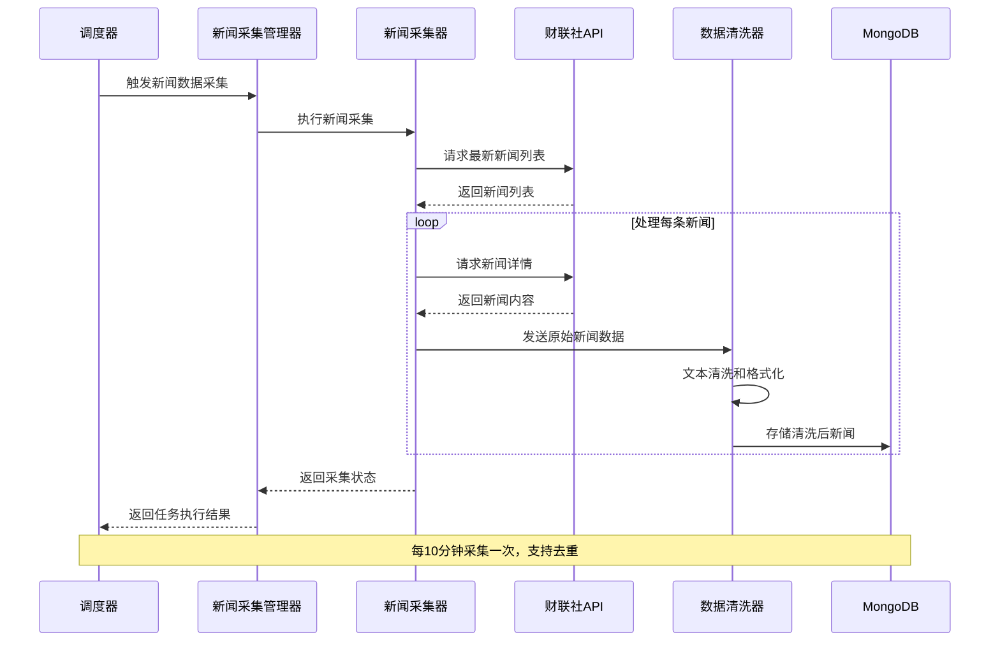

#### 2.3.3 技术限制和约束

**反爬虫处理：**
- 请求间隔控制：每次请求间隔2-5秒
- User-Agent轮换：模拟不同浏览器
- IP代理池：避免IP被封禁
- 验证码处理：自动识别和处理

**数据质量控制：**
- 新闻去重：基于标题和内容相似度
- 内容过滤：过滤广告和无关内容
- 文本清洗：去除HTML标签和特殊字符

### 2.4 市场数据采集模块

#### 2.4.1 模块职责
- 采集大盘指数数据（上证指数、深证成指、创业板指等）
- 采集行业指数数据（申万行业指数、中证行业指数等）
- 采集板块分类数据（概念板块、地域板块等）
- 采集指数成分股数据
- 支持指数历史数据回填和实时更新

#### 2.4.2 模块架构

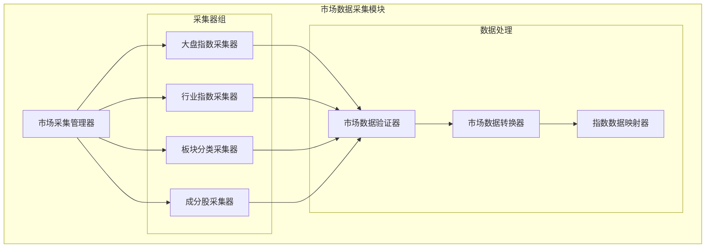

#### 2.4.3 核心接口设计

**大盘指数采集接口**
```go
type MarketIndexCollector interface {
    // 采集主要大盘指数数据
    CollectMainIndexes(date time.Time) (*CollectResult, error)
    
    // 采集指定指数的历史数据
    CollectIndexHistory(indexCode string, start, end time.Time) (*CollectResult, error)
    
    // 采集所有指数的最新数据
    CollectLatestIndexes() (*CollectResult, error)
}
```

**行业指数采集接口**
```go
type IndustryIndexCollector interface {
    // 采集申万行业指数
    CollectSWIndustryIndexes(date time.Time) (*CollectResult, error)
    
    // 采集中证行业指数
    CollectCSIIndustryIndexes(date time.Time) (*CollectResult, error)
    
    // 批量采集行业指数历史数据
    CollectIndustryHistory(industryCodes []string, start, end time.Time) (*CollectResult, error)
}
```

**板块分类采集接口**
```go
type SectorCollector interface {
    // 采集概念板块分类
    CollectConceptSectors() (*CollectResult, error)
    
    // 采集地域板块分类
    CollectRegionSectors() (*CollectResult, error)
    
    // 采集板块成分股
    CollectSectorStocks(sectorCode string) (*CollectResult, error)
}
```

#### 2.4.4 数据模型

**大盘指数数据模型**
```go
type MarketIndex struct {
    IndexCode   string    `json:"index_code" db:"index_code"`     // 指数代码
    IndexName   string    `json:"index_name" db:"index_name"`     // 指数名称
    TradeDate   time.Time `json:"trade_date" db:"trade_date"`     // 交易日期
    Open        string    `json:"open" db:"open"`                 // 开盘点数
    High        string    `json:"high" db:"high"`                 // 最高点数
    Low         string    `json:"low" db:"low"`                   // 最低点数
    Close       string    `json:"close" db:"close"`               // 收盘点数
    PreClose    string    `json:"pre_close" db:"pre_close"`       // 昨收点数
    Change      string    `json:"change" db:"change"`             // 涨跌点数
    PctChg      string    `json:"pct_chg" db:"pct_chg"`           // 涨跌幅(%)
    Vol         string    `json:"vol" db:"vol"`                   // 成交量(手)
    Amount      string    `json:"amount" db:"amount"`             // 成交额(千元)
    CreatedAt   time.Time `json:"created_at" db:"created_at"`     // 创建时间
    UpdatedAt   time.Time `json:"updated_at" db:"updated_at"`     // 更新时间
}
```

**行业指数数据模型**
```go
type IndustryIndex struct {
    IndexCode     string    `json:"index_code" db:"index_code"`         // 指数代码
    IndexName     string    `json:"index_name" db:"index_name"`         // 指数名称
    IndustryLevel string    `json:"industry_level" db:"industry_level"` // 行业级别(一级/二级/三级)
    ParentCode    string    `json:"parent_code" db:"parent_code"`       // 父级行业代码
    TradeDate     time.Time `json:"trade_date" db:"trade_date"`         // 交易日期
    Open          string    `json:"open" db:"open"`                     // 开盘点数
    High          string    `json:"high" db:"high"`                     // 最高点数
    Low           string    `json:"low" db:"low"`                       // 最低点数
    Close         string    `json:"close" db:"close"`                   // 收盘点数
    PreClose      string    `json:"pre_close" db:"pre_close"`           // 昨收点数
    Change        string    `json:"change" db:"change"`                 // 涨跌点数
    PctChg        string    `json:"pct_chg" db:"pct_chg"`               // 涨跌幅(%)
    CreatedAt     time.Time `json:"created_at" db:"created_at"`         // 创建时间
    UpdatedAt     time.Time `json:"updated_at" db:"updated_at"`         // 更新时间
}
```

**板块分类数据模型**
```go
type SectorClassification struct {
    SectorCode  string    `json:"sector_code" db:"sector_code"`   // 板块代码
    SectorName  string    `json:"sector_name" db:"sector_name"`   // 板块名称
    SectorType  string    `json:"sector_type" db:"sector_type"`   // 板块类型(概念/地域/风格)
    ParentCode  string    `json:"parent_code" db:"parent_code"`   // 父级板块代码
    Level       int       `json:"level" db:"level"`               // 板块层级
    IsActive    bool      `json:"is_active" db:"is_active"`       // 是否有效
    CreatedAt   time.Time `json:"created_at" db:"created_at"`     // 创建时间
    UpdatedAt   time.Time `json:"updated_at" db:"updated_at"`     // 更新时间
}
```

**板块成分股数据模型**
```go
type SectorStock struct {
    SectorCode  string    `json:"sector_code" db:"sector_code"`   // 板块代码
    StockCode   string    `json:"stock_code" db:"stock_code"`     // 股票代码
    StockName   string    `json:"stock_name" db:"stock_name"`     // 股票名称
    Weight      string    `json:"weight" db:"weight"`             // 权重(%)
    InDate      time.Time `json:"in_date" db:"in_date"`           // 纳入日期
    OutDate     *time.Time `json:"out_date" db:"out_date"`        // 剔除日期
    IsActive    bool      `json:"is_active" db:"is_active"`       // 是否有效
    CreatedAt   time.Time `json:"created_at" db:"created_at"`     // 创建时间
    UpdatedAt   time.Time `json:"updated_at" db:"updated_at"`     // 更新时间
}
```

#### 2.4.5 业务流程时序图

**大盘指数数据采集时序图**
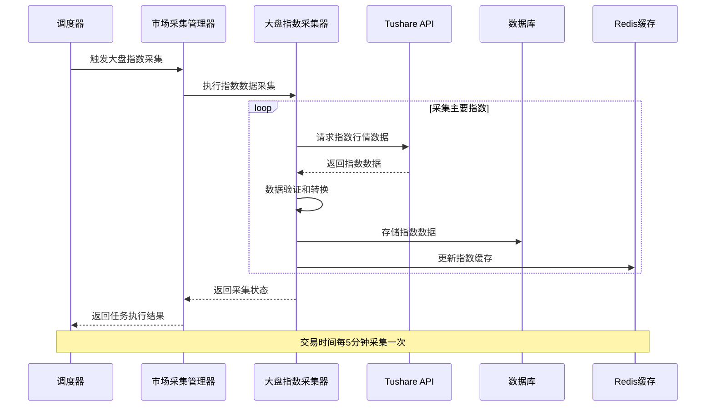

**行业指数数据采集时序图**
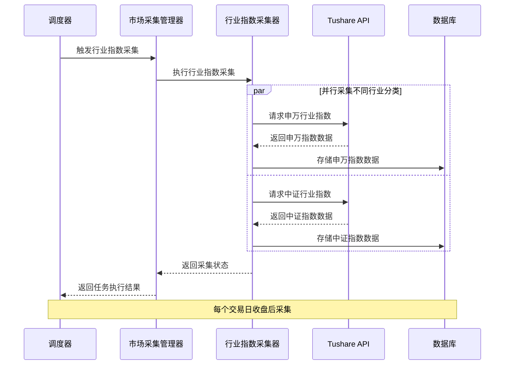

**板块分类数据采集时序图**
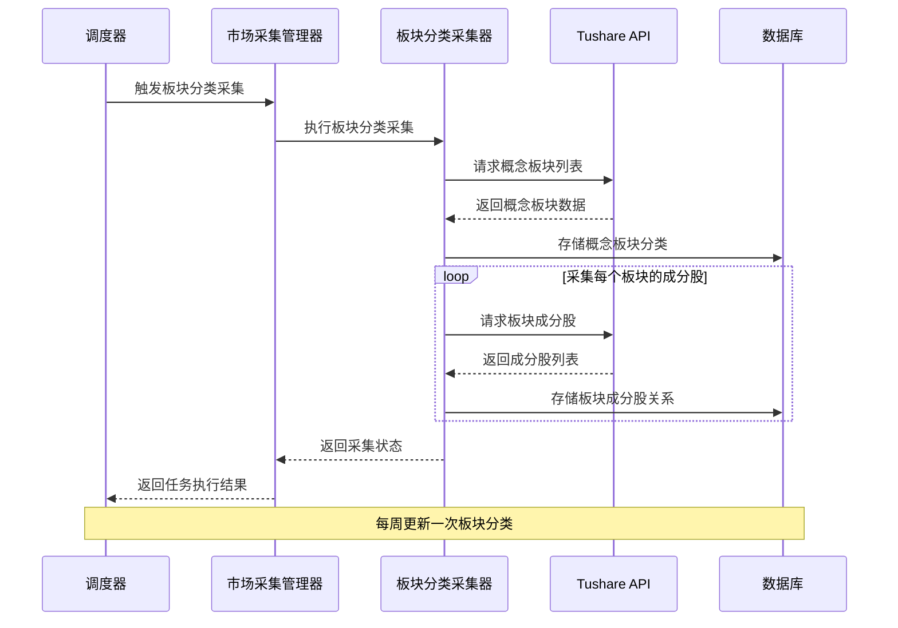

#### 2.4.6 技术限制和约束

**数据源限制：**
- Tushare Pro指数数据需要2000积分以上权限
- 部分行业指数数据需要5000积分权限
- 指数成分股数据更新频率为每月一次

**数据更新策略：**
- 大盘指数：交易时间每5分钟更新
- 行业指数：每个交易日收盘后更新
- 板块分类：每周更新一次
- 成分股调整：每月第一个交易日更新

**性能约束：**
- 单次指数数据采集不超过100个指数
- 历史数据回填按年度分批处理
- 板块成分股采集支持并发处理

### 2.5 政策数据采集模块

#### 2.5.1 模块职责
- 采集监管政策文件
- 采集央行货币政策信息
- 采集交易所规则变更
- 政策文本结构化处理

#### 2.5.2 业务流程时序图

**政策数据采集时序图**
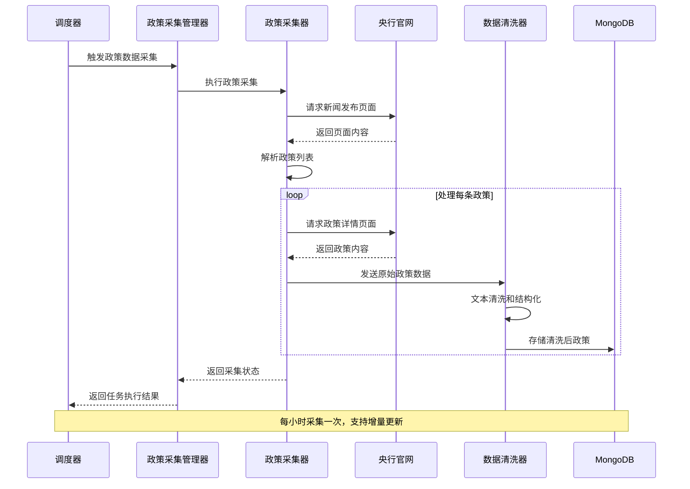

### 2.5 任务调度模块

#### 2.5.1 模块职责
- 定时触发数据采集任务

#### 2.5.2 模块架构

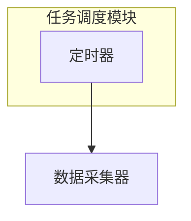

#### 2.5.3 调度策略

**定时任务配置：**
- 股票行情数据：每个交易日9:30-15:00，每5分钟采集一次
- 股票基础信息：交易日晚上7点采集
- 复权因子数据：交易日晚上7点采集
- 大盘指数数据：每个交易日9:30-15:00，每5分钟采集一次
- 行业指数数据：每个交易日收盘后采集
- 板块分类数据：每周一早上9点采集
- 板块成分股数据：每月第一个交易日采集
- 财务数据：每季度末后第一个工作日采集
- 新闻数据：每10分钟采集一次
- 政策数据：每小时采集一次

**失败处理策略：**
- 任务失败后不进行重试
- 失败任务等待下次定时执行
- 记录失败日志供后续分析

### 2.6 数据服务API模块

#### 2.6.1 模块职责
- 提供RESTful API接口
- 请求参数验证
- 响应数据格式化
- API访问控制

#### 2.6.2 核心API接口

**股票数据接口**
```
GET /api/v1/stocks                    # 获取股票列表
GET /api/v1/stocks/info               # 获取股票基本信息
GET /api/v1/stocks/quotes             # 获取股票行情数据
GET /api/v1/stocks/adj-factors        # 获取股票复权因子
POST /api/v1/stocks/init              # 全量股票基本数据初始化
```

**市场数据接口**
```
GET /api/v1/market/indexes            # 获取大盘指数数据
GET /api/v1/market/indexes/history    # 获取指数历史数据
GET /api/v1/market/industry-indexes   # 获取行业指数数据
GET /api/v1/market/sectors            # 获取板块分类数据
GET /api/v1/market/sector-stocks      # 获取板块成分股数据
POST /api/v1/market/init              # 初始化市场数据
```

**财务数据接口**
```
GET /api/v1/financial/reports         # 获取财务报表
GET /api/v1/financial/indicators      # 获取财务指标
```

**新闻数据接口**
```
GET /api/v1/news                      # 获取新闻列表
GET /api/v1/news/detail               # 获取新闻详情
```

**政策数据接口**
```
GET /api/v1/policies                  # 获取政策列表
```

## 3. 数据库设计

### 3.1 数据库架构

**MySQL数据库：** 存储结构化数据（股票、财务、市场数据）
**MongoDB数据库：** 存储非结构化数据（新闻、政策、社交媒体数据）
**Redis缓存：** 缓存热点数据和查询结果

### 3.2 MySQL表结构设计

**股票基本信息表 (stocks)**
```sql
CREATE TABLE stocks (
    id BIGINT AUTO_INCREMENT PRIMARY KEY,
    symbol VARCHAR(10) NOT NULL UNIQUE COMMENT '股票代码',
    ts_code VARCHAR(12) NOT NULL UNIQUE COMMENT 'Tushare代码',
    name VARCHAR(50) NOT NULL COMMENT '股票名称',
    area VARCHAR(20) COMMENT '地域',
    industry VARCHAR(50) COMMENT '行业',
    market VARCHAR(10) COMMENT '市场类型',
    list_date DATE COMMENT '上市日期',
    is_hs VARCHAR(1) COMMENT '是否沪深港通',
    created_at TIMESTAMP DEFAULT CURRENT_TIMESTAMP,
    updated_at TIMESTAMP DEFAULT CURRENT_TIMESTAMP ON UPDATE CURRENT_TIMESTAMP,
    INDEX idx_symbol (symbol),
    INDEX idx_ts_code (ts_code),
    INDEX idx_market (market),
    INDEX idx_industry (industry)
) ENGINE=InnoDB DEFAULT CHARSET=utf8mb4 COMMENT='股票基本信息表';
```

**股票行情数据表 (stock_quotes)**
```sql
CREATE TABLE stock_quotes (
    id BIGINT AUTO_INCREMENT PRIMARY KEY,
    symbol VARCHAR(10) NOT NULL COMMENT '股票代码',
    trade_date DATE NOT NULL COMMENT '交易日期',
    open DECIMAL(10,3) COMMENT '开盘价',
    high DECIMAL(10,3) COMMENT '最高价',
    low DECIMAL(10,3) COMMENT '最低价',
    close DECIMAL(10,3) COMMENT '收盘价',
    pre_close DECIMAL(10,3) COMMENT '昨收价',
    change_amount DECIMAL(10,3) COMMENT '涨跌额',
    pct_chg DECIMAL(8,4) COMMENT '涨跌幅(%)',
    vol BIGINT COMMENT '成交量(手)',
    amount DECIMAL(15,2) COMMENT '成交额(千元)',
    created_at TIMESTAMP DEFAULT CURRENT_TIMESTAMP,
    updated_at TIMESTAMP DEFAULT CURRENT_TIMESTAMP ON UPDATE CURRENT_TIMESTAMP,
    UNIQUE KEY uk_symbol_date (symbol, trade_date),
    INDEX idx_symbol (symbol),
    INDEX idx_trade_date (trade_date)
) ENGINE=InnoDB DEFAULT CHARSET=utf8mb4 COMMENT='股票行情数据表';
```

**股票复权因子表 (stock_adj_factors)**
```sql
CREATE TABLE stock_adj_factors (
    id BIGINT AUTO_INCREMENT PRIMARY KEY,
    ts_code VARCHAR(12) NOT NULL COMMENT '股票代码',
    trade_date DATE NOT NULL COMMENT '交易日期',
    adj_factor DECIMAL(12,6) NOT NULL COMMENT '复权因子',
    created_at TIMESTAMP DEFAULT CURRENT_TIMESTAMP,
    updated_at TIMESTAMP DEFAULT CURRENT_TIMESTAMP ON UPDATE CURRENT_TIMESTAMP,
    UNIQUE KEY uk_ts_code_date (ts_code, trade_date),
    INDEX idx_ts_code (ts_code),
    INDEX idx_trade_date (trade_date)
) ENGINE=InnoDB DEFAULT CHARSET=utf8mb4 COMMENT='股票复权因子表';
```

**大盘指数数据表 (market_indexes)**
```sql
CREATE TABLE market_indexes (
    id BIGINT AUTO_INCREMENT PRIMARY KEY,
    index_code VARCHAR(12) NOT NULL COMMENT '指数代码',
    index_name VARCHAR(50) NOT NULL COMMENT '指数名称',
    trade_date DATE NOT NULL COMMENT '交易日期',
    open DECIMAL(12,3) COMMENT '开盘点数',
    high DECIMAL(12,3) COMMENT '最高点数',
    low DECIMAL(12,3) COMMENT '最低点数',
    close DECIMAL(12,3) COMMENT '收盘点数',
    pre_close DECIMAL(12,3) COMMENT '昨收点数',
    change_amount DECIMAL(12,3) COMMENT '涨跌点数',
    pct_chg DECIMAL(8,4) COMMENT '涨跌幅(%)',
    vol BIGINT COMMENT '成交量(手)',
    amount DECIMAL(15,2) COMMENT '成交额(千元)',
    created_at TIMESTAMP DEFAULT CURRENT_TIMESTAMP,
    updated_at TIMESTAMP DEFAULT CURRENT_TIMESTAMP ON UPDATE CURRENT_TIMESTAMP,
    UNIQUE KEY uk_index_date (index_code, trade_date),
    INDEX idx_index_code (index_code),
    INDEX idx_trade_date (trade_date),
    INDEX idx_index_name (index_name)
) ENGINE=InnoDB DEFAULT CHARSET=utf8mb4 COMMENT='大盘指数数据表';
```

**行业指数数据表 (industry_indexes)**
```sql
CREATE TABLE industry_indexes (
    id BIGINT AUTO_INCREMENT PRIMARY KEY,
    index_code VARCHAR(12) NOT NULL COMMENT '指数代码',
    index_name VARCHAR(50) NOT NULL COMMENT '指数名称',
    industry_level VARCHAR(10) NOT NULL COMMENT '行业级别',
    parent_code VARCHAR(12) COMMENT '父级行业代码',
    trade_date DATE NOT NULL COMMENT '交易日期',
    open DECIMAL(12,3) COMMENT '开盘点数',
    high DECIMAL(12,3) COMMENT '最高点数',
    low DECIMAL(12,3) COMMENT '最低点数',
    close DECIMAL(12,3) COMMENT '收盘点数',
    pre_close DECIMAL(12,3) COMMENT '昨收点数',
    change_amount DECIMAL(12,3) COMMENT '涨跌点数',
    pct_chg DECIMAL(8,4) COMMENT '涨跌幅(%)',
    created_at TIMESTAMP DEFAULT CURRENT_TIMESTAMP,
    updated_at TIMESTAMP DEFAULT CURRENT_TIMESTAMP ON UPDATE CURRENT_TIMESTAMP,
    UNIQUE KEY uk_index_date (index_code, trade_date),
    INDEX idx_index_code (index_code),
    INDEX idx_trade_date (trade_date),
    INDEX idx_industry_level (industry_level),
    INDEX idx_parent_code (parent_code)
) ENGINE=InnoDB DEFAULT CHARSET=utf8mb4 COMMENT='行业指数数据表';
```

**板块分类表 (sector_classifications)**
```sql
CREATE TABLE sector_classifications (
    id BIGINT AUTO_INCREMENT PRIMARY KEY,
    sector_code VARCHAR(12) NOT NULL UNIQUE COMMENT '板块代码',
    sector_name VARCHAR(50) NOT NULL COMMENT '板块名称',
    sector_type VARCHAR(20) NOT NULL COMMENT '板块类型',
    parent_code VARCHAR(12) COMMENT '父级板块代码',
    level INT NOT NULL DEFAULT 1 COMMENT '板块层级',
    is_active BOOLEAN NOT NULL DEFAULT TRUE COMMENT '是否有效',
    created_at TIMESTAMP DEFAULT CURRENT_TIMESTAMP,
    updated_at TIMESTAMP DEFAULT CURRENT_TIMESTAMP ON UPDATE CURRENT_TIMESTAMP,
    INDEX idx_sector_code (sector_code),
    INDEX idx_sector_type (sector_type),
    INDEX idx_parent_code (parent_code),
    INDEX idx_level (level),
    INDEX idx_is_active (is_active)
) ENGINE=InnoDB DEFAULT CHARSET=utf8mb4 COMMENT='板块分类表';
```

**板块成分股表 (sector_stocks)**
```sql
CREATE TABLE sector_stocks (
    id BIGINT AUTO_INCREMENT PRIMARY KEY,
    sector_code VARCHAR(12) NOT NULL COMMENT '板块代码',
    stock_code VARCHAR(10) NOT NULL COMMENT '股票代码',
    stock_name VARCHAR(50) NOT NULL COMMENT '股票名称',
    weight DECIMAL(8,4) COMMENT '权重(%)',
    in_date DATE NOT NULL COMMENT '纳入日期',
    out_date DATE COMMENT '剔除日期',
    is_active BOOLEAN NOT NULL DEFAULT TRUE COMMENT '是否有效',
    created_at TIMESTAMP DEFAULT CURRENT_TIMESTAMP,
    updated_at TIMESTAMP DEFAULT CURRENT_TIMESTAMP ON UPDATE CURRENT_TIMESTAMP,
    UNIQUE KEY uk_sector_stock (sector_code, stock_code, in_date),
    INDEX idx_sector_code (sector_code),
    INDEX idx_stock_code (stock_code),
    INDEX idx_in_date (in_date),
    INDEX idx_is_active (is_active)
) ENGINE=InnoDB DEFAULT CHARSET=utf8mb4 COMMENT='板块成分股表';
```

### 3.3 MongoDB集合设计

**新闻数据集合 (news)**
```javascript
{
  "_id": ObjectId,
  "title": "快讯标题",
  "content": "快讯内容",
  "source": "财联社",
  "publish_time": ISODate,
  "url": "原文链接",
  "related_stocks": [
    {
      "code": "000001",
      "name": "平安银行"
    }
  ],
  "related_industries": ["银行", "金融"],
  "created_at": ISODate,
  "updated_at": ISODate
}
```

**政策数据集合 (policies)**
```javascript
{
  "_id": ObjectId,
  "title": "政策标题",
  "content": "政策内容",
  "source": "发布机构",
  "policy_type": "货币政策|监管政策|交易规则",
  "publish_time": ISODate,
  "effective_time": ISODate,
  "url": "原文链接",
  "keywords": ["关键词1", "关键词2"],
  "impact_level": "high|medium|low",
  "created_at": ISODate,
  "updated_at": ISODate
}
```

### 3.4 Redis缓存设计

**缓存策略：**
- 热点股票实时行情：TTL 5分钟
- 股票基础信息：TTL 24小时
- API查询结果：TTL 10分钟
- 用户会话信息：TTL 30分钟

**缓存键设计：**
```
stock:quote:{symbol}:{date}        # 股票行情数据
stock:basic:{symbol}               # 股票基础信息
api:result:{hash}                  # API查询结果缓存
```

## 4. 错误处理和监控

### 4.1 错误处理策略

#### 4.1.1 错误分类

**系统错误：**
- 网络连接错误
- 数据库连接错误
- 服务不可用错误

**业务错误：**
- 数据格式错误
- 参数验证错误
- 业务规则违反错误

**外部错误：**
- 数据源不可用
- 反爬虫限制
- API限流错误

#### 4.1.2 统一错误响应格式

```json
{
  "code": 40001,
  "message": "参数错误",
  "error": "symbol参数不能为空",
  "timestamp": "2024-01-20T10:00:00Z",
  "request_id": "req_123456789"
}
```

### 4.2 日志记录规范

#### 4.2.1 日志级别
- **DEBUG**：详细的调试信息
- **INFO**：一般信息记录
- **WARN**：警告信息
- **ERROR**：错误信息
- **FATAL**：致命错误

#### 4.2.2 结构化日志格式

```json
{
  "timestamp": "2024-01-20T10:00:00Z",
  "level": "INFO",
  "service": "data-collector",
  "module": "stock-collector",
  "trace_id": "trace_123456",
  "message": "股票数据采集完成",
  "fields": {
    "symbol": "000001",
    "count": 100,
    "duration": "2.5s"
  }
}
```

## 5. 部署和运维

### 5.1 工程目录结构

```
data-collector/
├── cmd/                    # 应用程序入口
│   └── server/            # 服务器启动程序
├── internal/              # 内部包（不对外暴露）
│   ├── collector/         # 数据采集模块
│   │   ├── stock/         # 股票数据采集器
│   │   ├── financial/     # 财务数据采集器
│   │   ├── news/          # 新闻数据采集器
│   │   └── policy/        # 政策数据采集器
│   ├── cleaner/           # 数据清洗模块
│   ├── storage/           # 数据存储模块
│   ├── api/               # API服务模块
│   ├── scheduler/         # 任务调度模块
│   ├── model/             # 数据模型
│   ├── config/            # 配置管理
│   └── common/            # 通用组件
├── pkg/                   # 公共包（可对外暴露）
├── configs/               # 配置文件
├── scripts/               # 脚本文件
├── docs/                  # 文档
├── test/                  # 测试文件
├── go.mod                 # Go模块文件
├── Dockerfile             # Docker构建文件
└── README.md              # 项目说明
```

### 5.2 配置管理

**环境配置：**
- development：开发环境
- testing：测试环境
- production：生产环境

**配置文件示例：**
```yaml
server:
  port: 8080
  mode: debug

database:
  mysql:
    host: localhost
    port: 3306
    username: root
    password: password
    database: qtrade
  mongodb:
    uri: mongodb://localhost:27017/qtrade
  redis:
    host: localhost
    port: 6379
    password: ""
    db: 0

tushare:
  tokens:
    - your_tushare_token_1
    - your_tushare_token_2
    - your_tushare_token_3
  rate_limit: 200
  timeout: 30s

scheduler:
  stock_quotes: "0 */5 9-15 * * 1-5"  # 交易时间每5分钟
  stock_basic: "0 0 16 * * 1-5"       # 每个交易日收盘后
  market_indexes: "0 */5 9-15 * * 1-5" # 大盘指数交易时间每5分钟
  industry_indexes: "0 0 16 * * 1-5"  # 行业指数每个交易日收盘后
  sector_classification: "0 0 9 * * 1" # 板块分类每周一早上9点
  sector_stocks: "0 0 9 1 * *"        # 板块成分股每月第一天
  financial: "0 0 9 1 */3 *"          # 每季度第一天
  news: "0 */10 * * * *"              # 每10分钟
  policy: "0 0 * * * *"               # 每小时
```

## 6. 附录

### 6.1 术语表

| 术语 | 英文 | 定义 |
|------|------|------|
| 股票行情 | Stock Quote | 股票的实时交易数据，包含价格、成交量、涨跌幅等信息 |
| 复权因子 | Adjustment Factor | 用于计算股票复权价格的系数 |
| PE比率 | Price-to-Earnings Ratio | 市盈率，股价与每股收益的比值 |
| PB比率 | Price-to-Book Ratio | 市净率，股价与每股净资产的比值 |
| ROE | Return on Equity | 净资产收益率 |
| ROA | Return on Assets | 总资产收益率 |
| 限流 | Rate Limiting | 控制请求频率的技术手段 |
| 熔断 | Circuit Breaker | 当服务异常时自动切断请求的保护机制 |

### 6.2 参考资料

1. [Golang官方文档](https://golang.org/doc/)
2. [Gin Web框架文档](https://gin-gonic.com/docs/)
3. [Tushare Pro API文档](https://tushare.pro/document/2)
4. [MySQL官方文档](https://dev.mysql.com/doc/)
5. [MongoDB官方文档](https://docs.mongodb.com/)
6. [Redis官方文档](https://redis.io/documentation)

### 6.3 变更记录

[2025-01-20] 新增 添加Tushare Pro API Token管理器设计，支持多token配置和自动轮换机制
[2025-01-20] 修改 更新错误处理策略，token相关错误时自动切换到下一个可用token
[2025-01-20] 优化 更新配置文件格式，支持多token配置和轮换参数设置
[2025-01-20] 修改 Token轮换策略从按请求次数轮换改为round robin算法，简化实现逻辑
[2025-01-20] 修复 将所有价格相关字段从float64改为string类型，避免浮点数精度丢失问题
[2025-01-20] 重构 重新组织文档结构，按功能模块清晰分层展示，每个模块包含职责、架构、接口、数据模型、时序图、技术限制和实现细节
[2025-01-20] 优化 将时序图整合到对应功能模块中，便于理解每个功能的具体实现流程
[2025-01-20] 修改 调整新闻数据模型以适配财联社快讯格式，优化关联股票和行业信息的数据结构
[2025-01-20] 新增 为每个模块添加详细的技术限制和约束条件说明
[2025-01-20] 改进 统一接口设计规范，提供完整的Go语言接口定义
[2025-01-20] 完善 补充数据模型的详细字段定义和数据库表结构设计
[2025-01-20] 新增 添加市场数据采集模块，包含大盘指数、行业指数、板块分类和成分股数据采集功能