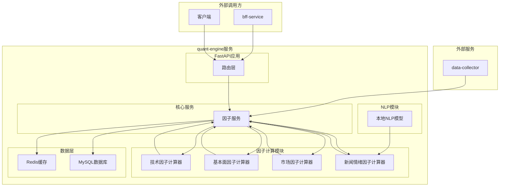
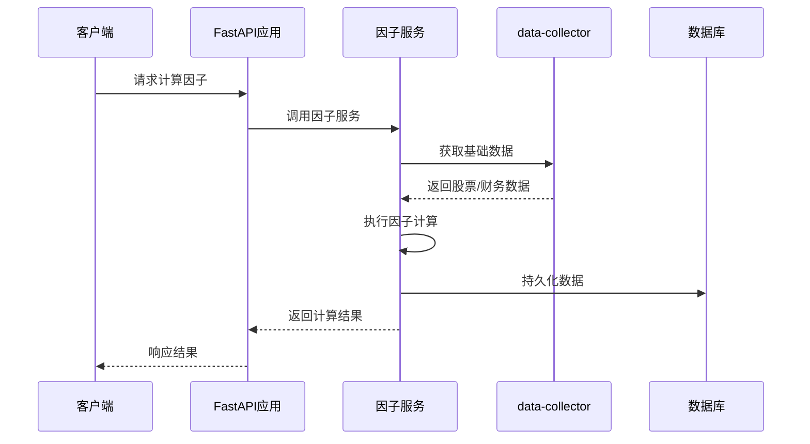
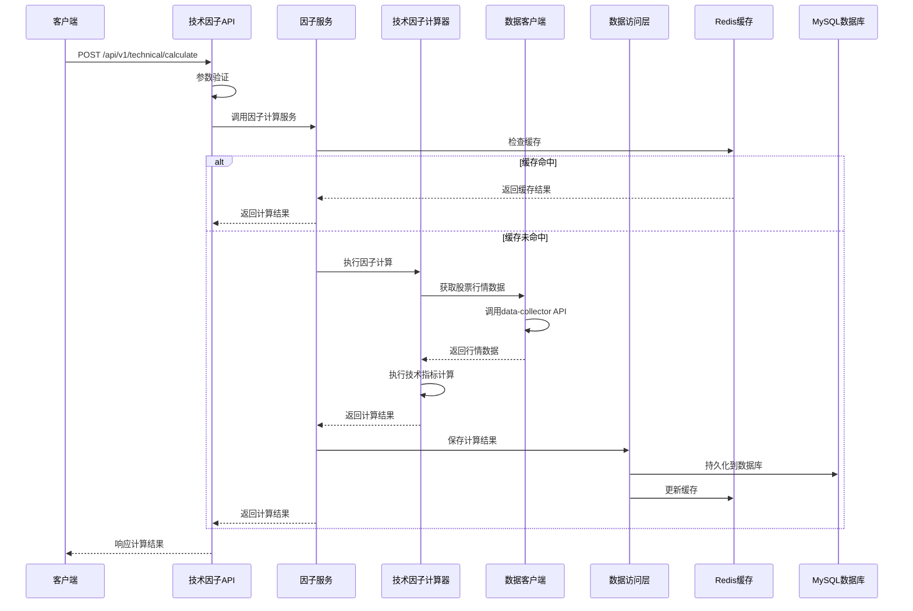
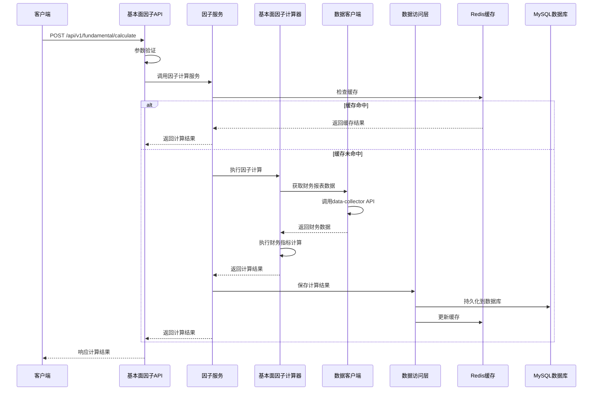
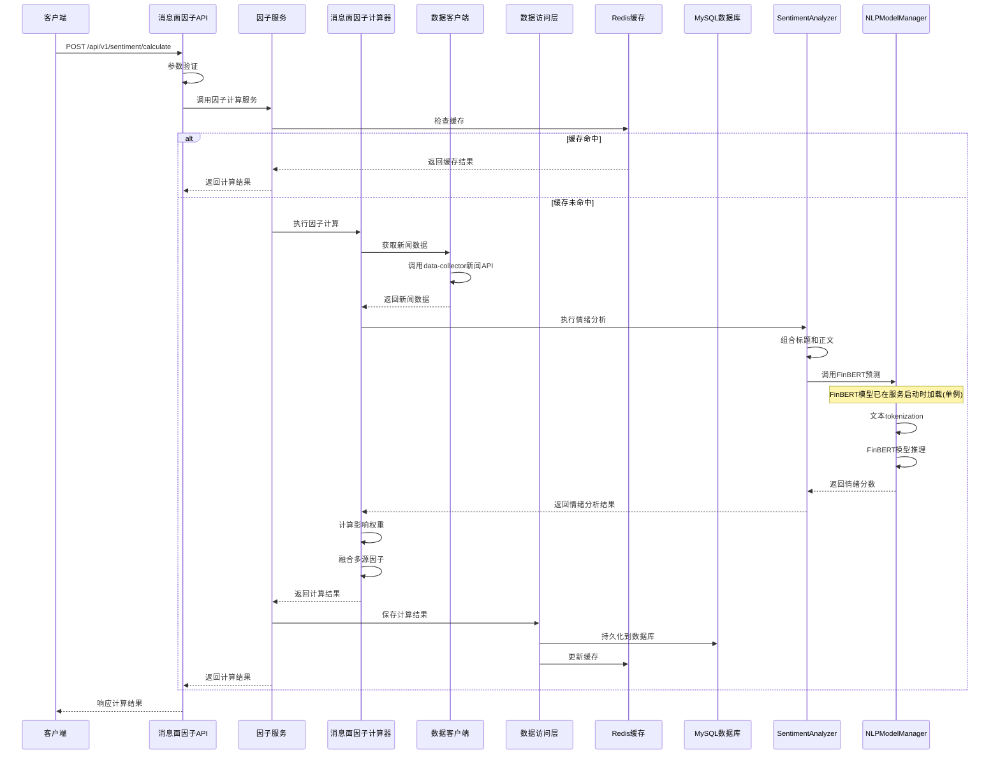
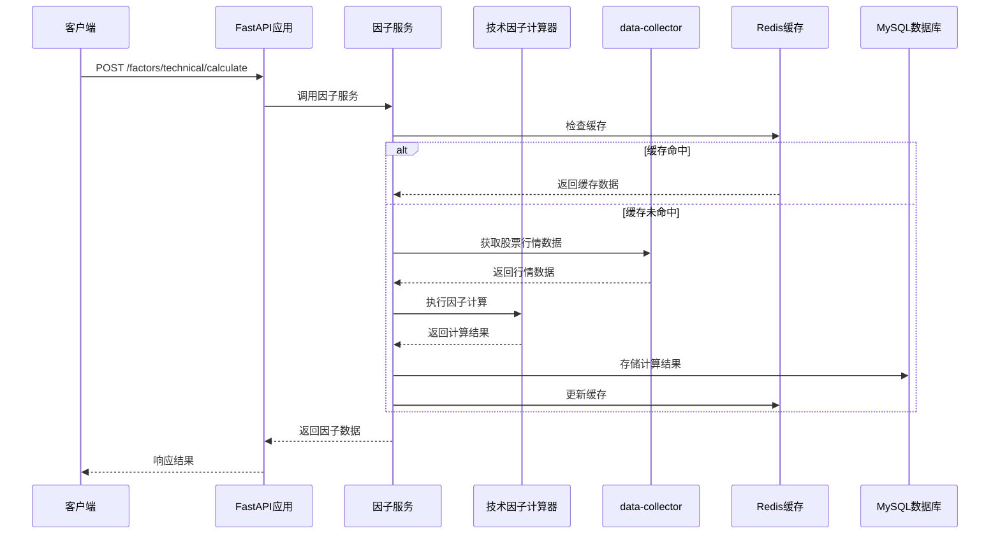

# 后端系统设计文档

# 因子计算引擎 - 迭代2：核心因子计算功能

## 0. 现有系统分析

### 0.1 现有架构分析

**quant-engine服务现状：**
- 项目结构：Python项目，使用pyproject.toml管理依赖
- 技术栈：Python 3.11+
- 当前状态：基础框架搭建，factor-engine目录为空
- 架构模式：微服务架构，与data-collector、bff-service协同工作，内置本地NLP模型进行情绪分析

**data-collector服务分析：**
- 技术栈：Golang + Gin框架
- 数据存储：MySQL（股票、财务数据）+ MongoDB（新闻、政策数据）+ Redis（缓存）
- 数据模型：已定义完整的股票、财务、新闻数据模型
- API接口：提供RESTful API，支持新闻数据查询和情绪分析

### 0.2 现有组件清单

**可复用的data-collector组件：**
- 股票基础数据API：`/api/v1/stocks`
- 股票行情数据API：`/api/v1/stock-quotes`
- 财务报表数据API：`/api/v1/financial-reports`
- 财务指标数据API：`/api/v1/financial-indicators`
- 新闻数据API：`/api/v1/news`
- 复权因子数据API：`/api/v1/adj-factors`

**现有数据模型：**
- StockBasic：股票基础信息
- StockQuote：股票行情数据
- FinancialReport：财务报表数据
- FinancialIndicator：财务指标数据
- News：新闻数据（包含关联股票信息）

### 0.3 架构约束识别

**技术栈约束：**
- quant-engine使用Python技术栈，需保持一致性
- 数据存储复用现有基础设施（MySQL + MongoDB + Redis）
- 服务间通信使用HTTP协议

**数据约束：**
- 股票和财务数据存储在MySQL中
- 新闻数据存储在MongoDB中
- 因子计算结果需要高效存储和查询
- 数据更新频率：股票行情（实时）、财务数据（季度）、新闻数据（实时）

**性能约束：**
- 因子计算需要支持批量处理
- API响应时间要求：< 2秒
- 支持并发计算和查询

### 0.4 演进策略

**渐进式开发策略：**
1. **第一阶段**：建立基础架构和技术因子计算
2. **第二阶段**：实现基本面因子和市场因子计算
3. **第三阶段**：集成新闻情绪因子计算（使用本地NLP模型）
4. **第四阶段**：优化性能和扩展功能

**架构演进原则：**
- 保持与现有微服务架构的一致性
- 复用data-collector的数据接口
- 采用模块化设计，便于功能扩展
- 确保数据一致性和计算准确性

## 1. 系统架构概览

### 1.1 整体架构图



### 1.2 核心模块概述

**FastAPI路由层**
- 统一的HTTP API入口
- 请求路由和参数验证
- 基础的认证和错误处理

**因子计算模块**
- 技术因子计算器：MA、RSI、MACD等技术指标
- 基本面因子计算器：ROE、ROA、PE等财务指标
- 市场因子计算器：市值、流通市值、换手率等
- 消息面因子计算器：基于新闻情绪分析的因子，使用内置本地NLP模型进行情绪识别

**核心服务**
- 因子服务：统一管理因子计算、存储和查询功能，协调各因子计算器执行，处理数据持久化和缓存

### 1.3 技术栈选型

**开发语言：** Python 3.11+
**Web框架：** FastAPI（高性能、自动文档生成）
**数据处理：** Pandas、NumPy（数据分析和计算）
**NLP处理：** 
- transformers（预训练模型，使用FinBERT）
- torch（深度学习框架，FinBERT运行依赖）
**数据库：** 
- MySQL（因子数据存储）
- Redis（缓存和临时数据）
**HTTP客户端：** httpx（异步HTTP请求）
**任务调度：** APScheduler（定时任务）
**配置管理：** Pydantic Settings
**日志：** structlog
**测试：** pytest

### 1.4 代码组织结构

```
quant-engine/
├── main.py                          # quant-engine服务主入口
├── pyproject.toml                   # 项目依赖配置
├── README.md                        # 项目说明文档
├── .python-version                  # Python版本配置
├── src/
│   ├── config/                      # 全局配置管理
│   │   ├── __init__.py
│   │   ├── settings.py              # 配置管理
│   │   └── database.py              # 数据库配置
│   ├── api/                         # 全局API路由
│   │   ├── __init__.py
│   │   ├── deps.py                  # 依赖注入
│   │   ├── main_router.py           # 主路由
│   │   └── v1/
│   │       └── __init__.py
│   ├── clients/                     # 外部服务客户端
│   │   ├── __init__.py
│   │   └── data_collector.py        # data-collector客户端
│   ├── nlp/                         # NLP处理模块
│   │   ├── __init__.py
│   │   ├── sentiment_analyzer.py    # 情绪分析器
│   │   └── models.py                # NLP模型管理
│   ├── utils/                       # 通用工具
│   │   ├── __init__.py
│   │   ├── logger.py                # 日志工具
│   │   ├── exceptions.py            # 异常定义
│   │   ├── validators.py            # 数据验证
│   │   ├── cache.py                 # 缓存工具
│   │   └── helpers.py               # 辅助函数
│   ├── dao/                         # 全局数据访问层
│   │   ├── __init__.py
│   │   ├── mysql_dao.py             # MySQL数据访问
│   │   └── redis_dao.py             # Redis缓存访问
│   └── factor-engine/               # 因子计算引擎模块
│       ├── __init__.py
│       ├── api/
│       │   ├── __init__.py
│       │   ├── router.py            # 因子模块路由
│       │   └── v1/
│       │       ├── __init__.py
│       │       ├── technical.py     # 技术因子API
│       │       ├── fundamental.py  # 基本面因子API
│       │       ├── market.py        # 市场因子API
│       │       ├── sentiment.py    # 消息面因子API
│       │       └── batch.py         # 批量计算API
│       ├── services/
│       │   ├── __init__.py
│       │   └── factor_service.py    # 统一因子服务
│       ├── calculators/
│       │   ├── __init__.py
│       │   ├── base.py              # 基础计算器抽象类
│       │   ├── technical.py         # 技术因子计算器
│       │   ├── fundamental.py      # 基本面因子计算器
│       │   ├── market.py            # 市场因子计算器
│       │   └── sentiment.py         # 消息面因子计算器
│       ├── dao/
│       │   ├── __init__.py
│       │   └── factor_dao.py        # 因子数据访问
│       └── models/
│           ├── __init__.py
│           ├── database.py          # 数据库模型
│           ├── schemas.py           # Pydantic模型
│           └── enums.py             # 枚举定义
├── tests/
│   ├── __init__.py
│   ├── conftest.py                  # pytest配置
│   ├── test_common/                 # 通用组件测试
│   │   ├── __init__.py
│   │   ├── test_clients/
│   │   │   ├── __init__.py
│   │   │   └── test_data_collector.py
│   │   ├── test_nlp/
│   │   │   ├── __init__.py
│   │   │   └── test_sentiment_analyzer.py
│   │   ├── test_utils/
│   │   │   ├── __init__.py
│   │   │   ├── test_cache.py
│   │   │   └── test_validators.py
│   │   └── test_dao/
│   │       ├── __init__.py
│   │       ├── test_mysql_dao.py
│   │       └── test_redis_dao.py
│   └── test_factor_engine/
│       ├── __init__.py
│       ├── test_api/
│       │   ├── __init__.py
│       │   ├── test_technical.py
│       │   ├── test_fundamental.py
│       │   ├── test_market.py
│       │   └── test_sentiment.py
│       ├── test_calculators/
│       │   ├── __init__.py
│       │   ├── test_technical.py
│       │   ├── test_fundamental.py
│       │   ├── test_market.py
│       │   └── test_sentiment.py
│       ├── test_dao/
│       │   ├── __init__.py
│       │   └── test_factor_dao.py
│       └── test_services/
│           ├── __init__.py
│           └── test_factor_service.py
└── scripts/
    ├── init_db.py                   # 数据库初始化脚本
    ├── migrate.py                   # 数据迁移脚本
    └── seed_data.py                 # 测试数据生成
```

**目录说明：**

**全局基础组件（src/根目录）：**
- **config/**: 全局配置管理，包括数据库配置、应用设置等
- **api/**: 全局API路由管理，统一的依赖注入和主路由
- **clients/**: 外部服务客户端，封装与其他微服务的通信
- **nlp/**: NLP处理模块，包含情绪分析器和模型管理，可被多个业务模块复用
- **utils/**: 通用工具函数，包括缓存工具、日志、异常处理、数据验证等
- **dao/**: 全局数据访问层，封装MySQL和Redis的基础操作

**业务模块（src/factor-engine/）：**
- **api/**: 因子计算相关的HTTP API接口层，按功能模块划分
- **services/**: 因子业务服务层，统一管理因子计算、存储和查询逻辑
- **calculators/**: 因子计算器，实现具体的计算算法
- **dao/**: 因子专用数据访问层，基于全局DAO实现因子特定的数据操作
- **models/**: 因子相关的数据模型定义，包括数据库模型和API模型

**测试和脚本：**
- **tests/**: 测试代码，分为通用组件测试和因子引擎测试
- **scripts/**: 运维脚本和工具

**架构说明：**
- **main.py**: quant-engine服务的主入口，集成所有业务模块
- **分层架构**: API层 → Services层 → DAO层 → 数据库/缓存，清晰的分层职责
- **模块化设计**: 基础组件与业务模块分离，便于复用和扩展
- **DAO层职责**: 全局DAO提供基础数据操作，业务DAO实现特定业务逻辑
- **数据流**: 计算器计算因子 → 通过DAO层存储到MySQL → 同时更新Redis缓存 → 查询时优先从缓存获取
- **可扩展性**: 新增业务模块可直接复用基础组件，如config、clients、nlp、utils等

### 1.5 数据流概览



## 2. 业务功能设计

### 2.1 技术因子计算功能

#### 2.1.1 功能概述
技术因子计算功能提供股票技术指标的计算服务，包括移动平均线、RSI、MACD、布林带等常用技术指标。支持单股票计算和批量计算，提供实时计算和历史数据查询。

#### 2.1.2 业务流程



#### 2.1.3 API接口设计

**计算技术因子**
```http
POST /api/v1/technical/calculate
Content-Type: application/json

{
  "stock_code": "000001",
  "factors": ["MA5", "MA10", "RSI", "MACD"],
  "end_date": "2024-01-15",
  "period": 20
}
```

**响应格式**
```json
{
  "code": 200,
  "message": "success",
  "data": {
    "stock_code": "000001",
    "calculation_date": "2024-01-15",
    "factors": {
      "MA5": 12.45,
      "MA10": 12.38,
      "RSI": 65.2,
      "MACD": {
        "dif": 0.15,
        "dea": 0.12,
        "histogram": 0.03
      }
    }
  }
}
```

**批量计算技术因子**
```http
POST /api/v1/technical/batch-calculate
Content-Type: application/json

{
  "stock_codes": ["000001", "000002", "600000"],
  "factors": ["MA5", "MA10", "RSI"],
  "end_date": "2024-01-15"
}
```

**查询历史技术因子**
```http
GET /api/v1/technical/history?stock_code=000001&factor=MA5&start_date=2024-01-01&end_date=2024-01-15
```

#### 2.1.4 核心组件设计

**技术因子计算器**
```python
class TechnicalFactorCalculator:
    def __init__(self, data_client: DataCollectorClient):
        self.data_client = data_client
    
    async def calculate_ma(self, stock_code: str, period: int, end_date: str = None) -> float:
        """计算移动平均线"""
        pass
    
    async def calculate_rsi(self, stock_code: str, period: int = 14, end_date: str = None) -> float:
        """计算RSI指标"""
        pass
    
    async def calculate_macd(self, stock_code: str, end_date: str = None) -> Dict[str, float]:
        """计算MACD指标"""
        pass
    
    def _calculate_ema(self, prices: List[float], period: int) -> float:
        """计算指数移动平均"""
        pass
```

**因子服务层**
```python
class FactorService:
    def __init__(self, calculator: TechnicalFactorCalculator, dao: FactorDAO, cache: RedisDAO):
        self.calculator = calculator
        self.dao = dao
        self.cache = cache
    
    async def calculate_technical_factors(
        self, 
        stock_code: str, 
        factors: List[str], 
        end_date: str = None
    ) -> Dict[str, Any]:
        """计算技术因子"""
        pass
```

#### 2.1.5 数据模型

**数据库表结构**
```sql
CREATE TABLE technical_factors (
    id BIGINT AUTO_INCREMENT PRIMARY KEY,
    stock_code VARCHAR(10) NOT NULL COMMENT '股票代码',
    factor_name VARCHAR(20) NOT NULL COMMENT '因子名称',
    factor_value DECIMAL(15,6) NOT NULL COMMENT '因子值',
    calculation_date DATE NOT NULL COMMENT '计算日期',
    created_at TIMESTAMP DEFAULT CURRENT_TIMESTAMP,
    updated_at TIMESTAMP DEFAULT CURRENT_TIMESTAMP ON UPDATE CURRENT_TIMESTAMP,
    INDEX idx_stock_factor_date (stock_code, factor_name, calculation_date),
    INDEX idx_calculation_date (calculation_date)
) COMMENT='技术因子数据表';
```

**Pydantic模型**
```python
class TechnicalFactorRequest(BaseModel):
    stock_code: str = Field(..., description="股票代码")
    factors: List[str] = Field(..., description="因子列表")
    end_date: Optional[str] = Field(None, description="计算截止日期")
    period: Optional[int] = Field(20, description="计算周期")

class TechnicalFactorResponse(BaseModel):
    stock_code: str
    calculation_date: str
    factors: Dict[str, Union[float, Dict[str, float]]]

class TechnicalFactor(BaseModel):
    id: int
    stock_code: str
    factor_name: str
    factor_value: float
    calculation_date: date
    created_at: datetime
    updated_at: datetime
```

#### 2.1.6 数据访问层

```python
class FactorDAO:
    async def save_factor_values(self, factor_type: str, stock_code: str, factor_data: Dict) -> bool:
        """保存因子计算结果"""
        pass
    
    async def get_factor_history(
        self, 
        stock_code: str, 
        factor_name: str, 
        start_date: str, 
        end_date: str
    ) -> List[Dict]:
        """查询因子历史数据"""
        pass
```

### 2.2 基本面因子计算功能

#### 2.2.1 功能概述
基本面因子计算功能基于公司财务报表数据，计算反映公司经营状况的各类财务指标，包括盈利能力、成长能力、偿债能力、运营能力等维度的因子。支持季度和年度数据计算，提供同比和环比分析。

#### 2.2.2 业务流程



#### 2.2.3 API接口设计

**计算基本面因子**
```http
POST /api/v1/fundamental/calculate
Content-Type: application/json

{
  "stock_code": "000001",
  "factors": ["ROE", "ROA", "GROSS_MARGIN", "DEBT_RATIO"],
  "period": "2023Q3",
  "report_type": "quarterly"
}
```

**响应格式**
```json
{
  "code": 200,
  "message": "success",
  "data": {
    "stock_code": "000001",
    "period": "2023Q3",
    "report_type": "quarterly",
    "factors": {
      "ROE": 0.1245,
      "ROA": 0.0856,
      "GROSS_MARGIN": 0.3421,
      "DEBT_RATIO": 0.4567
    },
    "growth_rates": {
      "ROE_YOY": 0.0234,
      "ROA_YOY": 0.0156
    }
  }
}
```

**批量计算基本面因子**
```http
POST /api/v1/fundamental/batch-calculate
Content-Type: application/json

{
  "stock_codes": ["000001", "000002", "600000"],
  "factors": ["ROE", "ROA", "DEBT_RATIO"],
  "period": "2023Q3"
}
```

**查询历史基本面因子**
```http
GET /api/v1/fundamental/history?stock_code=000001&factor=ROE&start_period=2022Q1&end_period=2023Q3
```

#### 2.2.4 核心组件设计

**基本面因子计算器**
```python
class FundamentalFactorCalculator:
    def __init__(self, data_client: DataCollectorClient):
        self.data_client = data_client
    
    async def calculate_roe(self, stock_code: str, period: str) -> float:
        """计算净资产收益率 ROE = 净利润 / 平均股东权益"""
        pass
    
    async def calculate_roa(self, stock_code: str, period: str) -> float:
        """计算总资产收益率 ROA = 净利润 / 平均总资产"""
        pass
    
    async def calculate_gross_margin(self, stock_code: str, period: str) -> float:
        """计算毛利率 = (营业收入 - 营业成本) / 营业收入"""
        pass
    
    async def calculate_debt_ratio(self, stock_code: str, period: str) -> float:
        """计算资产负债率 = 总负债 / 总资产"""
        pass
    
    async def calculate_growth_rates(self, stock_code: str, current_period: str, factors: List[str]) -> Dict[str, float]:
        """计算同比增长率"""
        pass
    
    def _get_previous_year_period(self, period: str) -> str:
        """获取上年同期"""
        pass
    
    async def _get_factor_value(self, stock_code: str, period: str, factor: str) -> float:
        """获取指定因子值"""
        pass
```

**因子服务层**
```python
class FundamentalFactorService:
    def __init__(self, calculator: FundamentalFactorCalculator, dao: FactorDAO, cache: RedisDAO):
        self.calculator = calculator
        self.dao = dao
        self.cache = cache
    
    async def calculate_fundamental_factors(
        self, 
        stock_code: str, 
        factors: List[str], 
        period: str,
        report_type: str = "quarterly"
    ) -> Dict[str, Any]:
        """计算基本面因子"""
        pass
```

#### 2.2.5 数据模型

**数据库表结构**
```sql
CREATE TABLE fundamental_factors (
    id BIGINT AUTO_INCREMENT PRIMARY KEY,
    stock_code VARCHAR(10) NOT NULL COMMENT '股票代码',
    factor_name VARCHAR(30) NOT NULL COMMENT '因子名称',
    factor_value DECIMAL(15,6) NOT NULL COMMENT '因子值',
    period VARCHAR(10) NOT NULL COMMENT '报告期(如2023Q3)',
    report_type ENUM('quarterly', 'annual') NOT NULL COMMENT '报告类型',
    created_at TIMESTAMP DEFAULT CURRENT_TIMESTAMP,
    updated_at TIMESTAMP DEFAULT CURRENT_TIMESTAMP ON UPDATE CURRENT_TIMESTAMP,
    INDEX idx_stock_factor_period (stock_code, factor_name, period),
    INDEX idx_period (period)
) COMMENT='基本面因子数据表';
```

**Pydantic模型**
```python
class FundamentalFactorRequest(BaseModel):
    stock_code: str = Field(..., description="股票代码")
    factors: List[str] = Field(..., description="因子列表")
    period: str = Field(..., description="报告期")
    report_type: str = Field("quarterly", description="报告类型")

class FundamentalFactorResponse(BaseModel):
    stock_code: str
    period: str
    report_type: str
    factors: Dict[str, float]
    growth_rates: Dict[str, float]

class FundamentalFactor(BaseModel):
    id: int
    stock_code: str
    factor_name: str
    factor_value: float
    period: str
    report_type: str
    created_at: datetime
    updated_at: datetime
```

#### 2.2.6 数据访问层

```python
class FundamentalFactorDAO:
    async def save_factor_values(self, factor_type: str, stock_code: str, factor_data: Dict) -> bool:
        """保存基本面因子计算结果"""
        try:
            records = []
            
            # 保存基本因子
            for factor_name, factor_value in factor_data["factors"].items():
                records.append({
                    "stock_code": stock_code,
                    "factor_name": factor_name,
                    "factor_value": factor_value,
                    "period": factor_data["period"],
                    "report_type": factor_data["report_type"]
                })
            
            # 保存增长率
            for growth_name, growth_value in factor_data["growth_rates"].items():
                records.append({
                    "stock_code": stock_code,
                    "factor_name": growth_name,
                    "factor_value": growth_value,
                    "period": factor_data["period"],
                    "report_type": factor_data["report_type"]
                })
            
            await self.mysql_dao.insert_factor_batch("fundamental_factors", records)
            return True
        except Exception as e:
            logger.error(f"保存基本面因子失败: {e}")
            return False
    
    async def get_factor_history(
        self, 
        stock_code: str, 
        factor_name: str, 
        start_period: str, 
        end_period: str
    ) -> List[Dict]:
        """查询基本面因子历史数据"""
        conditions = {
            "stock_code": stock_code,
            "factor_name": factor_name,
            "period": {"between": [start_period, end_period]}
        }
        return await self.mysql_dao.query_factors("fundamental_factors", conditions, "period ASC")
```

### 2.4 市场因子计算模块

#### 2.4.1 模块职责
- 计算市值因子（总市值、流通市值）
- 计算流动性因子（换手率、成交量比率）
- 计算波动率因子（价格波动率、收益率波动率）
- 计算动量因子（价格动量、收益率动量）

#### 2.3.2 核心接口设计

```python
class MarketFactorCalculator:
    async def calculate_market_cap(self, stock_code: str, trade_date: str) -> float:
        """计算市值"""
        pass
    
    async def calculate_turnover_rate(self, stock_code: str, period: int) -> float:
        """计算换手率"""
        pass
```

### 2.3 消息面因子计算功能

#### 2.3.1 功能概述
消息面因子计算功能通过分析新闻、公告、政策等多源信息，计算股票的消息面情绪因子。该功能整合文本情绪分析、影响权重评估和多源数据融合，为量化交易提供消息面维度的决策支持。

#### 2.3.2 业务流程



#### 2.3.3 API接口设计

**计算消息面因子**
```http
POST /api/v1/sentiment/calculate
Content-Type: application/json

{
  "stock_code": "000001",
  "date": "2023-10-15",
  "sources": ["news", "announcements", "policies"],
  "time_window": 7
}
```

**响应格式**
```json
{
  "code": 200,
  "message": "success",
  "data": {
    "stock_code": "000001",
    "date": "2023-10-15",
    "sentiment_factors": {
      "news_sentiment": 0.65,
      "announcement_impact": 0.78,
      "policy_impact": 0.45,
      "composite_sentiment": 0.62
    },
    "source_weights": {
      "news": 0.4,
      "announcements": 0.4,
      "policies": 0.2
    },
    "data_counts": {
      "news_count": 15,
      "announcement_count": 3,
      "policy_count": 2
    }
  }
}
```

**批量计算消息面因子**
```http
POST /api/v1/sentiment/batch-calculate
Content-Type: application/json

{
  "stock_codes": ["000001", "000002", "600000"],
  "date": "2023-10-15",
  "time_window": 7
}
```

**查询历史消息面因子**
```http
GET /api/v1/sentiment/history?stock_code=000001&start_date=2023-10-01&end_date=2023-10-15
```

#### 2.3.4 核心组件设计

**新闻情绪因子计算器**
```python
class SentimentFactorCalculator:
    def __init__(self, data_client: DataCollectorClient):
        self.data_client = data_client
        self.sentiment_analyzer = SentimentAnalyzer()
        self.nlp_model = NLPModelManager()
    
    async def calculate_news_sentiment(self, stock_code: str, date: str, time_window: int = 7) -> float:
        """计算新闻情绪因子"""
        # 1. 从data-collector获取新闻原始文本数据
        news_data = await self.data_client.get_news_by_stock(
            stock_code=stock_code,
            start_date=date - timedelta(days=time_window),
            end_date=date
        )
        
        if not news_data:
            return 0.5  # 中性情绪
        
        total_score = 0.0
        total_weight = 0.0
        
        for news in news_data:
            # 2. 使用本地NLP模型进行情绪识别
            sentiment_result = await self.sentiment_analyzer.analyze_sentiment(
                text=news['content'],
                title=news['title']
            )
            
            # 3. 计算权重
            time_weight = self._calculate_time_weight(news['publish_time'], date)
            media_weight = self._calculate_media_weight(news['source'])
            confidence_weight = sentiment_result['confidence']
            
            # 4. 计算加权得分
            weighted_score = (
                sentiment_result['sentiment_score'] * 
                confidence_weight * 
                time_weight * 
                media_weight
            )
            
            total_score += weighted_score
            total_weight += confidence_weight * time_weight * media_weight
        
        # 5. 归一化处理
        if total_weight > 0:
            return total_score / total_weight
        else:
            return 0.5  # 中性情绪
    
    def _calculate_time_weight(self, publish_time: datetime, current_date: str) -> float:
        """计算时间权重，越新的新闻权重越高"""
        current_dt = datetime.strptime(current_date, '%Y-%m-%d')
        days_diff = (current_dt - publish_time).days
        return max(0.1, 1.0 - days_diff * 0.1)  # 每天衰减10%
    
    def _calculate_media_weight(self, source: str) -> float:
        """计算媒体权重"""
        # 根据媒体影响力设置权重
        media_weights = {
            '新华社': 1.0,
            '人民日报': 1.0,
            '央视新闻': 0.9,
            '财经网': 0.8,
            '新浪财经': 0.7,
            '腾讯财经': 0.7,
            '其他': 0.5
        }
        return media_weights.get(source, 0.5)
```

**情绪分析器**
```python
class SentimentAnalyzer:
    def __init__(self):
        self.model_manager = NLPModelManager()
        
    async def analyze_sentiment(self, text: str, title: str = None) -> Dict[str, float]:
        """分析文本情绪，返回情绪分数和置信度"""
        # 1. 组合标题和正文
        full_text = text
        if title:
            # 标题权重更高，放在前面
            full_text = f"{title} {text}"
        
        # 2. 使用FinBERT模型进行情绪分析
        sentiment_result = await self.model_manager.predict_sentiment(full_text)
        
        # 3. 直接返回FinBERT的分析结果
        final_score = sentiment_result['score']
        confidence = sentiment_result['confidence']
        
        return {
            'sentiment_score': final_score,
            'confidence': confidence
        }
    
    def _lexicon_based_analysis(self, text: str) -> float:
        """基于词典的情绪分析"""
        words = self.text_processor.segment(text)
        positive_score = 0.0
        negative_score = 0.0
        
        for i, word in enumerate(words):
            # 检查积极词汇
            if word in self.positive_words:
                degree = self._get_degree_modifier(words, i)
                positive_score += self.positive_words[word] * degree
            
            # 检查消极词汇
            if word in self.negative_words:
                degree = self._get_degree_modifier(words, i)
                negative_score += self.negative_words[word] * degree
        
        # 归一化到[0,1]范围
        total_score = positive_score + negative_score
        if total_score > 0:
            return positive_score / total_score
        else:
            return 0.5  # 中性
    
    def _get_degree_modifier(self, words: List[str], index: int) -> float:
        """获取程度修饰词的影响系数"""
        modifier = 1.0
        # 检查前面的程度修饰词
        if index > 0 and words[index-1] in self.degree_words:
            modifier *= self.degree_words[words[index-1]]
        return modifier
    
    @property
    def positive_words(self) -> Dict[str, float]:
        """积极词汇词典"""
        return {
            '上涨': 0.8, '增长': 0.7, '利好': 0.9, '盈利': 0.8,
            '突破': 0.7, '强势': 0.8, '看好': 0.7, '买入': 0.8,
            '推荐': 0.6, '优秀': 0.7, '领先': 0.7, '创新': 0.6
        }
    
    @property
    def negative_words(self) -> Dict[str, float]:
        """消极词汇词典"""
        return {
            '下跌': 0.8, '下降': 0.7, '利空': 0.9, '亏损': 0.8,
            '跌破': 0.7, '疲软': 0.6, '看空': 0.7, '卖出': 0.8,
            '风险': 0.6, '担忧': 0.6, '困难': 0.6, '危机': 0.9
        }
    
    @property
    def degree_words(self) -> Dict[str, float]:
        """程度修饰词典"""
        return {
            '非常': 1.5, '极其': 1.8, '特别': 1.4, '相当': 1.3,
            '比较': 1.2, '稍微': 0.8, '略微': 0.7, '有点': 0.9
        }
```

**NLP模型管理器**
```python
class NLPModelManager:
    """NLP模型管理器 - 单例模式
    
    在服务启动时加载FinBERT模型，全局复用，避免重复加载
    """
    _instance = None
    _initialized = False
    
    def __new__(cls):
        if cls._instance is None:
            cls._instance = super().__new__(cls)
        return cls._instance
    
    def __init__(self):
        if not self._initialized:
            self.model = None
            self.tokenizer = None
            self._load_model()
            self._initialized = True
    
    def _load_model(self):
        """加载预训练的情绪分析模型"""
        try:
            from transformers import AutoTokenizer, AutoModelForSequenceClassification
            import torch
            
            # 使用FinBERT金融领域预训练模型
            model_name = "ProsusAI/finbert"
            self.tokenizer = AutoTokenizer.from_pretrained(model_name)
            self.model = AutoModelForSequenceClassification.from_pretrained(model_name)
            self.model.eval()
        except Exception as e:
            logger.error(f"Failed to load NLP model: {e}")
            # 降级到基于词典的方法
            self.model = None
            self.tokenizer = None
    
    async def predict_sentiment(self, text: str) -> Dict[str, float]:
        """预测文本情绪"""
        if self.model is None or self.tokenizer is None:
            # 模型加载失败，返回中性结果
            return {'score': 0.5, 'confidence': 0.5}
        
        try:
            # 文本编码
            inputs = self.tokenizer(text, return_tensors="pt", truncation=True, max_length=512)
            
            # 模型预测
            with torch.no_grad():
                outputs = self.model(**inputs)
                predictions = torch.nn.functional.softmax(outputs.logits, dim=-1)
            
            # 假设模型输出：[negative, neutral, positive]
            negative_prob = predictions[0][0].item()
            neutral_prob = predictions[0][1].item()
            positive_prob = predictions[0][2].item()
            
            # 计算情绪分数 [0,1]，0.5为中性
            sentiment_score = positive_prob / (positive_prob + negative_prob) if (positive_prob + negative_prob) > 0 else 0.5
            
            # 置信度为最大概率值
            confidence = max(negative_prob, neutral_prob, positive_prob)
            
            return {
                'score': sentiment_score,
                'confidence': confidence
            }
        except Exception as e:
            logger.error(f"Sentiment prediction failed: {e}")
            return {'score': 0.5, 'confidence': 0.5}
```

**因子服务层**
```python
class SentimentFactorService:
    def __init__(self, calculator: SentimentFactorCalculator, dao: FactorDAO, cache: RedisDAO):
        self.calculator = calculator
        self.dao = dao
        self.cache = cache
    
    async def calculate_sentiment_factors(
        self, 
        stock_code: str, 
        date: str, 
        sources: List[str],
        time_window: int = 7
    ) -> Dict[str, Any]:
        """计算消息面因子"""
        pass
    
    async def _get_data_counts(self, stock_code: str, date: str, time_window: int) -> Dict[str, int]:
        """获取各数据源的数据量统计"""
        pass
```

#### 2.3.5 数据模型

**数据库表结构**
```sql
CREATE TABLE sentiment_factors (
    id BIGINT AUTO_INCREMENT PRIMARY KEY,
    stock_code VARCHAR(10) NOT NULL COMMENT '股票代码',
    factor_name VARCHAR(30) NOT NULL COMMENT '因子名称',
    factor_value DECIMAL(8,4) NOT NULL COMMENT '因子值',
    date DATE NOT NULL COMMENT '计算日期',
    time_window INT NOT NULL DEFAULT 7 COMMENT '时间窗口(天)',
    data_count INT NOT NULL DEFAULT 0 COMMENT '数据量',
    created_at TIMESTAMP DEFAULT CURRENT_TIMESTAMP,
    updated_at TIMESTAMP DEFAULT CURRENT_TIMESTAMP ON UPDATE CURRENT_TIMESTAMP,
    INDEX idx_stock_factor_date (stock_code, factor_name, date),
    INDEX idx_date (date)
) COMMENT='消息面因子数据表';
```

**Pydantic模型**
```python
class SentimentFactorRequest(BaseModel):
    stock_code: str = Field(..., description="股票代码")
    date: str = Field(..., description="计算日期")
    sources: List[str] = Field(["news", "announcements", "policies"], description="数据源列表")
    time_window: int = Field(7, description="时间窗口")

class SentimentFactorResponse(BaseModel):
    stock_code: str
    date: str
    sentiment_factors: Dict[str, float]
    source_weights: Dict[str, float]
    data_counts: Dict[str, int]

class SentimentFactor(BaseModel):
    id: int
    stock_code: str
    factor_name: str
    factor_value: float
    date: date
    time_window: int
    data_count: int
    created_at: datetime
    updated_at: datetime
```

#### 2.3.6 数据访问层

```python
class SentimentFactorDAO:
    async def save_factor_values(self, factor_type: str, stock_code: str, factor_data: Dict) -> bool:
        """保存消息面因子计算结果"""
        try:
            records = []
            
            # 保存各类情绪因子
            for factor_name, factor_value in factor_data["sentiment_factors"].items():
                data_count = factor_data["data_counts"].get(factor_name.replace("_sentiment", "").replace("_impact", ""), 0)
                records.append({
                    "stock_code": stock_code,
                    "factor_name": factor_name,
                    "factor_value": factor_value,
                    "date": factor_data["date"],
                    "time_window": factor_data.get("time_window", 7),
                    "data_count": data_count
                })
            
            await self.mysql_dao.insert_factor_batch("sentiment_factors", records)
            return True
        except Exception as e:
            logger.error(f"保存消息面因子失败: {e}")
            return False
    
    async def get_factor_history(
        self, 
        stock_code: str, 
        factor_name: str, 
        start_date: str, 
        end_date: str
    ) -> List[Dict]:
        """查询消息面因子历史数据"""
        conditions = {
            "stock_code": stock_code,
            "factor_name": factor_name,
            "date": {"between": [start_date, end_date]}
        }
        return await self.mysql_dao.query_factors("sentiment_factors", conditions, "date ASC")
```

## 3. 数据库设计

### 3.1 数据库架构

**存储策略：**
- MySQL：存储结构化的因子数据，支持复杂查询和聚合
- Redis：缓存热点数据和计算中间结果

### 3.2 MySQL表结构设计

#### 3.2.1 技术因子表

```sql
CREATE TABLE technical_factors (
    id BIGINT AUTO_INCREMENT PRIMARY KEY,
    stock_code VARCHAR(10) NOT NULL COMMENT '股票代码',
    factor_name VARCHAR(50) NOT NULL COMMENT '因子名称',
    factor_value DECIMAL(20,6) NOT NULL COMMENT '因子值',
    trade_date DATE NOT NULL COMMENT '交易日期',
    created_at TIMESTAMP DEFAULT CURRENT_TIMESTAMP COMMENT '创建时间',
    updated_at TIMESTAMP DEFAULT CURRENT_TIMESTAMP ON UPDATE CURRENT_TIMESTAMP COMMENT '更新时间',
    
    INDEX idx_stock_factor_date (stock_code, factor_name, trade_date),
    INDEX idx_trade_date (trade_date),
    UNIQUE KEY uk_stock_factor_date (stock_code, factor_name, trade_date)
) ENGINE=InnoDB DEFAULT CHARSET=utf8mb4 COMMENT='技术因子表';
```

#### 3.2.2 基本面因子表

```sql
CREATE TABLE fundamental_factors (
    id BIGINT AUTO_INCREMENT PRIMARY KEY,
    stock_code VARCHAR(10) NOT NULL COMMENT '股票代码',
    factor_name VARCHAR(50) NOT NULL COMMENT '因子名称',
    factor_value DECIMAL(20,6) NOT NULL COMMENT '因子值',
    report_period VARCHAR(10) NOT NULL COMMENT '报告期',
    ann_date DATE NOT NULL COMMENT '公告日期',
    created_at TIMESTAMP DEFAULT CURRENT_TIMESTAMP COMMENT '创建时间',
    updated_at TIMESTAMP DEFAULT CURRENT_TIMESTAMP ON UPDATE CURRENT_TIMESTAMP COMMENT '更新时间',
    
    INDEX idx_stock_factor_period (stock_code, factor_name, report_period),
    INDEX idx_ann_date (ann_date),
    UNIQUE KEY uk_stock_factor_period (stock_code, factor_name, report_period)
) ENGINE=InnoDB DEFAULT CHARSET=utf8mb4 COMMENT='基本面因子表';
```

#### 3.2.3 市场因子表

```sql
CREATE TABLE market_factors (
    id BIGINT AUTO_INCREMENT PRIMARY KEY,
    stock_code VARCHAR(10) NOT NULL COMMENT '股票代码',
    factor_name VARCHAR(50) NOT NULL COMMENT '因子名称',
    factor_value DECIMAL(20,6) NOT NULL COMMENT '因子值',
    trade_date DATE NOT NULL COMMENT '交易日期',
    created_at TIMESTAMP DEFAULT CURRENT_TIMESTAMP COMMENT '创建时间',
    updated_at TIMESTAMP DEFAULT CURRENT_TIMESTAMP ON UPDATE CURRENT_TIMESTAMP COMMENT '更新时间',
    
    INDEX idx_stock_factor_date (stock_code, factor_name, trade_date),
    INDEX idx_trade_date (trade_date),
    UNIQUE KEY uk_stock_factor_date (stock_code, factor_name, trade_date)
) ENGINE=InnoDB DEFAULT CHARSET=utf8mb4 COMMENT='市场因子表';
```

#### 3.2.4 新闻情绪因子表

```sql
CREATE TABLE news_sentiment_factors (
    id BIGINT AUTO_INCREMENT PRIMARY KEY,
    stock_code VARCHAR(10) NOT NULL COMMENT '股票代码',
    factor_value DECIMAL(10,6) NOT NULL COMMENT '情绪因子值',
    calculation_date DATE NOT NULL COMMENT '计算日期',
    news_count INT NOT NULL DEFAULT 0 COMMENT '参与计算的新闻数量',
    created_at TIMESTAMP DEFAULT CURRENT_TIMESTAMP COMMENT '创建时间',
    updated_at TIMESTAMP DEFAULT CURRENT_TIMESTAMP ON UPDATE CURRENT_TIMESTAMP COMMENT '更新时间',
    
    INDEX idx_stock_date (stock_code, calculation_date),
    INDEX idx_calculation_date (calculation_date),
    UNIQUE KEY uk_stock_date (stock_code, calculation_date)
) ENGINE=InnoDB DEFAULT CHARSET=utf8mb4 COMMENT='新闻情绪因子表';
```

### 3.3 Redis缓存设计

**缓存策略：**

1. **热点因子数据缓存**
   - Key格式：`factor:{factor_type}:{stock_code}:{date}`
   - TTL：1小时
   - 用途：缓存最近查询的因子数据

2. **计算中间结果缓存**
   - Key格式：`calc:{stock_code}:{factor_name}:{timestamp}`
   - TTL：30分钟
   - 用途：避免重复计算

3. **股票基础数据缓存**
   - Key格式：`stock_data:{stock_code}:{date_range}`
   - TTL：2小时
   - 用途：缓存从data-collector获取的基础数据

## 4. API接口设计

### 4.1 接口规范

**基础路径：** `/api/v1/factors`

**通用响应格式：**
```json
{
  "code": 200,
  "message": "success",
  "data": {},
  "timestamp": "2024-01-15T10:30:00Z"
}
```

### 4.2 核心接口列表

#### 4.2.1 技术因子接口

**计算技术因子**
```
POST /api/v1/factors/technical/calculate
```

请求体：
```json
{
  "stock_codes": ["000001", "000002"],
  "factors": ["MA5", "MA10", "RSI"],
  "end_date": "2024-01-15"
}
```

**查询技术因子**
```
GET /api/v1/factors/technical?stock_code=000001&factor_name=MA5&start_date=2024-01-01&end_date=2024-01-15
```

#### 4.2.2 基本面因子接口

**计算基本面因子**
```
POST /api/v1/factors/fundamental/calculate
```

**查询基本面因子**
```
GET /api/v1/factors/fundamental?stock_code=000001&factor_name=ROE&report_period=2023Q4
```

#### 4.2.3 市场因子接口

**计算市场因子**
```
POST /api/v1/factors/market/calculate
```

**查询市场因子**
```
GET /api/v1/factors/market?stock_code=000001&factor_name=market_cap&trade_date=2024-01-15
```

#### 4.2.4 新闻情绪因子接口

**计算新闻情绪因子**
```
POST /api/v1/factors/news-sentiment/calculate
```

请求体：
```json
{
  "stock_codes": ["000001", "000002"],
  "calculation_date": "2024-01-15",
  "lookback_days": 7
}
```

**查询新闻情绪因子**
```
GET /api/v1/factors/news-sentiment?stock_code=000001&start_date=2024-01-01&end_date=2024-01-15
```

### 4.3 批量操作接口

**批量计算所有因子**
```
POST /api/v1/factors/batch-calculate
```

请求体：
```json
{
  "stock_codes": ["000001", "000002"],
  "factor_types": ["technical", "fundamental", "market", "news_sentiment"],
  "calculation_date": "2024-01-15"
}
```

### 4.4 因子计算时序图



## 5. 错误处理和监控

### 5.1 错误处理策略

**错误分类：**
1. **业务错误**：数据不存在、计算参数错误
2. **系统错误**：数据库连接失败、外部服务不可用
3. **计算错误**：数值计算异常、数据格式错误

**错误码设计：**
```python
class ErrorCode:
    SUCCESS = 200
    BAD_REQUEST = 400
    NOT_FOUND = 404
    INTERNAL_ERROR = 500
    
    # 业务错误码
    STOCK_NOT_FOUND = 1001
    FACTOR_CALC_ERROR = 1002
    DATA_SOURCE_ERROR = 1003
```

### 5.2 日志记录规范

**日志级别：**
- INFO：正常业务流程
- WARN：异常情况但不影响功能
- ERROR：错误情况需要关注
- DEBUG：调试信息

**日志格式：**
```json
{
  "timestamp": "2024-01-15T10:30:00Z",
  "level": "INFO",
  "service": "quant-engine",
  "module": "technical_factor",
  "message": "计算技术因子完成",
  "stock_code": "000001",
  "factor_name": "MA5",
  "execution_time": 150
}
```

## 6. 性能优化

### 6.1 计算性能优化

**并行计算：**
- 使用asyncio实现异步计算
- 多股票并行处理
- 多因子并行计算

**数据预处理：**
- 批量获取基础数据
- 数据预加载和缓存
- 计算结果复用

### 6.2 查询性能优化

**数据库优化：**
- 合理的索引设计
- 分区表策略（按日期分区）
- 查询语句优化

**缓存策略：**
- 热点数据缓存
- 查询结果缓存
- 计算中间结果缓存

## 7. 部署和运维

### 7.1 部署架构

**容器化部署：**
- Docker镜像构建
- Kubernetes部署配置
- 服务发现和负载均衡

### 7.2 监控指标

**业务指标：**
- 因子计算成功率
- 因子计算耗时
- API响应时间

**系统指标：**
- CPU和内存使用率
- 数据库连接数
- 缓存命中率

## 8. 附录

### 8.1 术语表

| 术语 | 定义 |
|------|------|
| 因子 | 用于量化股票特征的数值指标 |
| 技术因子 | 基于价格和成交量计算的技术指标 |
| 基本面因子 | 基于财务数据计算的基本面指标 |
| 市场因子 | 反映市场特征的指标 |
| 新闻情绪因子 | 基于新闻情绪分析的因子 |

### 8.2 参考资料

- FastAPI官方文档
- Pandas数据处理文档
- MySQL性能优化指南
- Redis缓存最佳实践

### 8.3 修改记录

[2024-01-15] 新增 初始版本设计文档创建
[2024-01-15] 新增 新闻情绪因子计算模块详细设计
[2024-01-15] 新增 与data-collector服务的接口集成设计
[2025-01-16] 修改 移除API Gateway，简化为FastAPI应用直接处理请求，更新相关架构图和时序图
[2025-01-16] 修改 合并因子计算服务、因子存储服务、因子查询服务为统一的因子服务，简化服务架构
[2025-01-16] 新增 添加详细的代码组织结构图，包含完整的目录结构和文件说明
[2025-01-16] 修改 根据用户反馈优化设计文档：移除docs和docker目录，将新闻情绪因子改为消息面因子，简化services目录结构，明确main.py作为quant-engine主入口的定位
[2025-01-16] 新增 添加DAO(数据访问层)设计，包含FactorDAO、MySQLDAO、RedisDAO等核心接口，完善数据存储和缓存的架构设计
[2025-01-16] 重构 将功能模块设计改为业务功能设计，按照业务流程完整设计技术因子、基本面因子、消息面因子计算功能，包含API接口、核心组件、数据模型和数据访问层的端到端设计
[2025-01-16] 优化 简化所有代码示例，将详细实现替换为pass语句，保留核心接口定义和方法签名，符合设计文档只需要关键接口定义的要求
[2025-01-16] 修改 新闻情绪因子计算方式重大调整：移除对ai-service的依赖，改为quant-engine内部集成本地NLP模型进行情绪分析，新增NLP模块（包含情绪分析器、模型管理器、文本预处理器），更新技术栈添加transformers、torch、jieba等NLP相关依赖，架构图移除ai-service并新增NLP模块
[2025-01-16] 修改 指定使用FinBERT（ProsusAI/finbert）作为金融领域情绪分析的预训练模型
[2025-01-16] 优化 采用最小化依赖方案：移除jieba、scikit-learn依赖，删除TextProcessor文本预处理器，简化为仅使用transformers和torch运行FinBERT模型
[2025-01-16] 修改 更新新闻情绪因子计算时序图：移除公告和政策数据获取流程，添加详细的NLP模型交互步骤，体现FinBERT模型的完整处理流程
[2025-01-16] 优化 将NLPModelManager改为单例模式，FinBERT模型在服务启动时加载并全局复用，避免每次计算时重复加载模型，提升性能
[2025-01-16] 优化 重构目录结构，将clients、nlp、utils、config、api等通用组件提取到src根目录，提高代码复用性和架构清晰度