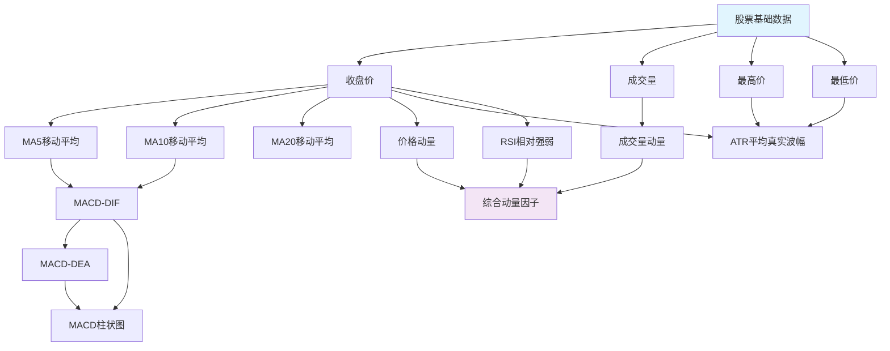

# 股票预测系统 - 迭代2：因子计算引擎

## 产品概述

### 产品背景
基于迭代1建立的数据基础设施，本迭代专注于构建因子计算引擎，将原始股票数据转化为可用于预测模型的特征因子。因子计算是量化投资的核心环节，直接影响预测模型的效果。

### 产品定位
- **目标用户**：系统内部服务（ai-service、bff服务）
- **使用场景**：自动化因子计算和特征工程
- **核心价值**：提供高质量的量化因子，支撑股票预测模型

### 产品目标
- **业务目标**：建立完整的因子计算体系，覆盖技术、基本面、市场情绪等多维度因子
- **技术目标**：实现因子计算的自动化、标准化和可扩展性
- **质量目标**：因子计算准确率>99.5%，计算延迟<10分钟

## 需求分析

### 功能需求

#### 1. 技术因子计算（优先级：高）
- **趋势因子**：移动平均线（MA5、MA10、MA20、MA60）、MACD、RSI、KDJ
- **动量因子**：价格动量、成交量动量、相对强弱指标
- **波动率因子**：历史波动率、ATR（平均真实波幅）
- **量价因子**：量价比、换手率、成交额占比

#### 2. 基本面因子计算（优先级：高）
- **估值因子**：PE、PB、PS、PCF、EV/EBITDA
- **盈利因子**：ROE、ROA、毛利率、净利率、ROIC
- **成长因子**：营收增长率、净利润增长率、EPS增长率
- **质量因子**：资产负债率、流动比率、速动比率

#### 3. 市场因子计算（优先级：中）
- **相对强度因子**：相对大盘表现、相对行业表现
- **市场情绪因子**：涨跌停数量、新高新低比例
- **资金流向因子**：主力资金净流入、散户资金流向

#### 4. 消息面因子计算（优先级：中）
- **新闻情绪因子**：基于data-collector提供的情绪分析结果计算新闻情绪因子

#### 5. 因子标准化处理（优先级：高）
- **缺失值处理**：前向填充、均值填充、插值处理
- **异常值处理**：3σ原则、分位数截尾
- **标准化处理**：Z-score标准化、Min-Max标准化
- **中性化处理**：行业中性化、市值中性化

#### 6. 因子存储管理（优先级：高）
- **因子数据存储**：结构化存储，支持时间序列查询
- **因子元数据管理**：因子定义、计算公式、更新频率
- **因子版本管理**：支持因子计算逻辑的版本控制
- **因子质量监控**：因子有效性检查、异常检测

### 用户需求

#### 用户故事1：因子计算
**作为** ai-service服务  
**我希望** 能够获取标准化的股票因子数据  
**以便** 训练和运行预测模型

#### 用户故事2：因子管理
**作为** 系统管理员  
**我希望** 能够管理和监控因子计算过程  
**以便** 确保因子数据的质量和时效性

#### 用户故事3：因子扩展
**作为** 量化研究员  
**我希望** 能够方便地添加新的因子计算逻辑  
**以便** 不断优化预测模型的效果

### 业务需求

#### 因子计算范围
- **股票覆盖**：A股全市场（主板、创业板、科创板）
- **时间范围**：最近3年历史数据，支持增量计算
- **因子数量**：初期支持30+个核心因子
- **计算频率**：日频计算，支持实时更新

#### 因子质量要求
- **计算准确性**：与标准公式计算结果一致性>99.5%
- **数据完整性**：单日因子缺失率<2%
- **计算时效性**：日终因子计算在收盘后30分钟内完成
- **因子稳定性**：同一因子在不同时间计算结果一致


## 产品功能设计

### 因子计算框架

#### 计算引擎架构
- **插件化设计**：支持因子计算逻辑的动态加载
- **流水线处理**：数据获取→因子计算→标准化→存储
- **并行计算**：支持多股票、多因子并行计算
- **容错机制**：单个因子计算失败不影响其他因子

#### 因子定义管理
- **因子注册机制**：统一的因子定义和注册接口
- **参数配置**：支持因子计算参数的灵活配置
- **依赖管理**：设计因子依赖图，处理因子间的依赖关系
- **版本控制**：支持因子计算逻辑的版本管理

#### 因子依赖图设计
- **依赖关系映射**：明确各因子之间的计算依赖关系
- **计算顺序**：根据依赖关系确定因子计算的先后顺序
- **循环依赖检测**：检测并避免因子间的循环依赖
- **依赖可视化**：提供因子依赖关系的图形化展示

**因子依赖图示例：**


### 技术因子模块

#### 趋势指标计算
- **移动平均线**：简单移动平均、指数移动平均、加权移动平均
- **MACD指标**：DIF、DEA、MACD柱状图
- **布林带指标**：上轨、中轨、下轨、带宽
- **趋势强度**：ADX、DMI指标

#### 动量指标计算
- **RSI指标**：相对强弱指数，支持不同周期
- **KDJ指标**：随机指标K值、D值、J值
- **威廉指标**：WR指标，超买超卖判断
- **动量指标**：价格动量、成交量动量

#### 波动率指标计算
- **历史波动率**：基于收益率的滚动波动率
- **ATR指标**：平均真实波幅
- **布林带宽度**：价格波动率的度量
- **VIX类指标**：隐含波动率估算

### 基本面因子模块

#### 估值因子计算
- **PE系列**：静态PE、动态PE、TTM PE
- **PB因子**：市净率，考虑净资产调整
- **PS因子**：市销率，基于营业收入
- **现金流估值**：PCF、EV/EBITDA

#### 盈利能力因子
- **ROE系列**：净资产收益率、加权ROE
- **ROA因子**：总资产收益率
- **利润率因子**：毛利率、净利率、EBITDA率
- **资本回报**：ROIC、ROCE

#### 成长性因子
- **收入增长**：营业收入同比、环比增长率
- **利润增长**：净利润增长率、扣非净利润增长
- **EPS增长**：每股收益增长率
- **现金流增长**：经营现金流增长率

### 消息面因子模块

#### 新闻情绪因子计算
- **数据来源**：从data-collector服务获取新闻原始文本数据
- **数据接口**：调用data-collector提供的新闻数据API获取新闻标题和内容
- **情绪识别**：quant-engine服务内部集成本地NLP模型进行情绪分析
  - **模型选择**：使用轻量级中文情绪分析模型（如BERT-base-chinese微调版本）
  - **情绪分类**：将新闻文本分类为积极、消极、平淡三类
  - **置信度评估**：输出情绪分类的置信度分数
- **计算逻辑**：
  - **步骤1：情绪识别与量化**
    - 使用本地NLP模型对新闻文本进行情绪分析
    - 积极情绪 → +1
    - 平淡情绪 → 0  
    - 消极情绪 → -1
    - 引入置信度权重：最终情绪值 = 情绪分类值 × 置信度
  - **步骤2：时间权重计算**
    - 时间权重 = exp(-λ × 天数差)
    - λ = 0.1（衰减系数，可调参数）
    - 当日新闻权重=1，1天前=0.9，2天前=0.82，以此类推
  - **步骤3：媒体权重设定**
    - 主流财经媒体：权重=1.0
    - 一般媒体：权重=0.8
    - 自媒体/论坛：权重=0.6
  - **步骤4：单条新闻得分计算**
    - 单条得分 = 情绪值 × 置信度 × 时间权重 × 媒体权重
  - **步骤5：股票级别聚合**
    - 分子：所有相关新闻的加权得分之和
    - 分母：所有相关新闻的权重之和
    - 新闻情绪因子 = Σ(单条得分) / Σ(置信度 × 时间权重 × 媒体权重)
- **计算示例**：
  ```
  假设股票A有3条新闻：
  新闻1：积极(+1)，置信度0.9，当日，主流媒体 → 得分 = 1 × 0.9 × 1.0 × 1.0 = 0.9
  新闻2：消极(-1)，置信度0.8，1天前，一般媒体 → 得分 = -1 × 0.8 × 0.9 × 0.8 = -0.576
  新闻3：平淡(0)，置信度0.7，2天前，主流媒体 → 得分 = 0 × 0.7 × 0.82 × 1.0 = 0
  
  权重总和 = 0.9×1.0×1.0 + 0.8×0.9×0.8 + 0.7×0.82×1.0 = 2.25
  情绪因子 = (0.9 + (-0.576) + 0) / 2.25 = 0.14
  ```
- **模型管理**：
  - **模型加载**：服务启动时加载预训练的情绪分析模型
  - **模型缓存**：将模型加载到内存中，避免重复加载
  - **模型更新**：支持模型版本更新和热替换
- **性能优化**：
  - **批量处理**：支持多条新闻的批量情绪分析
  - **异步处理**：使用异步队列处理大量新闻文本
  - **结果缓存**：缓存已分析新闻的情绪结果，避免重复计算
- **数据处理**：对计算结果进行标准化和因子化处理
- **更新频率**：根据data-collector的数据更新频率同步计算

### 数据处理模块

#### 数据清洗
- **异常值检测**：基于统计方法的异常值识别
- **缺失值处理**：多种填充策略的智能选择
- **数据一致性**：跨数据源的一致性检查
- **数据完整性**：必要字段的完整性验证

#### 因子标准化
- **去极值处理**：MAD、分位数截尾方法
- **标准化处理**：Z-score、Rank标准化
- **中性化处理**：行业、市值中性化
- **因子正交化**：去除因子间的共线性

### 存储查询模块

#### 数据存储设计
- **时间序列存储**：优化时间序列数据的存储结构
- **分区策略**：按时间和股票代码分区
- **索引优化**：多维度索引提升查询性能
- **数据压缩**：采用高效压缩算法节省存储空间

#### 查询接口设计
- **HTTP API**：标准化的因子数据查询接口
- **批量查询**：支持多股票、多因子批量查询
- **时间范围查询**：灵活的时间范围筛选
- **实时查询**：支持最新因子数据的实时获取

## 验收标准

### 功能验收
1. **因子计算功能**
   - 成功实现30+个核心因子的计算
   - 技术因子计算结果与TA-Lib库一致性>99%
   - 基本面因子计算逻辑符合行业标准
   - 消息面因子能够正确计算新闻情绪因子，确保NLP模型情绪识别准确率>85%，计算逻辑准确和数据接口正常
   - 支持全市场股票的因子计算

2. **数据处理功能**
   - 异常值和缺失值处理效果良好
   - 因子标准化处理符合预期
   - 数据质量检查机制有效

3. **存储查询功能**
   - 因子数据正确存储到数据库
   - 查询接口功能完整
   - 支持复杂查询条件

4. **系统集成功能**
   - 与迭代1数据基础设施无缝集成
   - 为后续预测模型提供标准接口


### 质量验收
- **计算准确率**：因子计算结果与标准算法一致
- **数据完整率**：因子数据完整性良好
- **系统稳定性**：系统运行稳定
- **因子覆盖率**：覆盖主要A股市场股票

## 技术约束

### 系统架构约束
- 基于迭代1的数据基础设施
- 因子计算逻辑部署在quant-engine服务（Python技术栈）
- quant-engine服务提供HTTP API接口供其他服务调用
- 共享现有数据库和缓存基础设施
- 采用异构微服务架构，各服务使用最适合的技术栈

### 技术栈约束
- 开发语言：Python（金融计算领域有天然优势，拥有丰富的数学计算库）
- 数学计算库：NumPy、Pandas、SciPy、TA-Lib等成熟金融计算库
- 数据库：MySQL（主要）、MongoDB（辅助）
- 缓存：Redis
- 服务架构：异构微服务架构，quant-engine使用Python技术栈

### 依赖约束
- 依赖迭代1的数据获取功能
- 为迭代3的预测模型提供数据支撑
- 与现有微服务架构保持兼容

## 风险控制

### 计算风险
- **精度风险**：采用高精度数值计算，避免浮点误差
- **性能风险**：优化算法复杂度，采用并行计算
- **内存风险**：合理管理内存使用，避免内存泄漏

### 数据风险
- **数据依赖风险**：建立数据质量检查机制
- **因子失效风险**：定期评估因子有效性
- **版本兼容风险**：维护因子计算的向后兼容性

### 业务风险
- **模型风险**：确保因子计算逻辑的正确性
- **时效性风险**：优化计算流程，确保及时更新
- **扩展性风险**：设计可扩展的因子框架

## 实施计划

### 第一阶段（1-2周）：框架搭建
- 设计因子计算框架架构
- 实现因子注册和管理机制
- 建立因子数据存储结构

### 第二阶段（2-3周）：核心因子实现
- 实现技术因子计算模块
- 实现基本面因子计算模块
- 建立数据处理和标准化流程

### 第三阶段（1-2周）：扩展功能
- 实现市场因子计算
- 实现新闻情绪因子计算功能（集成本地NLP模型，依赖data-collector的新闻原始数据）
- 建立因子质量监控机制
- 实现因子查询API

### 第四阶段（1周）：测试优化
- 因子计算准确性测试
- 系统性能优化
- 与迭代1集成测试

## 成功指标

### 关键指标
- **因子数量**：成功实现30+个核心因子
- **计算准确率**：因子计算结果与标准算法一致
- **数据完整性**：因子数据完整性良好

### 业务指标
- **因子覆盖率**：覆盖主要A股市场股票
- **因子时效性**：支持日终因子数据更新
- **系统稳定性**：系统运行稳定可靠

## 修改记录

[2024-01-20] 新增 初始版本创建，定义因子计算引擎的完整需求
[2024-01-20] 修改 PRD验证优化：澄清异构微服务架构，明确Python技术栈优势；简化性能指标要求，适配MVP项目定位；添加因子依赖图设计；修改API接口为HTTP风格
[2024-01-20] 修改 删除所有性能要求相关内容，专注功能实现；添加具体因子依赖图示例，展示技术因子间的计算依赖关系
[2024-01-20] 新增 补充消息面因子模块：包含新闻情绪因子、政策影响因子、市场关注度因子、机构观点因子等四大类消息面因子的详细设计
[2024-12-19] 修改 简化消息面因子模块，仅保留新闻情绪因子，且改为从data-collector服务获取数据而非计算
[2024-12-19] 补充 添加新闻情绪因子的具体计算逻辑，包括情绪量化、加权计算、时间衰减和聚合方式
[2024-12-19] 修改 新闻情绪因子计算方式调整：改为quant-engine服务内部集成本地NLP模型进行情绪识别，data-collector仅提供新闻原始文本数据