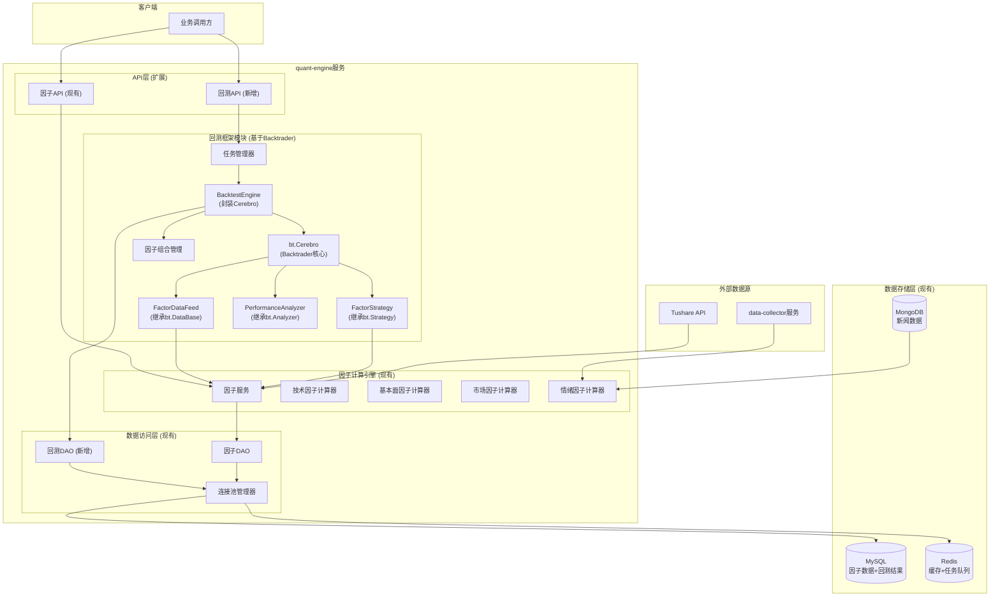
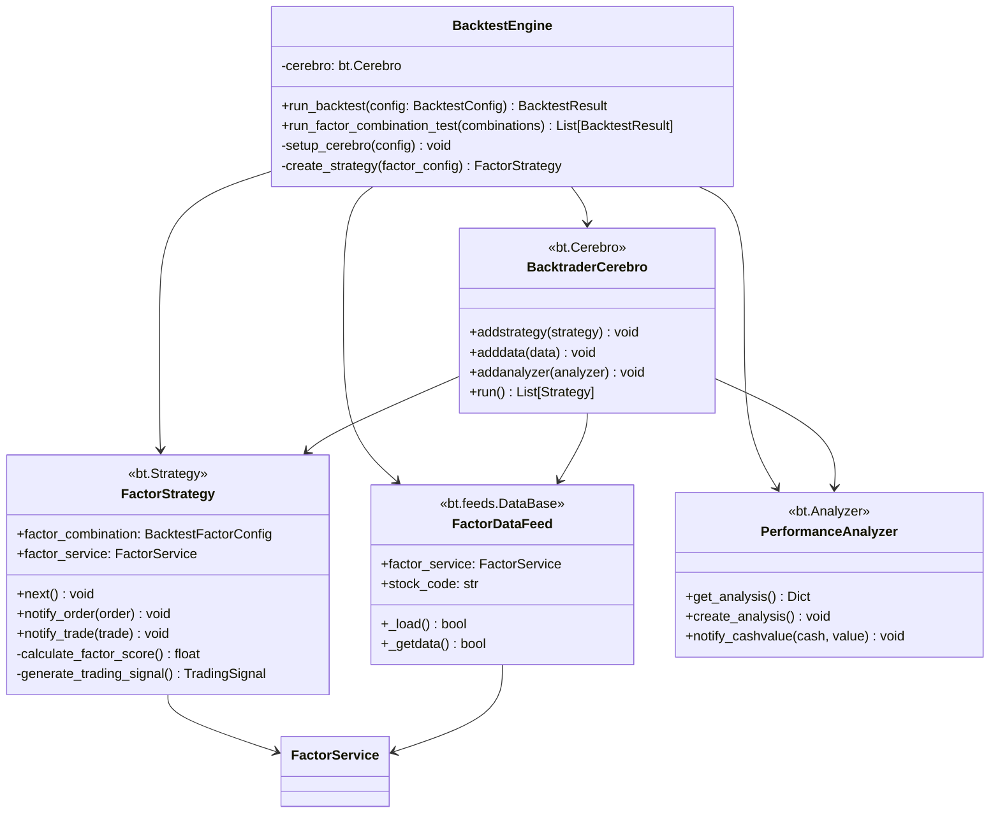
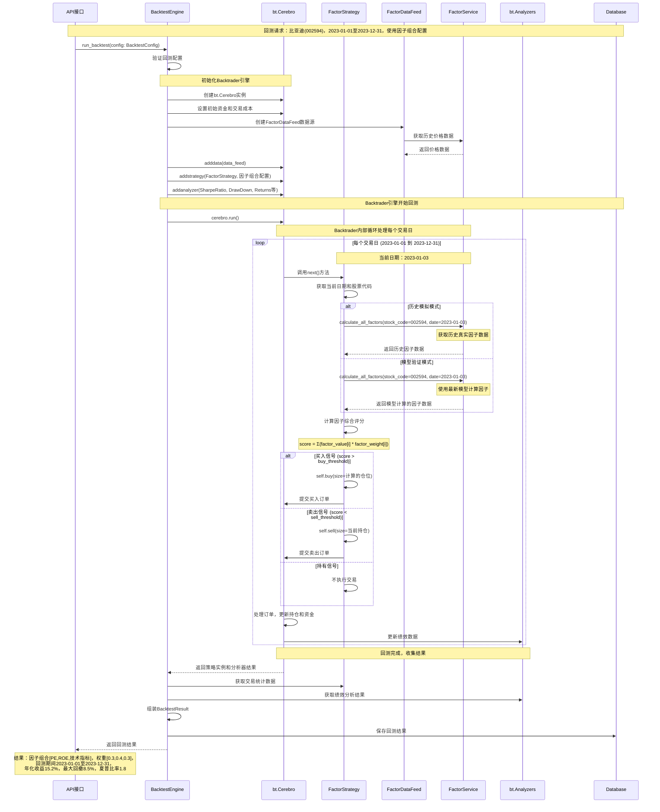
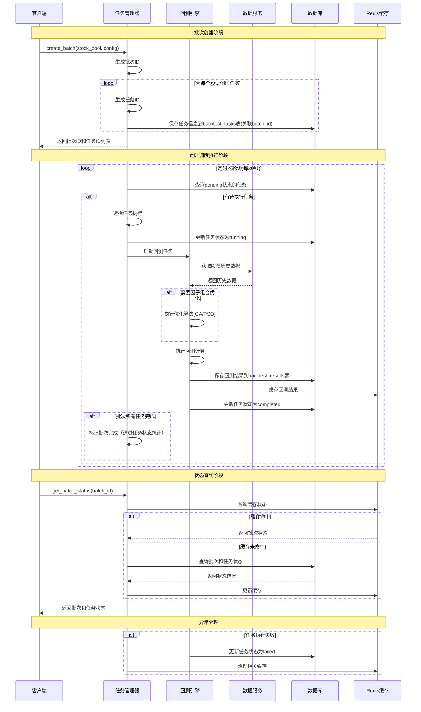

# 回测框架系统设计文档

# 股票预测系统 - 迭代3：回测框架建设

## 0. 现有系统分析

### 0.1 现有架构分析

**quant-engine服务现状：**
- 项目结构：Python项目，使用pyproject.toml管理依赖
- 技术栈：Python 3.11+ + FastAPI + SQLAlchemy + Redis + MySQL
- 当前状态：因子计算引擎已完成，包含技术因子、基本面因子、市场因子、情绪因子计算功能
- 架构模式：微服务架构，分层设计（API层 → Services层 → DAO层 → 数据库）
- 数据源：Tushare API（股票数据）+ data-collector服务（新闻数据）

**现有因子计算引擎分析：**
- 技术因子计算器：支持MA、RSI、MACD、布林带等技术指标
- 基本面因子计算器：支持ROE、ROA、毛利率等财务指标
- 市场因子计算器：支持市值、换手率、流通股本等市场指标
- 情绪因子计算器：基于新闻情绪分析的因子
- 因子数据存储：MySQL存储，Redis缓存，支持批量计算和历史查询

### 0.2 现有组件清单

**可复用的核心组件：**
- TushareClient：金融数据客户端，支持股票行情、财务数据获取
- FactorService：因子计算服务，统一管理各类因子计算
- FactorDAO：因子数据访问层，支持批量存储和查询
- 四大因子计算器：技术、基本面、市场、情绪因子计算器
- 连接池管理器：MySQL和Redis连接池管理
- 异常处理体系：统一的异常处理和日志记录

**现有数据模型：**
- TechnicalFactor：技术因子数据表
- FundamentalFactor：基本面因子数据表
- MarketFactor：市场因子数据表
- SentimentFactor：情绪因子数据表

**现有API接口：**
- 因子计算API：支持单股票和批量因子计算
- 因子查询API：支持历史因子数据查询
- 统一因子API：支持多类型因子统一计算

### 0.3 架构约束识别

**技术栈约束：**
- 必须使用Python 3.11+和FastAPI框架
- 必须复用现有的MySQL + Redis + MongoDB基础设施
- 必须遵循现有的分层架构模式
- 必须使用现有的异常处理和日志记录体系

**数据约束：**
- 必须复用现有的因子数据表结构
- 必须使用现有的TushareClient获取历史数据
- 必须遵循现有的数据缓存策略
- 禁止使用外键约束，通过应用层维护数据一致性

**性能约束：**
- 回测计算需要处理大量历史数据，必须考虑内存和计算效率
- 需要支持并行计算，提升大规模回测的执行效率
- 需要合理的缓存策略，避免重复计算和数据获取

### 0.4 演进策略

**基于现有架构的渐进式演进：**
1. 在quant-engine服务中新增backtest模块，复用现有的基础设施
2. 复用现有的因子计算器和数据访问层，避免重复开发
3. 扩展现有的数据模型，新增回测相关的数据表
4. 遵循现有的API设计模式，提供统一的回测服务接口
5. 集成现有的任务调度机制，支持批量回测任务

## 1. 系统架构概览

### 1.1 基于Backtrader的整体架构图



### 1.2 基于Backtrader的核心模块概述

**回测引擎（BacktestEngine）**
- Cerebro封装：封装Backtrader的Cerebro引擎，提供业务层接口
- 策略配置：配置FactorStrategy和相关参数
- 数据源管理：管理FactorDataFeed数据源
- 分析器集成：集成Backtrader内置和自定义分析器
- 结果提取：从Backtrader结果中提取业务所需数据

**因子策略（FactorStrategy）**
- 继承bt.Strategy：基于Backtrader策略框架
- 因子计算：集成因子服务，获取实时因子数据
- 信号生成：基于因子组合权重计算交易信号
- 订单管理：通过Backtrader的buy/sell接口执行交易
- 风险控制：实施仓位管理和风险控制策略

**因子数据源（FactorDataFeed）**
- 继承bt.DataBase：基于Backtrader数据源框架
- 价格数据：从Tushare获取历史价格数据
- 因子集成：集成因子服务，提供因子数据访问
- 数据同步：确保价格和因子数据的时间同步

**绩效分析器（PerformanceAnalyzer）**
- 继承bt.Analyzer：基于Backtrader分析器框架
- 实时监控：实时计算和更新绩效指标
- 自定义指标：扩展Backtrader内置分析器功能
- 结果输出：提供标准化的绩效分析结果

**因子组合管理（FactorCombinationManager）**
- 因子配置管理：管理用户自定义的因子组合配置
- 权重配置管理：管理因子权重的设置和验证
- 配置存储服务：持久化存储因子组合配置
- 配置验证器：验证因子配置和权重配置的有效性

**任务管理器（TaskManager）**
- 任务调度：管理回测任务的创建、调度和执行
- Backtrader集成：协调Backtrader引擎的执行
- 资源管理：管理计算资源的分配和使用
- 结果收集：收集和汇总回测结果

### 1.3 技术栈选型

**开发语言：** Python 3.11+（与现有系统保持一致）
**Web框架：** FastAPI（复用现有框架）
**数据处理：** Pandas、NumPy（数据分析和计算）
**回测框架：** Backtrader（功能完整、支持复杂策略、社区活跃、文档丰富）
**配置管理：** 
- Pydantic（数据验证和配置管理）
- JSON Schema（配置结构验证）
**并行计算：** 
- asyncio（异步编程）
- concurrent.futures（线程池和进程池）
- joblib（并行计算）
**数据库：** 
- MySQL（回测结果存储，复用现有）
- Redis（缓存和任务队列，复用现有）
**HTTP客户端：** httpx（复用现有）
**任务调度：** APScheduler（复用现有）
**配置管理：** Pydantic Settings（复用现有）
**日志：** loguru（复用现有）
**测试：** pytest（复用现有）

### 1.4 数据流概览


## 2. 功能模块设计

### 2.1 回测引擎模块

#### 2.1.1 模块职责
- 历史数据回放：按时间顺序回放历史数据，模拟真实交易环境
- 因子组合测试：支持两种回测模式的因子组合策略测试
- 交易信号生成：基于因子评分生成买卖信号
- 收益计算：计算投资组合的收益表现
- 风险控制：实施基本的风险控制措施

**支持的回测模式：**
- **历史模拟模式**：使用历史时点的真实因子数据进行回测，确保回测的真实性
- **模型验证模式**：使用当前最新因子模型对历史数据进行回测，验证模型有效性

#### 2.1.2 基于Backtrader的模块架构



#### 2.1.3 基于Backtrader的核心接口设计

```python
import backtrader as bt
from typing import Dict, List, Optional

class BacktestEngine:
    """基于Backtrader的回测引擎核心类"""
    
    def __init__(self, factor_service: FactorService):
        self.factor_service = factor_service
        self.cerebro = None
    
    async def run_backtest(
        self, 
        config: BacktestConfig
    ) -> BacktestResult:
        """执行回测
        
        Args:
            config: 回测配置
            
        Returns:
            回测结果
        """
        # 1. 创建Cerebro引擎
        cerebro = bt.Cerebro()
        
        # 2. 设置初始资金
        cerebro.broker.setcash(float(config.initial_capital))
        
        # 3. 设置交易成本
        cerebro.broker.setcommission(commission=config.transaction_cost)
        
        # 4. 添加数据源
        data_feed = FactorDataFeed(
            factor_service=self.factor_service,
            stock_code=config.stock_code,
            start_date=config.start_date,
            end_date=config.end_date,
            backtest_mode=config.backtest_mode
        )
        cerebro.adddata(data_feed)
        
        # 5. 添加策略
        cerebro.addstrategy(
            FactorStrategy,
            factor_combination=config.factor_combination,
            factor_service=self.factor_service,
            backtest_mode=config.backtest_mode
        )
        
        # 6. 添加分析器
        cerebro.addanalyzer(bt.analyzers.SharpeRatio, _name='sharpe')
        cerebro.addanalyzer(bt.analyzers.DrawDown, _name='drawdown')
        cerebro.addanalyzer(bt.analyzers.Returns, _name='returns')
        cerebro.addanalyzer(PerformanceAnalyzer, _name='performance')
        
        # 7. 运行回测
        results = cerebro.run()
        strategy = results[0]
        
        # 8. 提取结果
        return self._extract_backtest_result(strategy, config)
    
    def _extract_backtest_result(
        self, 
        strategy: 'FactorStrategy', 
        config: BacktestConfig
    ) -> BacktestResult:
        """从Backtrader策略结果中提取回测结果"""
        analyzers = strategy.analyzers
        
        return BacktestResult(
            factor_combination=config.factor_combination,
            start_date=config.start_date,
            end_date=config.end_date,
            stock_code=config.stock_code,
            total_return=analyzers.returns.get_analysis()['rtot'],
            annual_return=analyzers.returns.get_analysis()['rnorm'],
            max_drawdown=analyzers.drawdown.get_analysis()['max']['drawdown'] / 100,
            sharpe_ratio=analyzers.sharpe.get_analysis()['sharperatio'],
            win_rate=analyzers.performance.get_analysis()['win_rate'],
            trade_count=analyzers.performance.get_analysis()['trade_count']
        )

class FactorStrategy(bt.Strategy):
    """基于因子组合的Backtrader策略"""
    
    params = (
        ('factor_combination', None),
        ('factor_service', None),
        ('backtest_mode', BacktestMode.HISTORICAL_SIMULATION),
        ('buy_threshold', 0.6),
        ('sell_threshold', -0.6),
    )
    
    def __init__(self):
        self.factor_combination = self.params.factor_combination
        self.factor_service = self.params.factor_service
        self.backtest_mode = self.params.backtest_mode
        
        # 记录交易信息
        self.trade_count = 0
        self.win_count = 0
        
    def next(self):
        """Backtrader策略核心逻辑，每个交易日调用"""
        current_date = self.data.datetime.date(0).strftime('%Y-%m-%d')
        stock_code = self.data._name
        
        # 1. 获取当前时点的因子数据
        factor_data = self._get_current_factor_data(current_date, stock_code)
        
        if not factor_data:
            return
        
        # 2. 计算因子综合评分
        composite_score = self._calculate_factor_score(factor_data)
        
        # 3. 生成交易信号
        if composite_score > self.params.buy_threshold and not self.position:
            # 买入信号
            size = self._calculate_position_size()
            self.buy(size=size)
            
        elif composite_score < self.params.sell_threshold and self.position:
            # 卖出信号
            self.sell(size=self.position.size)
    
    def _get_current_factor_data(self, date: str, stock_code: str) -> Dict:
        """获取当前时点的因子数据"""
        try:
            # 根据回测模式获取因子数据
            if self.backtest_mode == BacktestMode.HISTORICAL_SIMULATION:
                # 历史模拟模式：获取历史真实因子数据
                return self._get_historical_factor_data(date, stock_code)
            else:
                # 模型验证模式：使用最新模型计算因子
                return self._get_model_factor_data(date, stock_code)
        except Exception as e:
            self.log(f'获取因子数据失败: {e}')
            return {}
    
    def _calculate_factor_score(self, factor_data: Dict) -> float:
        """计算因子综合评分"""
        composite_score = 0.0
        
        for factor in self.factor_combination.factors:
            factor_name = factor.factor_name
            factor_weight = factor.weight
            
            if factor_name in factor_data:
                factor_value = factor_data[factor_name]
                composite_score += factor_value * factor_weight
        
        return composite_score
    
    def _calculate_position_size(self) -> int:
        """计算仓位大小"""
        # 简单的固定仓位策略
        available_cash = self.broker.getcash()
        current_price = self.data.close[0]
        max_shares = int(available_cash / current_price)
        return min(max_shares, 100)  # 最大100股
    
    def notify_trade(self, trade):
        """交易完成通知"""
        if trade.isclosed:
            self.trade_count += 1
            if trade.pnl > 0:
                self.win_count += 1

class FactorDataFeed(bt.feeds.DataBase):
    """因子数据源，继承自Backtrader数据源"""
    
    def __init__(self, factor_service: FactorService, stock_code: str, 
                 start_date: str, end_date: str, backtest_mode: BacktestMode):
        super().__init__()
        self.factor_service = factor_service
        self.stock_code = stock_code
        self.start_date = start_date
        self.end_date = end_date
        self.backtest_mode = backtest_mode
        self._name = stock_code
        
    def _load(self):
        """加载数据"""
        # 从Tushare获取基础价格数据
        # 这里需要实现具体的数据加载逻辑
        pass

class PerformanceAnalyzer(bt.Analyzer):
    """自定义绩效分析器"""
    
    def create_analysis(self):
        self.rets = {}
        self.vals = 0.0
        self.trade_count = 0
        self.win_count = 0
    
    def notify_cashvalue(self, cash, value):
        self.vals = value
    
    def notify_trade(self, trade):
        if trade.isclosed:
            self.trade_count += 1
            if trade.pnl > 0:
                self.win_count += 1
    
    def get_analysis(self):
        return {
            'trade_count': self.trade_count,
            'win_rate': self.win_count / max(self.trade_count, 1),
            'final_value': self.vals
        }

class BacktestMode(Enum):
    """回测模式枚举"""
    HISTORICAL_SIMULATION = "historical_simulation"  # 历史模拟模式
    MODEL_VALIDATION = "model_validation"  # 模型验证模式
```

#### 2.1.4 数据模型

```python
class BacktestConfig(BaseModel):
    """回测配置"""
    stock_code: str  # 单个股票代码，每次回测只针对一只股票
    start_date: str
    end_date: str
    factor_combination: BacktestFactorConfig  # 因子组合配置
    optimization_result_id: Optional[str] = None  # 优化引擎结果ID，如果指定则使用优化后的因子组合
    rebalance_frequency: str = "daily"
    transaction_cost: float = 0.001
    backtest_mode: BacktestMode = BacktestMode.HISTORICAL_SIMULATION
    # 注意：因子计算服务不支持自定义回看天数，使用服务默认配置
    use_factor_cache: bool = True  # 是否使用因子缓存
    
class FactorItem(BaseModel):
    """单个因子配置"""
    factor_name: str  # 因子名称，如 "PE", "ROE", "MA", "RSI"
    factor_type: str  # 因子类型："technical", "fundamental", "market", "sentiment"
    weight: float  # 因子权重
    
class BacktestFactorConfig(BaseModel):
    """回测因子组合配置"""
    factors: List[FactorItem]  # 因子列表，按类型分组
    combination_id: str
    description: Optional[str] = None
    
    def get_factors_by_type(self, factor_type: str) -> List[str]:
        """根据因子类型获取因子名称列表"""
        return [f.factor_name for f in self.factors if f.factor_type == factor_type]
    
    def get_technical_factors(self) -> List[str]:
        """获取技术因子列表"""
        return self.get_factors_by_type("technical")
    
    def get_fundamental_factors(self) -> List[str]:
        """获取基本面因子列表"""
        return self.get_factors_by_type("fundamental")
    
    def get_market_factors(self) -> List[str]:
        """获取市场因子列表"""
        return self.get_factors_by_type("market")
    
    def get_sentiment_factors(self) -> List[str]:
        """获取情绪因子列表"""
        return self.get_factors_by_type("sentiment")
    
    def get_factor_weight(self, factor_name: str) -> float:
        """获取指定因子的权重"""
        for factor in self.factors:
            if factor.factor_name == factor_name:
                return factor.weight
        return 0.0
    
    def validate_weights(self) -> bool:
        """验证权重总和是否为1"""
        total_weight = sum(f.weight for f in self.factors)
        return abs(total_weight - 1.0) < 1e-6
    
class BacktestResult(BaseModel):
    """回测结果"""
    # 回测配置信息
    factor_combination: BacktestFactorConfig  # 使用的因子组合和权重
    start_date: str  # 回测开始日期
    end_date: str  # 回测结束日期
    stock_code: str  # 股票代码
    
    # 绩效指标
    total_return: float
    annual_return: float
    max_drawdown: float
    sharpe_ratio: float
    win_rate: float
    trade_count: int
```

#### 2.1.5 基于Backtrader的业务流程时序图

**详细回测流程（以比亚迪股票为例）**



**基于Backtrader的关键步骤说明：**

1. **Cerebro引擎初始化**：创建Backtrader核心引擎，设置初始资金、交易成本等参数
2. **数据源配置**：通过FactorDataFeed加载历史价格数据，集成因子服务
3. **策略配置**：将FactorStrategy添加到Cerebro，传入因子组合配置
4. **分析器配置**：添加Backtrader内置分析器（夏普比率、回撤、收益率等）
5. **回测执行**：Cerebro自动管理时间循环，每个交易日调用策略的next()方法
6. **因子计算**：策略内部调用因子服务，根据回测模式获取因子数据
7. **信号生成**：基于因子综合评分和阈值生成交易信号
8. **订单处理**：通过Backtrader的buy/sell方法提交订单，引擎自动处理
9. **绩效分析**：利用Backtrader分析器自动计算各项绩效指标
10. **结果提取**：从策略和分析器中提取结果，组装成标准格式返回

**Backtrader架构的优势：**
- **成熟稳定**：经过大量实际项目验证的回测框架
- **功能完整**：内置丰富的分析器、指标计算、订单管理等功能
- **易于扩展**：支持自定义策略、数据源、分析器等组件
- **性能优化**：高效的事件驱动架构，支持大规模历史数据回测
- **社区支持**：活跃的开源社区，丰富的文档和示例

### 2.2 因子组合管理模块

#### 2.2.1 模块职责
- 因子配置管理：管理用户自定义的因子组合配置
- 权重配置管理：管理因子权重的设置和验证
- 配置存储服务：持久化存储因子组合配置
- 配置验证器：验证因子配置和权重配置的有效性

#### 2.2.2 模块架构


#### 2.2.3 核心接口设计

```python
class FactorCombinationManager:
    """因子组合管理器"""
    
    def __init__(self, validator: ConfigValidator, storage: ConfigStorage):
        self.validator = validator
        self.storage = storage
    
    async def create_configuration(
        self, 
        config: FactorConfig
    ) -> str:
        """创建因子组合配置"""
        pass
    
    async def get_configuration(
        self, 
        config_id: str
    ) -> FactorConfig:
        """获取因子组合配置"""
        pass
    
    async def update_configuration(
        self, 
        config_id: str, 
        config: FactorConfig
    ) -> bool:
        """更新因子组合配置"""
        pass

class ConfigValidator:
    """配置验证器"""
    
    async def validate_weights(
        self, 
        weights: Dict[str, float]
    ) -> ValidationResult:
        """验证权重配置"""
        pass
```

#### 2.2.4 数据模型

```python
class FactorConfig(BaseModel):
    """因子组合配置"""
    config_id: str  # 配置ID
    stock_code: str  # 股票代码（如：000001.SZ）
    technical_factors: List[str]  # 技术面因子列表
    fundamental_factors: List[str]  # 基本面因子列表
    sentiment_factors: List[str]  # 消息面因子列表
    factor_weights: Dict[str, float]  # 因子权重（key为因子名称）
    description: Optional[str]  # 配置描述
    created_at: datetime
    updated_at: datetime
    
class FactorType(str, Enum):
    """因子类型枚举"""
    TECHNICAL = "technical"  # 技术面因子
    FUNDAMENTAL = "fundamental"  # 基本面因子
    SENTIMENT = "sentiment"  # 消息面因子
    
class ValidationResult(BaseModel):
    """验证结果"""
    is_valid: bool  # 是否有效
    errors: List[str]  # 错误信息
    warnings: List[str]  # 警告信息
```

#### 2.2.5 业务流程时序图


#### 2.2.6 技术限制和约束
- 因子权重总和必须等于1.0

#### 2.2.7 HTTP API接口设计

**基础路径：** `/api/v1/factor-config`

##### 创建因子组合配置
```http
POST /api/v1/factor-config/create
Content-Type: application/json

{
  "stock_code": "000001.SZ",
  "description": "基于多类型因子的组合配置",
  "technical_factors": ["rsi", "macd", "bollinger_bands"],
  "fundamental_factors": ["pe_ratio", "pb_ratio"],
  "sentiment_factors": ["news_sentiment"],
  "factor_weights": {
    "rsi": 0.2,
    "macd": 0.2,
    "bollinger_bands": 0.2,
    "pe_ratio": 0.2,
    "pb_ratio": 0.1,
    "news_sentiment": 0.1
  }
}
```

**响应：**
```json
{
  "code": 200,
  "message": "配置创建成功",
  "data": {
    "config_id": "config_20240107_001",
    "stock_code": "000001.SZ",
    "created_at": "2024-01-07T10:00:00Z"
  }
}
```

##### 获取因子组合配置
```http
POST /api/v1/factor-config/get
Content-Type: application/json

{
  "config_id": "config_20240107_001"
}
```

**响应：**
```json
{
  "code": 200,
  "message": "查询成功",
  "data": {
    "config_id": "config_20240107_001",
    "stock_code": "000001.SZ",
    "description": "基于技术指标的因子组合配置",
    "factors": ["rsi", "macd", "bollinger_bands"],
    "factor_weights": {
      "rsi": 0.3,
      "macd": 0.4,
      "bollinger_bands": 0.3
    },
    "created_at": "2024-01-07T10:00:00Z",
    "updated_at": "2024-01-07T10:00:00Z"
  }
}
```

##### 更新因子组合配置
```http
POST /api/v1/factor-config/update
Content-Type: application/json

{
  "config_id": "config_20240107_001",
  "stock_code": "000001.SZ",
  "description": "调整权重后的技术指标组合",
  "factors": ["rsi", "macd", "bollinger_bands"],
  "factor_weights": {
    "rsi": 0.35,
    "macd": 0.35,
    "bollinger_bands": 0.3
  }
}
```

**响应：**
```json
{
  "code": 200,
  "message": "配置更新成功",
  "data": {
    "config_id": "config_20240107_001",
    "updated_at": "2024-01-07T11:30:00Z"
  }
}
```

##### 删除因子组合配置
```http
POST /api/v1/factor-config/delete
Content-Type: application/json

{
  "config_id": "config_20240107_001"
}
```

**响应：**
```json
{
  "code": 200,
  "message": "配置删除成功",
  "data": {
    "config_id": "config_20240107_001",
    "deleted_at": "2024-01-07T12:00:00Z"
  }
}
```

##### 获取配置列表
```http
POST /api/v1/factor-config/list
Content-Type: application/json

{
  "page": 1,
  "size": 10
}
```

**响应：**
```json
{
  "code": 200,
  "message": "查询成功",
  "data": {
    "total": 5,
    "page": 1,
    "size": 10,
    "configs": [
      {
        "config_id": "config_20240107_001",
        "stock_code": "000001.SZ",
        "description": "基于多类型因子的组合配置",
        "technical_factors": ["rsi", "macd", "bollinger_bands"],
        "fundamental_factors": ["pe_ratio", "pb_ratio"],
        "sentiment_factors": ["news_sentiment"],
        "factor_weights": {
          "rsi": 0.2,
          "macd": 0.2,
          "bollinger_bands": 0.2,
          "pe_ratio": 0.2,
          "pb_ratio": 0.1,
          "news_sentiment": 0.1
        },
        "factor_count": 6,
        "created_at": "2024-01-07T10:00:00Z",
        "updated_at": "2024-01-07T11:30:00Z"
      }
    ]
  }
}
```

##### 按股票代码查询配置
```http
POST /api/v1/factor-config/get-by-stock
Content-Type: application/json

{
  "stock_code": "000001.SZ"
}
```

**响应：**
```json
{
  "code": 200,
  "message": "查询成功",
  "data": {
    "config_id": "config_20240107_001",
    "stock_code": "000001.SZ",
    "description": "基于多类型因子的组合配置",
    "technical_factors": ["rsi", "macd", "bollinger_bands"],
    "fundamental_factors": ["pe_ratio", "pb_ratio"],
    "sentiment_factors": ["news_sentiment"],
    "factor_weights": {
      "rsi": 0.2,
      "macd": 0.2,
      "bollinger_bands": 0.2,
      "pe_ratio": 0.2,
      "pb_ratio": 0.1,
      "news_sentiment": 0.1
    },
    "factor_count": 6,
    "created_at": "2024-01-07T10:00:00Z",
    "updated_at": "2024-01-07T11:30:00Z"
  }
}
```

**股票无配置时的响应：**
```json
{
  "code": 404,
  "message": "该股票暂无因子组合配置",
  "data": null
}
```


##### 错误响应格式
```json
{
  "code": 400,
  "message": "参数错误",
  "error": "权重总和必须等于1.0",
  "details": {
    "field": "factor_weights",
    "current_sum": 0.95,
    "expected_sum": 1.0
  }
}
```


### 2.3 任务管理模块

#### 2.3.1 模块职责
- 任务调度：管理回测任务的创建、调度和执行
- 进度监控：实时跟踪任务执行进度
- 资源管理：管理计算资源的分配和使用
- 结果收集：收集和汇总回测结果
- 异常处理：处理任务执行过程中的异常情况

#### 2.3.2 核心接口设计

```python
class TaskManager:
    """任务管理器"""
    
    async def submit_backtest_task(
        self,
        task_config: BacktestTaskConfig
    ) -> str:
        """提交回测任务
        
        Args:
            task_config: 任务配置
            
        Returns:
            任务ID
        """
        pass
    
    async def get_task_status(
        self,
        task_id: str
    ) -> TaskStatus:
        """获取任务状态
        
        Args:
            task_id: 任务ID
            
        Returns:
            任务状态
        """
        pass

```

#### 2.3.3 HTTP API接口设计

**基础路径：** `/api/v1/backtest`

##### 创建回测任务批次
```http
POST /api/v1/backtest/createBatch
Content-Type: application/json

{
  "name": "因子组合回测任务批次",
  "description": "测试多因子组合在A股市场的表现",
  "stock_pool": ["000001.SZ", "000002.SZ", "600000.SH"],
  "start_date": "2020-01-01",
  "end_date": "2023-12-31",
  "initial_capital": 1000000,
  "factor_config_id": "config_20240107_001"
}
```

**响应：**
```json
{
  "code": 200,
  "message": "批次创建成功",
  "data": {
    "batch_id": "batch_20240107_001",
    "task_ids": ["bt_20240107_001", "bt_20240107_002", "bt_20240107_003"],
    "total_tasks": 3,
    "status": "pending",
    "created_at": "2024-01-07T10:00:00Z",
    "estimated_duration": "90分钟"
  }
}
```


##### 查询批次状态
```http
POST /api/v1/backtest/getBatchStatus
Content-Type: application/json

{
  "batch_id": "batch_20240107_001"
}
```

**响应：**
```json
{
  "code": 200,
  "message": "查询成功",
  "data": {
    "batch_id": "batch_20240107_001",
    "name": "因子组合回测任务批次",
    "status": "running",
    "progress": 65,
    "total_tasks": 3,
    "completed_tasks": 2,
    "failed_tasks": 0,
    "created_at": "2024-01-07T10:00:00Z",
    "started_at": "2024-01-07T10:01:00Z",
    "estimated_completion": "2024-01-07T10:25:00Z",
    "current_stage": "执行中",
    "tasks": [
      {
        "task_id": "bt_20240107_001",
        "stock_code": "000001.SZ",
        "status": "completed",
        "progress": 100
      },
      {
        "task_id": "bt_20240107_002",
        "stock_code": "000002.SZ",
        "status": "completed",
        "progress": 100
      },
      {
        "task_id": "bt_20240107_003",
        "stock_code": "600000.SH",
        "status": "running",
        "progress": 45
      }
    ]
  }
}
```

##### 查询任务状态
```http
POST /api/v1/backtest/getTaskStatus
Content-Type: application/json

{
  "task_id": "bt_20240107_001"
}
```

**响应：**
```json
{
  "code": 200,
  "message": "查询成功",
  "data": {
    "task_id": "bt_20240107_001",
    "batch_id": "batch_20240107_001",
    "name": "单股票回测任务",
    "stock_code": "000001.SZ",
    "status": "running",
    "progress": 65,
    "created_at": "2024-01-07T10:00:00Z",
    "started_at": "2024-01-07T10:01:00Z",
    "estimated_completion": "2024-01-07T10:25:00Z",
    "current_stage": "因子组合优化中",
    "processed_stocks": 150,
    "total_stocks": 230
  }
}
```

##### 查询任务列表
```http
POST /api/v1/backtest/getTaskList
Content-Type: application/json

{
  "page": 1,
  "size": 20,
  "status": "completed",
  "start_date": "2024-01-01",
  "end_date": "2024-01-07"
}
```

**响应：**
```json
{
  "code": 200,
  "message": "查询成功",
  "data": {
    "total": 45,
    "page": 1,
    "size": 20,
    "tasks": [
      {
        "task_id": "bt_20240107_001",
        "name": "因子组合回测任务",
        "status": "completed",
        "created_at": "2024-01-07T10:00:00Z",
        "completed_at": "2024-01-07T10:28:00Z",
        "duration": "28分钟",
        "stock_count": 230,
        "annual_return": 0.156,
        "max_drawdown": 0.082,
        "sharpe_ratio": 1.23
      }
    ]
  }
}
```


##### 获取任务结果
```http
POST /api/v1/backtest/getTaskResults
Content-Type: application/json

{
  "task_id": "bt_20240107_001"
}
```

**响应：**
```json
{
  "code": 200,
  "message": "查询成功",
  "data": {
    "task_id": "bt_20240107_001",
    "summary": {
      "annual_return": 0.156,
      "volatility": 0.128,
      "sharpe_ratio": 1.23,
      "max_drawdown": 0.082,
      "win_rate": 0.65,
      "total_trades": 1250
    },
    "factor_combination": {
      "name": "优化后组合",
      "factors": [
        {"name": "rsi", "weight": 0.35, "params": {"period": 14}},
        {"name": "macd", "weight": 0.42, "params": {"fast": 12, "slow": 26}},
        {"name": "bollinger", "weight": 0.23, "params": {"period": 20}}
      ]
    }
  }
}
```

##### 错误响应格式
```json
{
  "code": 400,
  "message": "参数错误",
  "error": "stock_pool不能为空",
  "details": {
    "field": "stock_pool",
    "reason": "required field missing"
  }
}
```

#### 2.3.4 业务流程时序图

##### 批次创建流程


## 3. 数据库设计

### 3.1 数据库架构

**存储策略：**
- MySQL：存储结构化的回测结果、任务信息、因子组合配置
- Redis：缓存热点数据、任务队列、临时计算结果
- 复用现有的因子数据表，避免数据重复

### 3.2 MySQL表结构设计

#### 3.2.1 回测任务表

```sql
CREATE TABLE backtest_tasks (
    id BIGINT PRIMARY KEY AUTO_INCREMENT COMMENT '主键ID',
    task_id VARCHAR(64) NOT NULL UNIQUE COMMENT '任务唯一标识',
    batch_id VARCHAR(64) COMMENT '所属批次ID',
    task_name VARCHAR(200) NOT NULL COMMENT '任务名称',
    task_type VARCHAR(50) NOT NULL COMMENT '任务类型：backtest, optimization',
    stock_code VARCHAR(10) NOT NULL COMMENT '股票代码（单股票回测）',
    start_date DATE NOT NULL COMMENT '回测开始日期',
    end_date DATE NOT NULL COMMENT '回测结束日期',
    backtest_mode VARCHAR(50) NOT NULL DEFAULT 'historical_simulation' COMMENT '回测模式：historical_simulation, model_validation',
    factor_combination_id VARCHAR(64) COMMENT '因子组合ID',
    optimization_result_id VARCHAR(64) COMMENT '优化结果ID（如果使用优化后的组合）',
    config JSON NOT NULL COMMENT '回测配置',
    status VARCHAR(20) NOT NULL DEFAULT 'pending' COMMENT '任务状态：pending, running, completed, failed, cancelled',
    error_message TEXT COMMENT '错误信息',
    created_at DATETIME NOT NULL DEFAULT CURRENT_TIMESTAMP COMMENT '创建时间',
    started_at DATETIME COMMENT '开始时间',
    completed_at DATETIME COMMENT '完成时间',
    updated_at DATETIME NOT NULL DEFAULT CURRENT_TIMESTAMP ON UPDATE CURRENT_TIMESTAMP COMMENT '更新时间',
    
    INDEX idx_task_id (task_id),
    INDEX idx_batch_id (batch_id),
    INDEX idx_status (status),
    INDEX idx_stock_code (stock_code),
    INDEX idx_task_type (task_type),
    INDEX idx_created_at (created_at),
    INDEX idx_factor_combination_id (factor_combination_id)
) COMMENT='回测任务表';
```

#### 3.2.2 因子组合配置表

```sql
CREATE TABLE factor_configurations (
    id BIGINT PRIMARY KEY AUTO_INCREMENT COMMENT '主键ID',
    config_id VARCHAR(64) NOT NULL UNIQUE COMMENT '配置唯一标识',
    stock_code VARCHAR(10) NOT NULL UNIQUE COMMENT '股票代码（如：000001.SZ）',
    technical_factors JSON COMMENT '技术面因子列表',
    fundamental_factors JSON COMMENT '基本面因子列表',
    sentiment_factors JSON COMMENT '消息面因子列表',
    factor_weights JSON NOT NULL COMMENT '因子权重配置',
    description TEXT COMMENT '配置描述',
    is_active TINYINT(1) NOT NULL DEFAULT 1 COMMENT '是否激活：1-激活，0-停用',
    created_at DATETIME NOT NULL DEFAULT CURRENT_TIMESTAMP COMMENT '创建时间',
    updated_at DATETIME NOT NULL DEFAULT CURRENT_TIMESTAMP ON UPDATE CURRENT_TIMESTAMP COMMENT '更新时间',
    
    INDEX idx_config_id (config_id),
    INDEX idx_created_at (created_at)
) COMMENT='因子组合配置表';
```

#### 3.2.3 回测结果表

```sql
CREATE TABLE backtest_results (
    id BIGINT PRIMARY KEY AUTO_INCREMENT COMMENT '主键ID',
    task_id VARCHAR(64) NOT NULL COMMENT '任务ID',
    stock_code VARCHAR(10) NOT NULL COMMENT '股票代码',
    factor_combination JSON NOT NULL COMMENT '因子组合配置：包含因子名称、类型、权重',
    combination_name VARCHAR(200) COMMENT '因子组合名称',
    total_return DECIMAL(10, 6) NOT NULL COMMENT '总收益率',
    annual_return DECIMAL(10, 6) NOT NULL COMMENT '年化收益率',
    max_drawdown DECIMAL(10, 6) NOT NULL COMMENT '最大回撤',
    sharpe_ratio DECIMAL(10, 6) COMMENT '夏普比率',
    sortino_ratio DECIMAL(10, 6) COMMENT '索提诺比率',
    win_rate DECIMAL(10, 6) COMMENT '胜率',
    trade_count INT COMMENT '交易次数',
    volatility DECIMAL(10, 6) COMMENT '波动率',
    var_95 DECIMAL(10, 6) COMMENT '95% VaR',
    created_at DATETIME NOT NULL DEFAULT CURRENT_TIMESTAMP COMMENT '创建时间',
    
    INDEX idx_task_id (task_id),
    INDEX idx_stock_code (stock_code),
    INDEX idx_total_return (total_return DESC),
    INDEX idx_sharpe_ratio (sharpe_ratio DESC),
    INDEX idx_created_at (created_at),
    UNIQUE KEY uk_task_stock (task_id, stock_code)
) COMMENT='回测结果表';
```


## 4. 错误处理和监控

### 4.1 错误处理策略

**异常分类：**
- BacktestException：回测相关异常
- OptimizationException：优化算法异常
- DataIntegrityException：数据完整性异常
- TaskException：任务管理异常

**错误处理机制：**
- 统一异常处理：复用现有的异常处理体系
- 错误重试：对于临时性错误实施重试机制
- 降级策略：在部分功能异常时提供降级服务
- 错误恢复：支持任务中断后的恢复机制

### 4.2 日志记录规范

**日志级别：**
- INFO：正常业务流程记录
- WARN：警告信息，如数据质量问题
- ERROR：错误情况需要关注
- DEBUG：调试信息

**日志格式：**
```json
{
  "timestamp": "2024-01-15T10:30:00Z",
  "level": "INFO",
  "service": "quant-engine",
  "module": "backtest_engine",
  "message": "回测任务完成",
  "task_id": "bt_20240115_001",
  "stock_code": "000001",
  "execution_time": 1500
}
```

## 5. 附录

### 5.1 术语表

| 术语 | 定义 |
|------|------|
| 回测 | 使用历史数据测试投资策略的过程 |
| 因子组合 | 多个因子按一定权重组合形成的复合指标 |
| IC | 信息系数，衡量因子预测能力的指标 |
| 夏普比率 | 风险调整后收益的衡量指标 |
| 最大回撤 | 投资组合净值从峰值到谷值的最大跌幅 |
| 遗传算法 | 模拟生物进化过程的优化算法 |
| 粒子群优化 | 模拟鸟群觅食行为的优化算法 |

### 5.2 参考资料

- [量化投资策略与技术](https://book.douban.com/subject/26898431/)
- [Python量化交易教程](https://github.com/quantopian/zipline)
- [因子投资方法与实践](https://book.douban.com/subject/35192979/)

### 5.3 修改记录

[2024-01-28 15:00] [新增] [创建回测框架技术设计文档，包含架构设计、模块设计、数据库设计等]
[2025-01-07 11:30] [修正] [修正回测流程时序图中的因子数据获取描述，从"获取历史因子数据"改为"计算指定时点因子数据"，更准确地反映回测场景下的数据处理逻辑]
[2025-01-07 15:45] [新增] [添加历史模拟和模型验证两种回测模式支持，包括时序图、接口设计、数据模型、数据库表结构和缓存策略的相应修改]
[2025-01-07 16:00] [修正] 修改回测引擎模块时序图，将数据获取部分改为alt分支结构，区分历史模拟模式和模型验证模式的不同数据获取逻辑
[2025-01-07 16:15] [优化] 详细化回测引擎时序图，以比亚迪股票为例展示完整回测流程，包括参数验证、数据获取、因子计算、信号生成、交易执行和收益计算等关键步骤
[2025-01-07 16:30] [重构] 重构回测引擎设计以支持动态因子组合和权重配置，包括：1)扩展BacktestFactorConfig类添加权重管理方法；2)修改get_factor_data接口支持因子过滤；3)更新SignalGenerator支持动态权重计算；4)优化时序图体现因子过滤流程
[2025-01-07 16:35] [修改] 移除时序图中保存当日回测记录的步骤，简化回测流程
[2025-01-07 16:40] [扩展] 扩展BacktestResult数据模型，增加因子组合、权重、日期和股票代码字段，完善回测结果信息
[2025-01-07 16:45] [修改] 统一回测接口参数设计，将get_factor_data和_fetch_all_factors方法的symbols参数改为symbol，保持单股票回测的设计一致性
[2025-01-07 16:50] [补充] 在时序图中明确体现factor_lookback_days参数的使用，说明历史模拟模式下需要回看252天历史数据来计算因子值
[2025-01-07 16:55] [优化] 优化时序图设计，遵循松耦合原则，回测引擎只调用因子服务接口，不关心其内部实现细节]
[2025-01-07 17:00] [修改] 更新因子服务接口调用，将get_factors方法改为calculate_all_factors，使用UnifiedFactorRequest/Response，与现有代码保持一致
[2025-01-07 17:05] [优化] 根据现有接口能力优化因子获取流程：移除factor_lookback_days配置（接口不支持），直接在请求中传入具体因子列表，移除后续过滤步骤
[2025-01-07 17:10] [重构] 重构因子组合配置结构：1)新增FactorItem模型支持因子类型分类；2)修改BacktestFactorConfig支持按技术面、基本面、市场面、情绪面分类管理因子；3)更新_fetch_all_factors方法按类型提取因子并调用calculate_all_factors接口；4)更新时序图添加sentiment_factors参数
[2025-01-07 17:15] [移除] 移除性能评估模块：1)删除PerformanceEngine类及相关接口；2)移除架构图中的性能评估引擎节点；3)删除时序图中的性能评估步骤；4)更新章节编号，任务管理模块从2.4改为2.3。原因：回测引擎的ReturnCalculator已包含所有绩效计算功能，避免功能重复
[2025-01-07 17:20] [优化] 优化数据库设计：1)修改回测任务表，将stock_codes改为stock_code支持单股票回测，新增backtest_mode、factor_combination_id等字段；2)优化因子组合表，移除stock_code字段，新增source_type和optimization_task_id字段；3)新增optimization_results表存储优化引擎结果；4)删除historical_factor_cache表，复用现有因子服务；5)简化Redis缓存策略。原因：与功能模块设计保持一致，避免数据冗余
[2025-01-07 17:25] [简化] 移除回测任务表progress字段：删除执行进度百分比字段，简化任务状态管理为完成/未完成二元状态，符合KISS设计原则，降低系统复杂度
[2025-01-07 17:30] [重构] 删除优化结果表和因子组合表，将因子组合信息直接存储在回测结果表中，简化数据库设计，只保留最优回测结果
[2025-01-08 10:00] [重命名] 将回测引擎中的FactorCombination类重命名为BacktestFactorConfig，避免与因子组合管理模块中的概念冲突，更好地体现其在回测场景下的用途
[2025-01-07 17:35] [简化] 删除回测详细记录表，进一步简化数据库设计，只保留核心的回测结果汇总数据
[2025-01-07 17:40] [补充] 为任务管理模块添加业务流程时序图，展示任务提交、执行、监控、异常处理和取消的完整流程
[2025-01-07 17:45] [新增] 为任务管理模块添加HTTP API接口设计，包含创建任务、查询任务状态、查询任务列表、取消任务、获取任务结果等CRUD操作的REST API
[2025-01-07 17:50] [修改] 将HTTP API设计从RESTful风格改为RPC风格，所有接口统一使用POST方法，采用action-based的URL设计
[2025-01-07 17:55] [重构] 修改回测任务设计支持批次管理：一个批次包含多个任务，每个任务只支持单个股票；新增批次表和相关API接口
[2025-01-08 10:30] [简化] 移除backtest_batches批次表，改为仅使用backtest_tasks表的batch_id字段进行批次管理，简化数据库设计并减少数据冗余
[2025-01-07 18:00] [修改] 将任务调度机制从队列改为定时器轮询，更新时序图体现批次创建多任务逻辑，移除队列缓存改为定时器锁
[2024-01-28 16:00] [重构] 同步PRD文档修改：删除优化引擎模块，新增因子组合管理模块；更新架构图、核心模块概述、技术栈选型、数据流概览；修改任务管理API接口，删除优化相关配置参数；新增因子组合管理HTTP API接口设计
[2024-01-28 16:30] [修复] 因子组合管理模块设计缺陷修复：1)在FactorConfig数据模型中添加stock_code字段，支持为指定股票配置因子组合；2)更新所有HTTP API接口示例，添加股票代码参数；3)新增按股票代码查询配置的API接口；4)新增因子组合配置表的数据库设计，支持用户为不同股票配置不同的因子组合和权重
[2024-01-28 16:35] [简化] 根据用户反馈移除user_id字段：1)从FactorConfig数据模型中移除user_id字段；2)简化数据库表设计，移除用户相关字段和索引；3)更新API接口，移除用户ID参数
[2024-01-28 16:40] [简化] 移除配置名称字段，确保一个股票只有一个配置：1)从FactorConfig数据模型中移除config_name字段；2)更新所有HTTP API接口示例，移除配置名称参数；3)修改数据库表设计，移除config_name字段，将stock_code设为唯一约束，简化索引结构
[2024-01-28 16:45] [移除] 移除任务取消功能：1)从TaskManager类中移除cancel_task方法；2)删除取消任务的HTTP API接口；3)移除业务流程时序图中的任务取消流程，简化系统设计
[2024-01-28 16:50] [简化] 移除创建单个回测任务API：删除POST /api/v1/backtest/createTask接口，因为批量创建API传入单个股票代码即可兼容单个任务创建场景，避免接口冗余
[2024-01-28 16:55] [简化] 移除任务结果响应中的URL字段：删除performance_chart_url和detailed_results_url字段，简化API响应结构，避免不必要的额外接口设计
[2024-01-28 17:00] [简化] 移除Redis缓存设计：删除整个缓存策略章节，包括批次状态缓存、任务状态缓存、回测结果缓存等，简化系统架构，直接从数据库查询数据
[2024-01-28 17:05] [统一] 统一分页查询参数：将所有API接口中的page_size参数统一改为size，保持接口参数命名的一致性
[2024-01-28 17:10] [移除] 移除因子组合配置验证接口：删除POST /api/v1/factor-config/validate接口，因为验证逻辑应该在创建配置时进行，避免接口冗余
[2024-01-28 17:15] [重构] 因子组合管理重构：1）修改数据模型，将factors字段拆分为technical_factors、fundamental_factors、sentiment_factors三个字段，支持因子类型分类；2）更新数据库表结构，添加因子类型字段；3）修改API接口，确保一个股票只有一个配置，将list-by-stock改为get-by-stock接口；4）查询接口返回完整的因子组合详情，包括各类型因子和权重信息
[2025-01-08 10:00] [重大重构] [基于Backtrader框架重新设计回测引擎架构] 解决技术选型与实际设计不一致的问题：1）将自研的BacktestEngine、DataReplayer、SignalGenerator、ReturnCalculator重构为基于Backtrader的FactorStrategy、FactorDataFeed、PerformanceAnalyzer；2）更新整体架构图，体现Cerebro核心引擎和Backtrader组件继承关系；3）重写核心接口设计，基于bt.Strategy、bt.DataBase、bt.Analyzer框架；4）更新业务流程时序图，体现Backtrader的事件驱动机制；5）更新核心模块概述，强调Backtrader框架的优势和集成方式。原因：避免重复造轮子，利用成熟框架的稳定性和功能完整性