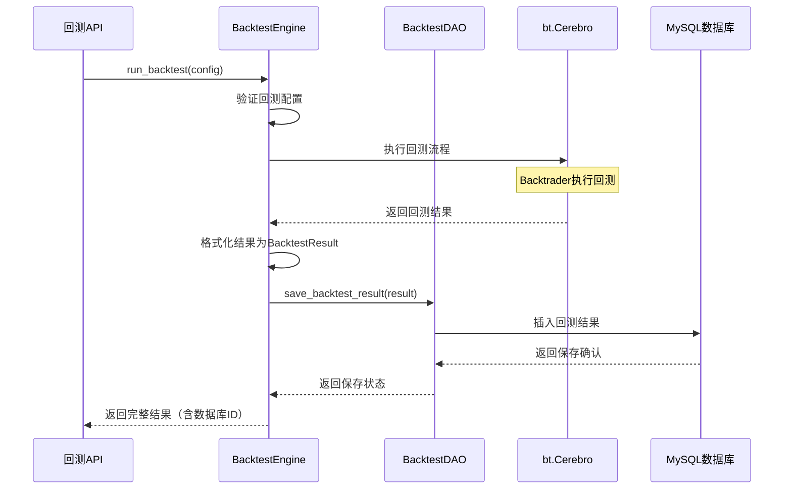

# 任务拆分设计规范与问题总结

## 问题分析：回测引擎任务文档的设计缺陷

### 发现的主要问题

**1. 业务逻辑链路不完整**
- **问题描述**：任务M005（BacktestEngine核心）和任务M006（BacktestDAO数据访问层）都已实现，但缺少两者之间的集成任务
- **具体表现**：
  - BacktestEngine能够执行回测并生成结果
  - BacktestDAO能够保存和查询回测结果
  - 但两者之间没有连接，回测结果无法自动持久化
  - 缺少历史回测结果查询和对比功能

**2. 任务执行顺序规划不准确**
- **问题描述**：任务执行顺序说明中提到了"任务M007：API接口"，但在具体任务列表中没有定义
- **具体表现**：
  - 文档结构不一致，存在引用但未定义的任务
  - 执行顺序规划与实际任务列表不匹配

**3. 端到端业务流程验证缺失**
- **问题描述**：各个组件任务都有独立的集成测试点，但缺少完整业务流程的端到端测试
- **具体表现**：
  - 无法验证"提交回测请求 → 执行回测 → 保存结果 → 查询历史"的完整流程
  - 缺少数据一致性和事务管理的验证

## 解决方案：新增任务M007

### 任务设计
- **任务M007**：实现BacktestEngine与BacktestDAO集成
- **核心功能**：
  - 修改BacktestEngine.run_backtest()方法，集成数据持久化
  - 实现历史回测结果查询功能
  - 实现回测结果对比分析功能
  - 确保事务管理和数据一致性

### 时序图设计

## 任务拆分设计规范

### 1. 业务逻辑完整性原则

**规范要求**：
- 每个业务功能必须包含完整的数据流路径：输入 → 处理 → 输出 → 存储
- 必须明确定义组件间的集成任务，不能假设组件会自动集成
- 业务流程中的每个环节都必须有对应的任务覆盖

**检查清单**：
- [ ] 数据输入层是否有对应任务？
- [ ] 业务处理层是否有对应任务？
- [ ] 数据输出层是否有对应任务？
- [ ] 数据持久化层是否有对应任务？
- [ ] 各层之间的集成是否有对应任务？

### 2. 任务依赖关系明确性原则

**规范要求**：
- 任务执行顺序说明必须与具体任务列表完全一致
- 每个任务的前置条件必须明确且可验证
- 不能出现引用但未定义的任务

**检查清单**：
- [ ] 任务执行顺序中提到的所有任务是否都在任务列表中定义？
- [ ] 每个任务的前置条件是否都有对应的任务？
- [ ] 任务依赖关系是否形成有向无环图（DAG）？

### 3. 端到端验证覆盖原则

**规范要求**：
- 必须设计完整业务流程的端到端测试任务
- 集成测试点必须覆盖关键的业务场景和异常情况
- 必须包含数据一致性和事务管理的验证

**检查清单**：
- [ ] 是否有端到端业务流程测试？
- [ ] 是否覆盖了正常场景和异常场景？
- [ ] 是否验证了数据一致性？
- [ ] 是否验证了性能要求？

### 4. 任务边界清晰性原则

**规范要求**：
- 每个任务必须有明确的输入、输出和职责边界
- 任务间的接口和数据传递必须明确定义
- 避免任务职责重叠或遗漏

**检查清单**：
- [ ] 每个任务的输入输出是否明确？
- [ ] 任务间的接口是否清晰定义？
- [ ] 是否存在职责重叠的任务？
- [ ] 是否存在职责空白区域？

## 质量保证流程

### 1. 任务设计阶段检查

**步骤1：业务流程梳理**
- 绘制完整的业务流程图
- 识别所有关键节点和数据流
- 确保没有流程断点

**步骤2：任务映射验证**
- 将业务流程节点映射到具体任务
- 验证每个节点都有对应任务
- 检查任务覆盖的完整性

**步骤3：依赖关系验证**
- 绘制任务依赖关系图
- 验证依赖关系的合理性
- 检查是否存在循环依赖

### 2. 文档一致性检查

**步骤1：交叉引用验证**
- 检查任务执行顺序与任务列表的一致性
- 验证所有引用的任务都已定义
- 确保前置条件的任务都存在

**步骤2：时序图一致性**
- 验证时序图与任务描述的一致性
- 检查参与者和消息流的准确性
- 确保时序图覆盖了关键交互

### 3. 集成测试设计验证

**步骤1：测试覆盖度检查**
- 验证是否有端到端测试
- 检查异常场景的覆盖
- 确保性能测试的包含

**步骤2：验收标准完整性**
- 检查功能验收标准
- 验证技术验收标准
- 确保质量验收标准

## 预防措施

### 1. 设计评审机制
- 任务文档完成后必须进行同行评审
- 重点检查业务逻辑完整性和任务依赖关系
- 使用本规范作为评审检查清单

### 2. 原型验证
- 对于复杂的集成任务，建议先进行原型验证
- 验证技术可行性和集成方案
- 确保任务拆分的合理性

### 3. 迭代优化
- 在任务执行过程中收集反馈
- 及时调整任务设计和依赖关系
- 持续优化任务拆分方法

## 总结

通过分析回测引擎任务文档的问题，我们发现了任务拆分设计中的关键缺陷：**缺少组件间的集成任务导致业务逻辑链路不完整**。这个问题的根本原因是在任务设计时过于关注单个组件的实现，而忽略了组件间的协作和集成。

为了避免类似问题，我们制定了四个核心原则和相应的质量保证流程。这些规范将帮助我们设计出更加完整、一致和可执行的任务文档，确保项目能够顺利交付完整的业务功能。

**关键要点**：
1. **业务逻辑完整性**：确保每个业务流程都有完整的任务覆盖
2. **集成任务必要性**：组件间的集成不会自动发生，必须明确设计集成任务
3. **文档一致性**：任务列表、执行顺序、依赖关系必须保持一致
4. **端到端验证**：必须设计完整业务流程的测试验证

遵循这些规范，可以有效避免任务设计中的逻辑断层，确保项目交付的完整性和质量。