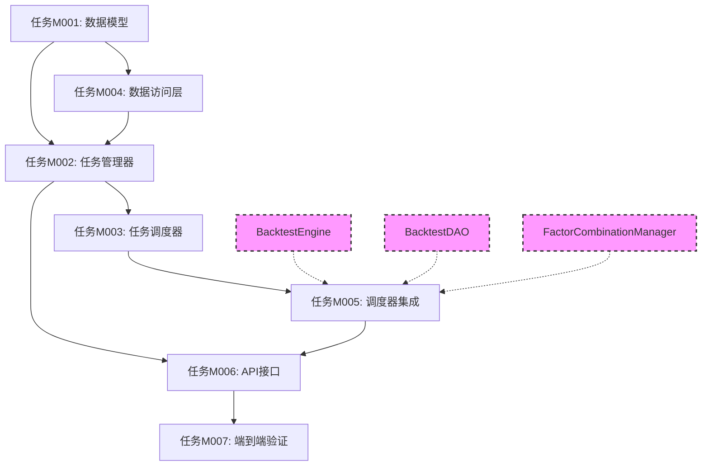

# 任务管理器模块 - 任务拆分文档

## 项目类型：现有项目（基于quant-engine服务扩展）

## 核心业务功能任务（按功能点拆分）

### 模块A：任务管理核心

#### 功能点A1：数据模型定义
- [x] 任务M001. 实现任务管理数据模型（完整端到端实现）
  - **时序图描述**：
    ```mermaid
    sequenceDiagram
        participant Client as 客户端
        participant API as API层
        participant Model as 数据模型
        participant Validator as 验证器
        
        Client->>API: 提交任务创建请求
        API->>Model: 创建TaskRequest实例
        Model->>Validator: 验证任务参数
        Validator->>Validator: 检查配置有效性
        Validator-->>Model: 返回验证结果
        Model-->>API: 返回任务对象
        API-->>Client: 返回任务确认
    ```
  - 实现TaskRequest数据模型（参考design_backend.md第2.3.3节）
    * 定义任务ID、批次ID（用于分组查询）、股票代码等基础字段
    * 实现任务配置和参数结构
    * 添加任务创建时间、开始时间、结束时间字段
    * 实现任务序列化和反序列化方法
  - 实现TaskInfo数据模型（参考design_backend.md第2.3.3节）
    * 定义任务ID、状态、进度等核心字段
    * 实现任务配置和结果数据结构
    * 添加批次ID字段用于分组查询
    * 实现任务状态转换功能
  - 实现TaskStatus枚举（参考design_backend.md第2.3.3节）
    * 定义任务状态（排队中、执行中、已完成、已失败、已取消）
    * 实现状态转换规则和验证逻辑
    * 添加状态描述和错误信息字段
  - _Requirements: 任务管理、状态跟踪、数据验证_
  - _Design Reference: design_backend.md 第2.3.3节_
  - _前置条件：无_
  - _集成测试点：数据模型创建测试、状态转换测试、验证逻辑测试_

#### 功能点A2：任务管理器实现
- [ ] 任务M002. 实现任务管理器（完整端到端实现）
  - **时序图描述**：
    ```mermaid
    sequenceDiagram
        participant API as API接口
        participant TM as TaskManager
        participant DB as 数据库
        
        API->>TM: create_task(request)
        TM->>TM: 生成任务ID和批次ID
        TM->>TM: 基本参数验证
        TM->>DB: 保存任务信息
        TM-->>API: 返回任务创建结果
        
        API->>TM: get_task_status(task_id)
        TM->>DB: 查询任务状态
        TM-->>API: 返回状态信息
    ```
  - 实现TaskManager类（参考design_backend.md第2.3.1节）
    * 实现create_task、get_task_status、cancel_task方法
    * 添加基本的参数验证功能
    * 实现简单的任务状态跟踪
    * 添加按批次ID查询任务列表功能
  - 实现任务创建流程（参考design_backend.md第2.3.4节）
    * 验证任务请求的基本参数
    * 生成唯一的任务ID和批次ID（用于分组）
    * 保存任务信息到数据库（状态为pending）
    * 返回任务创建结果
  - 实现任务查询功能（参考design_backend.md第2.3.1节）
    * 支持按任务ID查询单个任务状态
    * 支持按批次ID查询该批次所有任务
    * 实现基本的任务列表过滤
    * 添加任务结果查询功能
  - _Requirements: 任务管理、状态跟踪、查询功能_
  - _Design Reference: design_backend.md 第2.3.1节、第2.3.4节_
  - _前置条件：任务M001完成_
  - _集成测试点：任务创建测试、状态管理测试、查询功能测试_

#### 功能点A3：任务调度器实现
- [ ] 任务M003. 实现任务调度器（完整端到端实现）
  - **时序图描述**：
    ```mermaid
    sequenceDiagram
        participant Timer as 定时器
        participant TS as TaskScheduler
        participant DAO as TaskDAO
        participant BE as BacktestEngine
        
        Timer->>TS: 每30秒触发一次
        TS->>DAO: 查询待执行任务
        DAO-->>TS: 返回pending状态任务列表
        loop 处理每个任务
            TS->>DAO: 更新任务状态为running
            TS->>BE: 执行回测任务
            BE-->>TS: 返回执行结果
            TS->>DAO: 更新任务状态为completed/failed
        end
    ```
  - 实现TaskScheduler类（参考design_backend.md第2.3.1节）
    * 实现定时器机制，每30秒检查一次数据库
    * 查询状态为pending的任务
    * 逐个处理任务，更新状态
    * 添加基本的异常处理
  - 实现简单调度逻辑（参考design_backend.md第2.3.1节）
    * 按创建时间顺序处理任务（FIFO）
    * 一次处理一个任务，避免并发复杂性
    * 实现任务状态的及时更新
    * 添加任务执行超时检测
  - 实现定时任务管理（参考design_backend.md第2.3.1节）
    * 使用Python的schedule库或asyncio定时器
    * 实现调度器的启动和停止
    * 添加调度器运行状态监控
    * 实现简单的错误重试机制
  - _Requirements: 定时调度、状态更新、异常处理_
  - _Design Reference: design_backend.md 第2.3.1节_
  - _前置条件：任务M001、M002完成_
  - _集成测试点：定时调度测试、任务执行测试、状态更新测试_

### 模块B：数据存储层

#### 功能点B1：任务数据访问层实现
- [ ] 任务M004. 实现任务数据访问层（完整端到端实现）
  - **时序图描述**：
    ```mermaid
    sequenceDiagram
        participant TM as TaskManager
        participant DAO as TaskDAO
        participant DB as MySQL数据库
        
        TM->>DAO: save_task(task_info)
        DAO->>DB: 插入任务记录
        DB-->>DAO: 返回插入结果
        DAO-->>TM: 返回保存确认
        
        TM->>DAO: get_task(task_id)
        DAO->>DB: 查询数据库
        DB-->>DAO: 返回任务数据
        DAO-->>TM: 返回任务信息
    ```
  - 实现TaskDAO类（参考design_backend.md第3.2节）
    * 实现任务数据的CRUD操作
    * 添加批量数据操作和事务处理
    * 实现数据库连接池管理
    * 添加基础的数据访问监控
  - 创建数据库表结构（参考design_backend.md第3.2节）
    * 创建backtest_tasks表存储任务详情
    * 添加批次ID字段用于分组查询
    * 添加必要的索引和约束
    * 实现数据库迁移脚本
  - 实现查询功能（参考design_backend.md第3.2节）
    * 实现按任务ID查询单个任务
    * 实现按批次ID查询任务列表
    * 添加任务状态过滤功能
    * 实现分页查询支持
  - _Requirements: 数据持久化、查询功能、性能优化_
  - _Design Reference: design_backend.md 第3.2节_
  - _前置条件：任务M001完成_
  - _集成测试点：数据库操作测试、查询功能测试、性能测试_

### 模块C：任务执行集成层

#### 功能点C1：任务调度器与回测引擎集成
- [ ] 任务M005. 实现TaskScheduler与BacktestEngine集成（完整端到端实现）
  - **时序图描述**：
    ```mermaid
    sequenceDiagram
        participant TS as TaskScheduler
        participant DAO as TaskDAO
        participant FCM as FactorCombinationManager
        participant BE as BacktestEngine
        participant BDAO as BacktestDAO
        participant DB as MySQL数据库
        
        TS->>DAO: 查询pending状态任务
        DAO-->>TS: 返回待执行任务列表
        
        loop 处理每个任务
            TS->>DAO: 更新任务状态为running
            TS->>FCM: 获取股票因子组合配置
            FCM->>DB: 查询因子组合配置
            DB-->>FCM: 返回配置数据
            FCM-->>TS: 返回因子组合配置
            TS->>BE: run_backtest(config, factor_config)
            BE->>BE: 执行回测计算
            BE->>BDAO: save_backtest_result(result)
            BDAO->>DB: 保存回测结果
            DB-->>BDAO: 返回保存确认
            BDAO-->>BE: 返回结果ID
            BE-->>TS: 返回完整执行结果
            TS->>DAO: 更新任务状态为completed
            TS->>DAO: 保存结果引用ID
        end
    ```
  - 实现TaskScheduler与FactorCombinationManager的集成（参考design_backend.md第2.2.1节）
    * 集成因子组合配置获取接口
    * 实现按股票代码获取因子组合的逻辑
    * 添加因子配置验证和缓存机制
    * 处理因子配置获取失败的异常情况
  - 修改TaskScheduler类集成BacktestEngine（参考design_backend.md第2.3.1节）
    * 在任务执行流程中调用BacktestEngine.run_backtest()，传入因子配置
    * 实现回测结果的自动持久化
    * 添加任务执行结果与回测结果的关联
    * 实现任务执行异常的捕获和处理
  - 实现任务结果管理（参考design_backend.md第2.3.4节）
    * 在TaskInfo中添加backtest_result_id字段
    * 实现任务结果的查询和关联
    * 添加历史回测结果的对比功能
    * 实现任务执行日志的记录
  - 实现事务管理和数据一致性（参考design_backend.md第3.2节）
    * 确保任务状态更新与回测结果保存的事务一致性
    * 实现任务执行失败时的回滚机制
    * 添加数据完整性检查和修复功能
    * 实现任务重试机制
  - _Requirements: 任务执行、因子配置集成、结果持久化、事务管理、异常处理_
  - _Design Reference: design_backend.md 第2.2.1节、第2.3.1节、第2.3.4节、第3.2节_
  - _前置条件：任务M003完成，BacktestEngine和BacktestDAO已实现，因子组合管理模块已实现_
  - _集成测试点：因子配置获取测试、任务执行流程测试、结果持久化测试、事务一致性测试、异常处理测试_

### 模块D：HTTP API接口层

#### 功能点D1：任务管理API实现
- [ ] 任务M006. 实现任务管理API（完整端到端实现）
  - **时序图描述**：
    ```mermaid
    sequenceDiagram
        participant Client as 客户端
        participant API as TaskAPI
        participant TM as TaskManager
        participant Validator as 参数验证器
        
        Client->>API: POST /api/v1/backtest/createTask
        API->>Validator: 验证请求参数
        Validator-->>API: 返回验证结果
        API->>TM: create_task(request)
        TM-->>API: 返回任务信息
        API-->>Client: 返回任务创建结果
        
        Client->>API: GET /api/v1/backtest/getTaskStatus
        API->>TM: get_task_status(task_id)
        TM-->>API: 返回状态信息
        API-->>Client: 返回状态查询结果
    ```
  - 实现任务创建API（参考design_backend.md第2.3.5节）
    * 实现POST /api/v1/backtest/createTask接口
    * 添加请求参数验证和错误处理
    * 实现任务配置的格式化和响应封装
    * 支持批量创建多个股票的任务
  - 实现任务状态查询API（参考design_backend.md第2.3.5节）
    * 实现GET /api/v1/backtest/getTaskStatus接口
    * 支持单个任务状态查询
    * 实现GET /api/v1/backtest/getTasksByBatch接口
    * 支持按批次ID查询该批次所有任务状态
  - 实现任务控制API（参考design_backend.md第2.3.5节）
    * 实现POST /api/v1/backtest/cancelTask接口
    * 支持取消单个任务
    * 实现GET /api/v1/backtest/getTaskResult接口
    * 支持查询任务执行结果和关联的回测结果
  - _Requirements: RESTful API、参数验证、批次查询、结果查询_
  - _Design Reference: design_backend.md 第2.3.5节_
  - _前置条件：任务M002、M005完成_
  - _集成测试点：API接口测试、参数验证测试、批次查询测试、结果查询测试_

### 模块E：端到端业务流程验证

#### 功能点E1：完整业务流程集成测试
- [ ] 任务M007. 实现端到端业务流程验证（完整集成测试）
  - **时序图描述**：
    ```mermaid
    sequenceDiagram
        participant Test as 测试客户端
        participant API as TaskAPI
        participant TM as TaskManager
        participant TS as TaskScheduler
        participant BE as BacktestEngine
        participant DB as 数据库
        
        Test->>API: 创建回测任务
        API->>TM: create_task()
        TM->>DB: 保存任务(pending状态)
        TM-->>API: 返回任务ID
        API-->>Test: 返回创建结果
        
        Note over TS: 定时器触发
        TS->>DB: 查询pending任务
        TS->>DB: 更新状态为running
        TS->>BE: 执行回测
        BE->>DB: 保存回测结果
        BE-->>TS: 返回结果
        TS->>DB: 更新状态为completed
        
        Test->>API: 查询任务状态
        API->>TM: get_task_status()
        TM->>DB: 查询任务信息
        TM-->>API: 返回状态和结果
        API-->>Test: 返回查询结果
    ```
  - 实现完整业务流程测试（参考design_backend.md第2.3节）
    * 测试"创建任务 → 调度执行 → 保存结果 → 查询状态"完整流程
    * 验证任务状态转换的正确性
    * 测试批量任务的并发处理
    * 验证任务结果与回测结果的正确关联
  - 实现异常场景测试（参考design_backend.md第6节）
    * 测试任务执行失败的处理流程
    * 验证数据库连接异常的恢复机制
    * 测试任务取消功能的正确性
    * 验证系统重启后任务状态的恢复
  - 实现性能和压力测试（参考design_backend.md第7节）
    * 测试大量任务的处理能力
    * 验证数据库查询的性能表现
    * 测试系统在高负载下的稳定性
    * 验证内存使用和资源管理
  - _Requirements: 端到端测试、异常处理、性能验证、数据一致性_
  - _Design Reference: design_backend.md 第2.3节、第6节、第7节_
  - _前置条件：任务M001-M006全部完成_
  - _集成测试点：完整业务流程测试、异常场景测试、性能压力测试、数据一致性测试_


## 任务执行顺序说明

**第一阶段：基础数据模型（优先级最高）**
- 任务M001：数据模型定义是所有功能的基础

**第二阶段：核心组件实现（按依赖关系执行）**
- 任务M004：任务数据访问层（依赖M001）
- 任务M002：任务管理器（依赖M001、M004）
- 任务M003：任务调度器（依赖M001、M002）

**第三阶段：集成层实现（关键业务逻辑）**
- 任务M005：TaskScheduler与BacktestEngine集成（依赖M003，需要BacktestEngine和BacktestDAO已实现）

**第四阶段：API接口层（对外服务）**
- 任务M006：任务管理API（依赖M002、M005）

**第五阶段：端到端验证（质量保证）**
- 任务M007：端到端业务流程验证（依赖M001-M006全部完成）

## 关键依赖说明

**外部依赖**：
- BacktestEngine：回测引擎核心组件（来自回测引擎模块）
- BacktestDAO：回测结果数据访问层（来自回测引擎模块）
- FactorCombinationManager：因子组合配置管理（来自因子组合管理模块）

**任务依赖关系图**：


## 验收标准

**功能验收：**
- [ ] 支持回测任务的创建和管理
- [ ] 实现任务状态的查询和跟踪
- [ ] 支持基本的任务调度和执行
- [ ] 实现TaskScheduler与BacktestEngine的完整集成
- [ ] 支持回测结果的自动持久化和关联查询
- [ ] 提供完整的RESTful API接口
- [ ] 支持按批次ID查询任务列表
- [ ] 支持任务执行结果与回测结果的关联查询
- [ ] 实现任务取消和异常处理功能

**性能验收：**
- [ ] 任务创建响应时间在1秒以内
- [ ] 任务状态查询响应时间在500ms以内
- [ ] 支持基本的并发任务处理（至少10个并发任务）
- [ ] 数据库操作正常稳定，事务处理正确
- [ ] 任务调度器30秒轮询机制稳定运行
- [ ] 大批量任务处理性能满足要求（100个任务批次）

**质量验收：**
- [ ] 通过完整的端到端业务流程测试
- [ ] 通过异常场景和边界条件测试
- [ ] 通过数据一致性和事务管理测试
- [ ] 符合现有代码规范和架构设计
- [ ] 核心功能稳定可用，无关键缺陷
- [ ] 代码覆盖率达到80%以上
- [ ] 通过性能压力测试验证

**集成验收：**
- [ ] 与BacktestEngine集成正常，数据传递正确
- [ ] 与BacktestDAO集成正常，结果保存成功
- [ ] 任务状态与回测执行状态同步准确
- [ ] 系统重启后任务状态恢复正常
- [ ] 外部依赖异常时系统降级处理正确

**业务验收：**
- [ ] 完整业务流程："创建任务 → 调度执行 → 保存结果 → 查询状态"正常运行
- [ ] 批量任务处理流程正确，支持多股票同时回测
- [ ] 任务结果查询功能完整，支持历史结果对比
- [ ] 任务管理功能完善，支持任务生命周期管理