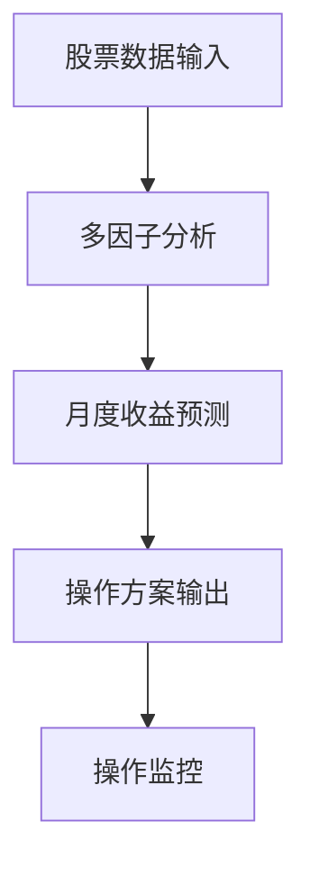
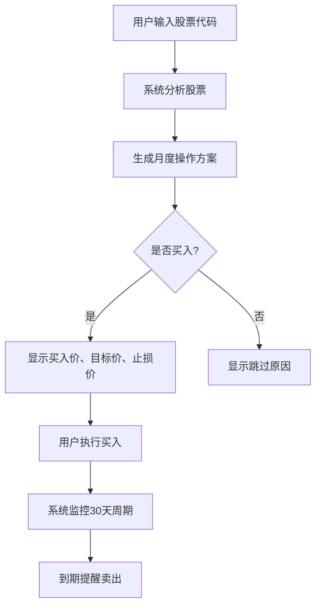

# 股票买卖价格预测系统MVP产品需求文档

## 1. 产品概述

### 1.1 产品背景

需要一个低成本的股票操作方案生成系统，预算限制在几百元以内，能够为每只股票提供明确的月度买卖操作指令。

### 1.2 产品目标

- 为每只股票提供明确的月度操作方案
- 实现买入后30天内必须卖出的操作周期
- 提供具体的买入价格、目标价格、止损价格
- 零成本或极低成本运营（预算几百元以内）

## 2. 需求分析

### 2.1 功能需求

#### 2.1.1 核心功能列表

| 功能模块 | 优先级 | 功能描述 | MVP包含 |
|----------|--------|----------|----------|
| 数据获取 | P0 | 免费数据源接入，股价和财务数据获取 | ✅ |
| 因子计算 | P0 | 基础技术因子和基本面因子计算 | ✅ |
| 预测模型 | P0 | 简化版多因子预测模型 | ✅ |
| 买卖信号 | P0 | 基础买入卖出信号生成 | ✅ |
| 风险控制 | P1 | 简单止损止盈策略 | ✅ |
| 数据可视化 | P1 | 基础图表展示 | ✅ |
| 回测功能 | P1 | 简单策略回测 | ✅ |
| 批量分析 | P2 | 多股票批量处理 | ❌ |
| 实时监控 | P2 | 实时价格监控和预警 | ❌ |
| 高级因子 | P2 | 复杂因子和另类数据 | ❌ |

#### 2.1.2 核心功能

**F1. 数据获取**：免费API获取股票价格和财务数据
**F2. 因子计算**：30个技术和基本面因子
**F3. 月度预测**：预测未来20个交易日收益率
**F4. 操作方案生成**：自动生成买入价、目标价、止损价
**F5. 操作监控**：跟踪操作状态，30天内强制卖出

### 2.2 核心需求

**N1. 操作方案生成**：为每只股票生成买入价、目标价、止损价
**N2. 月度操作周期**：买入股票必须在30天内卖出
**N3. 基础风险控制**：8%止损，10%单股仓位限制
**N4. 历史表现评估**：提供回测结果和关键指标

### 2.3 使用流程

1. 每日查看系统推荐的股票操作方案
2. 根据方案执行买入操作
3. 系统监控持仓状态和剩余天数
4. 30天内执行卖出（到期强制卖出）

### 2.4 核心业务规则

**操作方案生成**
- 预测月度收益率 > 8% 才生成买入方案
- 买入价 = 当前价 × 0.98，目标价 = 当前价 × (1 + 预测收益率)
- 止损价 = 当前价 × 0.92，持有期限 = 30天

**风险控制**
- 单股最大仓位10%，最大止损8%
- 持有满30天强制卖出，同时持有不超过10只

### 2.4 需求变更记录

| 日期 | 变更类型 | 变更内容 | 影响评估 |
|------|----------|----------|----------|
| 2025-01-XX | 新增 | 初始需求文档创建 | 无 |

## 3. 功能需求

### 3.1 功能架构

### 3.2 功能优先级

| 功能模块 | 优先级 | 说明 |
|----------|--------|------|
| 数据获取 | P0 | 核心基础功能 |
| 因子计算 | P0 | 核心分析功能 |
| 月度预测 | P0 | 核心预测功能 |
| 操作方案生成 | P0 | 核心输出功能 |
| 操作监控 | P1 | 重要辅助功能 |
| 历史回测 | P2 | 验证功能 |

### 3.3 业务流程

## 4. 数据需求

### 4.1 基础市场数据（必需 - 免费获取）

**股票价格数据**
- **数据源**：Tushare、AkShare、东方财富API
- **更新频率**：每日收盘后更新
- **历史深度**：至少3年日线数据
- **数据字段**：开盘价、最高价、最低价、收盘价、成交量、成交额、换手率、市盈率、市净率、总市值、流通市值

**指数数据**
- **覆盖指数**：沪深300、中证500、中证1000、创业板指、科创50、申万一级行业指数
- **数据字段**：指数点位、成交量、成交额、涨跌幅

### 4.2 财务数据（必需 - 部分免费）

**财务报表数据**
- **数据源**：Tushare、AkShare、巨潮资讯
- **更新频率**：季度更新（年报、半年报、季报）
- **历史深度**：至少5年财务数据
- **报表类型**：资产负债表、利润表、现金流量表
- **关键字段**：
  - 资产负债表：总资产、总负债、股东权益、流动资产、流动负债、货币资金
  - 利润表：营业收入、营业成本、净利润、归母净利润、每股收益
  - 现金流量表：经营活动现金流、投资活动现金流、自由现金流

**财务指标数据**
- **盈利能力**：ROE、ROA、ROIC、毛利率、净利率、营业利润率
- **成长能力**：营收增长率、净利润增长率、总资产增长率
- **偿债能力**：资产负债率、流动比率、速动比率
- **运营能力**：总资产周转率、存货周转率、应收账款周转率

### 4.3 宏观经济数据（必需 - 免费）

**货币政策指标**
- **数据源**：中国人民银行、国家统计局、Wind、东方财富
- 一年期LPR利率、十年期国债收益率、M2货币供应量增速、社会融资规模

**经济增长指标**
- **数据源**：国家统计局、各部委官网
- GDP增长率、工业增加值、固定资产投资、社会消费品零售总额

**通胀指标**
- **数据源**：国家统计局
- CPI同比、PPI同比、核心CPI

**汇率数据**
- **数据源**：中国外汇交易中心、新浪财经
- 人民币兑美元汇率、美元指数

### 4.4 新闻情绪数据（重要 - 需开发）

**新闻文本数据**
- **数据源**：财经媒体网站（新浪财经、东方财富、证券时报、上海证券报、中国证券报）
- **获取方式**：网络爬虫 + RSS订阅
- **更新频率**：实时抓取
- **数据字段**：
  - 新闻标题、正文内容、发布时间、新闻来源
  - 相关股票代码、行业分类
  - 新闻类型（公司公告、行业新闻、政策新闻、市场评论）

**社交媒体数据**
- **数据源**：微博、股吧、雪球、知乎财经话题
- **获取方式**：API接口 + 网络爬虫
- **数据字段**：帖子内容、发布时间、用户影响力、点赞数、评论数

**情绪分析处理**
- **技术方案**：中文NLP情绪分析模型（SnowNLP、百度情感分析API）
- **输出指标**：情绪得分（-1到1）、情绪分类（正面/中性/负面）、情绪强度

### 4.5 政策数据（重要 - 免费）

**监管政策**
- **数据源**：证监会、银保监会、央行官网
- **数据类型**：政策文件、监管公告、行业指导意见
- **关键政策**：IPO政策、再融资政策、分红政策、退市制度

**行业政策**
- **数据源**：发改委、工信部、各行业主管部门
- **数据类型**：产业政策、补贴政策、环保政策、技术标准
- **影响分析**：政策对相关行业和个股的影响程度评估

**重大事件数据**
- **数据源**：官方公告、权威媒体
- **事件类型**：
  - 公司层面：重大资产重组、高管变动、业绩预告、分红派息
  - 行业层面：行业整顿、技术突破、供需变化
  - 市场层面：指数调整、制度变革、国际事件影响

### 4.6 数据质量要求

- **数据完整性**：> 95%
- **数据准确性**：与官方数据源一致性 > 99%
- **数据及时性**：日线数据T+1更新，财务数据季报发布后1周内更新
- **数据覆盖范围**：A股主要股票（沪深300成分股优先，逐步扩展至全市场）

## 5. 验收标准

### 5.1 功能验收

- **F1. 数据获取**：能够成功获取指定股票的历史价格和财务数据
- **F2. 因子计算**：能够计算30个核心因子，计算结果准确
- **F3. 月度预测**：能够预测股票未来20个交易日收益率
- **F4. 操作方案生成**：能够生成包含买入价、目标价、止损价的完整方案
- **F5. 操作监控**：能够跟踪持仓状态，30天到期自动提醒

### 5.2 业务验收

- **B1. 操作周期**：严格执行30天操作周期，到期强制卖出
- **B2. 风险控制**：单股止损不超过8%，单股仓位不超过10%
- **B3. 收益阈值**：只对预测收益率>8%的股票生成买入方案
- **B4. 历史验证**：回测胜率达到55%以上

### 5.3 成本验收

- **C1. 运营成本**：年度总成本控制在200元以内
- **C2. 数据成本**：使用免费数据源，无额外数据费用
- **C3. 维护成本**：系统能够自动运行，人工维护时间<2小时/周

## 6. 风险控制

**技术风险**
- 数据源：配置多个备用免费数据源
- 模型：定期重新训练，防止过拟合
- 系统：定期备份，建立监控机制

**业务风险**
- 市场风险：严格执行8%止损策略
- 操作风险：提供明确操作指引
- 合规风险：仅提供分析工具，不构成投资建议

## 7. 成本分析

**年度运营成本**
- 云服务器：￥120/年（1核2G配置）
- 域名：￥50/年（可选）
- 数据源：￥0/年（免费API）
- **总计：￥170/年**，符合几百元预算

**预期效益**
- 投资收益提升：5-10%年化收益率
- 风险控制：减少情绪化交易损失
- 学习价值：量化投资和编程技能提升

## 8. 修改记录

| 日期 | 修改类型 | 修改内容 | 影响范围 |
|------|----------|----------|----------|
| 2025-01-XX | 新增 | 初始PRD文档创建 | 无 |
| 2025-01-XX | 修改 | 调整为月度操作周期 | 核心业务逻辑 |
| 2025-01-XX | 优化 | 精简文档结构，删除冗余描述 | 文档可读性 |